# Project Management Plan — Assignment 02 Implementation Phase

**Module:** SE3070 Case Studies in Software Engineering — Assignment 02 (30% of the module; 100 marks)
**Case study:** Smart Disaster Early-Warning and Emergency Coordination System for Sri Lanka (design received from Group_026)
**Team:** Anupa · Bineth · Lahiru · Sayuni
**Plan date:** Sun 27 Sep 2026 · **Submission deadline:** Fri 9 Oct 2026, 11:59 PM
**Jira project key:** `DMS` (commits follow the root README convention: `DMS-120 add hazard alert draft endpoint`)
**Plan version:** 2.0 (frontend automated testing removed from scope; backend testing unchanged and expanded into test-case catalogues)

---

## Contents

0. [Scope, sources and conventions](#0-scope-sources-and-conventions) · [How to read ticket links](#06-how-to-read-ticket-links)
1. [Epic overview and team load](#1-epic-overview-and-team-load)
2. [Team working agreement](#2-team-working-agreement)
3. [Shared Foundation, Documentation & Release (Epic DMS-1)](#3-shared-foundation-documentation--release-epic-dms-1)
4. [UC01 — Issue Hazard Warning (Anupa)](#uc01--issue-hazard-warning-anupa)
5. [UC02 — Submit and Verify Hazard Report (Bineth)](#uc02--submit-and-verify-hazard-report-bineth)
6. [UC03 — Coordinate Shelter and Resource Allocation (Lahiru)](#uc03--coordinate-shelter-and-resource-allocation-lahiru)
7. [UC04 — Generate Post-Event Analysis Report (Sayuni)](#uc04--generate-post-event-analysis-report-sayuni)
8. [Cross-member dependencies](#8-️-cross-member-dependencies-highest-risk)
9. [Duplicates & Relates-to register](#9-duplicates--relates-to-register)
10. [Sprint plan and schedule risks](#10-sprint-plan)
11. [Dependency graph (critical path)](#11-dependency-graph-blocks--is-blocked-by)
12. [Traceability matrix template](#12-traceability-matrix-template)
13. [Definition of Ready and Definition of Done](#13-definition-of-ready-and-definition-of-done)

---

## 0. Scope, sources and conventions

### 0.1 What this plan covers

The plan covers implementation, **backend unit and integration testing**, and documentation of the four improved use cases. Each use case is owned by one member and cuts across the three codebases in this repo:

| Codebase | Stack | Who signs in there | Automated tests in this plan |
|---|---|---|---|
| `server/` | Express + MongoDB (Mongoose), Jest + Supertest, in-memory Mongo | every role | **Yes**: unit and integration, ≥80% coverage per UC |
| `web/` | Vite + React + Tailwind (the "DMC Command Console") | `dmc_officer`, `duty_officer`, `district_officer` | No (see 0.4) |
| `app/` | Expo React Native + NativeWind | `citizen`, `community_volunteer`, `rescue_team_lead` | No (see 0.4) |

### 0.2 Sources read (all parsed successfully; nothing below is invented)

| File | Used for |
|---|---|
| `docs/Other/Case_Study_Assignment_Specification.pdf` | The group vs individual deliverables and the rubric: implementation accuracy 30, code quality 20 and unit testing 20 marks. The ">80% coverage" target covering positive, negative, edge and error cases. "Avoid implementing … login, logout, or administrative privilege granting". "User Interfaces should remain consistent with the storyboard/wireframes". |
| `docs/Other/Assignment_FAQs.jpeg` | What the report must contain: the critique, UI screenshots with flow descriptions, and the GitHub repo URL. AI prompts go in the Appendix. The repository must **not** be modified after the deadline. IoT/ML components may be mocked with dummy data. |
| `docs/Other/Case_Study.pdf` | The domain requirements: location-specific alerts by district or river basin; citizen reports verified by a duty officer; shelters, dispatch and supplies across organisations; offline capture and delayed sync; post-event statistics. |
| `docs/Other/Case_Study_Report_By_Another_Group.pdf` | The original Group_026 design (the use case diagram, class diagram, the three detailed scenarios and the hi-fi screens). It is the baseline each improved UC corrects. |
| `docs/Other/UC01…UC04 *_Improved_By_*.pdf` | The scenario steps, alternate and exception flows, improved class and sequence diagrams, wireframes, change justifications, and each PDF's "Note for implementation and testing". **Every story below is derived from these.** |
| `docs/api-contract.md`, `README.md`, `server/README.md`, `web/README.md`, `app/README.md` | The response envelope and error-code rules, the layering and class conventions, file locations, what already exists, and the test setup. |

> **Note:** the login/logout/admin-privilege exclusion comes from the **Specification PDF** (Instructions section), not the FAQ image. This plan contains **no** tickets for login, logout, registration or privilege granting. The existing auth code (`requireAuth`, `requireRole`, the demo accounts) is only *used*, never extended.

### 0.3 Baseline: what already exists on `develop` (27 Sep)

- **Server:** auth and upload only.
  - Models: `User` (name, email, passwordHash, role, isActive; no district or phone yet) and the token models.
  - `Role` enum, the `Person` class hierarchy with `PersonFactory`, and `AuthMiddleware.requireRole` (inheritance-aware: a `duty_officer` passes `requireRole(DMC_OFFICER)`).
  - `StorageService` (Supabase) and `EmailService` with `NoopEmailTransport`/`BrevoEmailTransport` and the `EmailTemplate` base class.
  - `server/README.md` says `district`/`shiftDistrict` are "plain district names until the shared `District` class exists".
- **Web:** login, the role gate and `ConsoleLayout`. `sidebarItems.js` already routes `/hazard-warnings`, `/ground-reports`, `/shelter-resources`, `/rescue-teams`, `/relief-supplies`, `/map` and `/reports` to `PlaceholderScreen`. The UI kit is small: no modal, table, tabs, badge or map.
- **App:** auth screens, one `MainTabs` navigator, and a rich `components/ui` kit (it already has `ConfirmDialog`, `Chip`, `Badge` and `SegmentedControl`).
- **Server tests:** Jest + Supertest against an in-memory MongoDB, with collections cleared after every test. **No coverage configuration yet.**
- **CI:** `.github/workflows/ci.yml` runs lint and tests (and `npm run build` for web) on every PR to `develop`/`main`; the check is required.
- **Ownership signals:** all 19 commits to date (scaffold, CI, server OOP refactor) are Lahiru's, and the root README names Lahiru as the manager of the report deliverables.

### 0.4 Scope decision: backend-only automated testing

- The rubric's unit testing criterion (20 marks) is met **on the server**. Every use case's business logic lives there, because the layering rules forbid logic in screens: the domain classes (state machines, thresholds), the services (validation, clustering, aggregation) and the endpoints.
- Coverage is measured and reported **per UC on server code** (`npm run coverage:uc01` … `coverage:uc04`).
- **Web and app have no automated test runners or test tickets in this plan.** Frontend correctness is checked by the *wireframe conformance review* in every PR (see the Definition of Done). That is a design-fidelity check, not a test suite.
- To keep frontend risk low without tests, UI code stays thin: screens call API modules; all rules (limits, thresholds, validation) come from the server response or from one shared constants file per UC.

### 0.5 Conventions

- **IDs:** epics are `DMS-1`…`DMS-5`, and stories and tasks are `DMS-101`…`DMS-163`, numbered in one sequence across the plan. Sub-tasks are written `DMS-120.1`, `DMS-120.2`, … (Jira assigns them their own keys on import; keep the dotted number in the sub-task title so the mapping survives).
- **Story splitting:** every alternate or exception flow in a PDF is **its own story**. A main success scenario that spans more than one screen or client is split at the PDF's own step boundaries (for example, UC03's four sub-flows).
- **Story format:** each story has
  - **User story:** As a … I want … so that …
  - **Background:** why the story exists and what it changed from the original design.
  - **Scenario trace:** the exact PDF steps.
  - **Acceptance criteria:** testable statements.
  - **API/data:** endpoints and models.
  - **UI:** the screen and the wireframe reference.
  - **Out of scope.**
  - **Sub-tasks:** each with a short description.
- **Points:** Fibonacci (1, 2, 3, 5, 8). One point is roughly half a focused day for this team.
- **Tags:** `backend/API`, `database`, `frontend/web`, `mobile app`, `testing`, `devops`, `docs`.
- **Link types:** Jira's own labels: *Blocks / is blocked by*, *Relates to*, *Duplicates / is duplicated by*. A testing story is blocked by the stories whose code it covers.
- **New error codes** in this plan are *proposals*, fixed in the API contract freeze (DMS-112). Per api-contract §7, reuse an existing code where one fits, and never repurpose an existing code. Field-level problems always use `400 VALIDATION_ERROR` with an `errors` array.
- **Mocked infrastructure (allowed by the FAQ):** the push, SMS and audible channels, map geocoding, and the email transport in development run against fake transports that record what they would send. This mirrors the existing `NoopEmailTransport`. GPS and the camera are real on the device.

### 0.6 How to read ticket links

| Link | Meaning | Effect on other tickets / people |
|---|---|---|
| **Blocks / is blocked by** | A hard order. The blocked ticket can't be finished (and usually can't be started) until the blocking ticket is merged. For example, DMS-104 (District model) blocks DMS-120, DMS-130 and DMS-140. | **The only link that affects others.** A late blocker delays everything after it. Cross-member blockers have needed-by dates and fallbacks in [Section 8](#8-️-cross-member-dependencies-highest-risk). |
| **Relates to** | Connected but not ordered: the tickets share a concept, code or data. For example, DMS-124 (UC01 all-clear) relates to DMS-153 (UC04 timeline), which must show all-clears, but either can be built first. | **None.** Awareness only: read the related ticket when designing or reviewing. |
| **Duplicates / is duplicated by** | The same functionality appears in two UCs and is built **once**, in the ticket named in [Section 9](#9-duplicates--relates-to-register). For example, UC02's "Escalate to warning" bubble is built only in DMS-122. | **None.** It prevents double work. |

- A range in a ticket table, such as "DMS-120 – DMS-128", means every ticket in that range.
- The Mermaid graph ([Section 11](#11-dependency-graph-blocks--is-blocked-by)) draws **only** Blocks links. Thick labelled arrows are cross-member blockers.
- If a blocker slips, its owner says so at stand-up that day, and the blocked owner switches to the fallback in Section 8.

---

## 1. Epic overview and team load

| Epic | Title | Owner | Stories | Points |
|---|---|---|---|---|
| DMS-1 | Shared foundation, documentation & release | split across all four | 19 (DMS-101 – DMS-119) | 42 |
| DMS-2 | UC01 — Issue Hazard Warning | Anupa | 10 (DMS-120 – DMS-129) | 47 |
| DMS-3 | UC02 — Submit and Verify Hazard Report | Bineth | 10 (DMS-130 – DMS-139) | 44 |
| DMS-4 | UC03 — Coordinate Shelter and Resource Allocation | Lahiru | 13 (DMS-140 – DMS-152) | 53 |
| DMS-5 | UC04 — Generate Post-Event Analysis Report | Sayuni | 11 (DMS-153 – DMS-163) | 37 |
| | **Total** | | **63** | **223** |

| Member | UC epic | Shared tickets | Total points | Notes |
|---|---|---|---|---|
| Anupa | UC01 — 47 | DMS-101, 104, 106, 114 — 12 | **59** | Also acts as PM (board, stand-ups, report compilation) |
| Bineth | UC02 — 44 | DMS-103, 105, 109, 111, 117 — 10 | **54** | Owns mobile navigation and the backend test helpers |
| Lahiru | UC03 — 53 | DMS-102, 112, 113, 119 — 6 | **59** | Largest UC (3 codebases), so fewest shared tickets; owns CI, deploy and release |
| Sayuni | UC04 — 37 | DMS-107, 108, 110, 115, 116, 118 — 14 | **51** | UC04 is blocked on others' data early, so she takes more shared work and documentation |

---

## 2. Team working agreement

| Topic | Agreement |
|---|---|
| Board | Jira project `DMS`, columns *To Do → In Progress → In Review → Done*; WIP limit 2 per person |
| Branches | `feature/DMS-<id>-<short-slug>` from `develop`; one story per branch; rebase on `develop` daily |
| Commits | `DMS-<id> <imperative summary>`; small and focused; never `--no-verify` (the root README forbids it) |
| Pull requests | Target `develop`; description links the ticket and lists the scenario steps covered; ≥1 approving reviewer who is not the author; the **consumer** of a cross-member interface must approve (Section 8) |
| Review turnaround | Under 12 h; the reviewer checks the Definition of Done (Section 13) including wireframe conformance |
| Stand-up | Daily 9:00 PM, 15 min: yesterday / today / blocked by whom |
| Contract first | An endpoint is documented in `docs/api-contract.md` before it is merged (api-contract §7) |
| Shared files | `App.js` route mounting, `ConsoleRoutes.jsx`, `sidebarItems.js`, `MainTabs.js` and the seeders: add one line per feature and never reformat others' lines, to keep merges trivial |
| Secrets | Never committed; new variables go into `.env.example` with dummy values and are read only through `Config.js` / `config.js` |
| AI usage | Every prompt used is pasted into the shared prompt log for the report appendix (DMS-118) |

---

## 3. Shared Foundation, Documentation & Release (Epic DMS-1)

**Epic description:** work that belongs to no single use case but blocks two or more of them, or is needed to submit. It covers:
- The shared domain models: geography, hazard events and organisations, person profile fields.
- The shared notification service.
- Backend coverage tooling and test helpers.
- The web UI kit and mobile navigation.
- Seed data, the API-contract freeze and the demo environment.
- Report compilation, and the final release.

Owners are chosen by who needs each piece most, or who already owns that part of the code, and balanced against each person's UC size.

| ID | Title | Type | Assignee | Points | Blocks | Blocked by | Relates to |
|---|---|---|---|---|---|---|---|
| DMS-1 | Shared foundation, documentation & release | Epic | All | 42 | — | — | DMS-2, DMS-3, DMS-4, DMS-5 |
| DMS-101 | Jira board, branch protection and PR workflow setup | Task | Anupa | 1 | — | — | DMS-102, DMS-119 |
| DMS-102 | Server coverage configuration + per-UC coverage scripts + CI coverage gate | Task | Lahiru | 2 | DMS-129, DMS-139, DMS-152, DMS-163 | — | DMS-103, DMS-119 |
| DMS-103 | Shared backend test helpers (auth tokens, user/area factories, fake clock, fake channels) | Task | Bineth | 2 | DMS-129, DMS-139, DMS-152, DMS-163 | DMS-104, DMS-105 | DMS-102, DMS-106 |
| DMS-104 | Shared geography model: District, RiverBasin, TargetArea + AreaRegistry + GeoDistance | Story | Anupa | 3 | DMS-103, DMS-105, DMS-107, DMS-110, DMS-120, DMS-130, DMS-140 | — | DMS-135, DMS-145 |
| DMS-105 | Person profile fields (homeDistrict, district, shiftDistrict, phone) + seeded citizens | Story | Bineth | 3 | DMS-103, DMS-110, DMS-120, DMS-130, DMS-140 | DMS-104 | DMS-127 |
| DMS-106 | Shared NotificationService + NotificationChannel interface + in-app inbox | Story | Anupa | 5 | DMS-121, DMS-130, DMS-131, DMS-142, DMS-148, DMS-149 | — | DMS-103, DMS-128 |
| DMS-107 | Shared HazardEvent (incident) + Organisation models | Story | Sayuni | 3 | DMS-110, DMS-140, DMS-142, DMS-143, DMS-153 | DMS-104 | DMS-120, DMS-124 |
| DMS-108 | Web UI kit additions (Modal, ConfirmDialog, DataTable, Tabs, StatusBadge, MapView…) | Story | Sayuni | 3 | DMS-120, DMS-131, DMS-140, DMS-153 | — | DMS-111 |
| DMS-109 | Add `hazard-reports` upload folder + contract §6 update | Task | Bineth | 1 | DMS-130 | — | DMS-134 |
| DMS-110 | Per-domain seeders (District, People, Organisation, HazardEvent + UC hooks) | Task | Sayuni | 2 | DMS-113, DMS-153 | DMS-104, DMS-105, DMS-107 | DMS-120, DMS-130, DMS-140 |
| DMS-111 | Mobile navigation for field features (role-based tabs + inbox) | Story | Bineth | 2 | DMS-130, DMS-142 | — | DMS-108 |
| DMS-112 | API contract freeze for UC01–UC04 (review gate, Wed 30 Sep) | Task | Lahiru | 1 | DMS-153 | — | DMS-120, DMS-130, DMS-140 |
| DMS-113 | Deploy demo environment (Render API + static web portal + seeded cluster) | Task | Lahiru | 2 | DMS-117 | DMS-110 | DMS-119 |
| DMS-114 | Group report: compile critique + improved designs for all four UCs | Task | Anupa | 3 | DMS-119 | — | DMS-116 |
| DMS-115 | Report: implemented-UI screenshots + flow descriptions | Task | Sayuni | 3 | DMS-119 | DMS-120 – DMS-128, DMS-130 – DMS-138, DMS-140 – DMS-151, DMS-153 – DMS-162 | DMS-116 |
| DMS-116 | Traceability matrix + design-deviation log | Task | Sayuni | 2 | DMS-119 | DMS-129, DMS-139, DMS-152, DMS-163 | DMS-114, DMS-115 |
| DMS-117 | Demo rehearsal and walkthrough script (per UC, from seed accounts) | Task | Bineth | 2 | — | DMS-113 | DMS-119 |
| DMS-118 | Report: front page, GitHub URL, AI-prompt appendix | Task | Sayuni | 1 | DMS-119 | — | DMS-114 |
| DMS-119 | Code freeze, release PR develop→main, tag, submission | Task | Lahiru | 1 | — | DMS-114, DMS-115, DMS-116, DMS-118, DMS-129, DMS-139, DMS-152, DMS-163 | DMS-101, DMS-113 |

---

### DMS-101 — Jira board, branch protection and PR workflow setup
**Assignee:** Anupa · **Points:** 1 · **Sprint:** S0 (Sun 27 Sep) · **Tags:** devops
**User story:** As the team, we want every ticket in this plan on a shared board with protected branches, so that nobody works on untracked scope and `develop` always builds.
**Background:** the plan only helps if it is visible and followed. The root README already fixes the branch and commit conventions, and CI is already required on `develop`.
**Acceptance criteria**
- Jira project `DMS` holds the 5 epics and 63 stories and tasks from this plan, with sub-tasks, assignees, points, sprints and all *Blocks / Relates / Duplicates* links.
- Sprints S1, S2 and S3 exist with the dates in Section 10.
- `develop` and `main` require a PR, one approval and a green CI check; force-pushes are disabled.
- The PR template (`.github/pull_request_template.md`) asks for: ticket key, scenario steps covered, screenshots of every UI state, and a Definition of Done checklist.
**Sub-tasks**
- **DMS-101.1 Create the Jira project and import tickets.** Create epics, stories and sub-tasks from this document (CSV import is fine) and apply the link types exactly as the tables show.
- **DMS-101.2 Configure the sprints.** Create S1/S2/S3 with goals and dates, and put each ticket in the sprint listed in Section 10.
- **DMS-101.3 Branch protection.** On GitHub, protect `develop` and `main` (PR required, 1 review, required status check `ci`, no force-push).
- **DMS-101.4 PR template.** Add the template with the DoD checklist (Section 13), so every review uses the same list.

### DMS-102 — Server coverage configuration + per-UC coverage scripts + CI coverage gate
**Assignee:** Lahiru · **Points:** 2 · **Sprint:** S1 · **Tags:** devops, testing
**User story:** As a team member, I want one command that shows the coverage of *my* use case's server code, so that I can prove the rubric's >80% target and put the evidence in the report.
**Background:** `server/jest.config.js` has no coverage settings. The rubric's "Excellent" band for unit testing requires ">80% coverage". Coverage is individual, so each member needs a number scoped to their own files. Lahiru owns `ci.yml`.
**Acceptance criteria**
- `npm run test:coverage` in `server/` prints a text summary and writes an HTML report to `coverage/lcov-report/`.
- `collectCoverageFrom` covers `src/**/*.js` and excludes `src/server.js`, `src/core/Server.js`, `src/config/**` and `scripts/**`.
- `npm run coverage:uc01` … `coverage:uc04` run the full suite but report coverage only for each UC's file list. Each owner registers their files in `server/coverage-scopes.json`, grouped by UC.
- CI runs `npm run test:coverage` for `server/` on every PR, and fails when any UC scope drops below **80% lines or 80% branches**, via `coverageThreshold` per path.
- The Testing section of `server/README.md` documents the commands and how to add a file to a scope.
**Sub-tasks**
- **DMS-102.1 Jest coverage settings.** Add `collectCoverageFrom`, `coverageReporters: ['text', 'html', 'json-summary']` and the `test:coverage` script.
- **DMS-102.2 Per-UC scopes.** Create `coverage-scopes.json` and a tiny script, `scripts/coverageScope.js`, that passes the right `--collectCoverageFrom` globs to Jest for `coverage:uc0X`.
- **DMS-102.3 Thresholds.** Add a per-path `coverageThreshold` generated from the scopes, so each UC is gated on its own.
- **DMS-102.4 CI step.** Add the server coverage run to `ci.yml`, and upload `coverage-summary.json` as a build artefact for the report.
- **DMS-102.5 Documentation.** Update `server/README.md` → Testing with the commands and the "register your files" rule.

### DMS-103 — Shared backend test helpers
**Assignee:** Bineth · **Points:** 2 · **Sprint:** S1 · **Tags:** testing, backend/API
**User story:** As a developer writing server tests, I want ready-made helpers to create users in any role and district, sign tokens and fake time and channels, so that every UC's tests are short, readable and consistent.
**Background:** the four test suites all need the same setup:
- An officer of a given role in a given district.
- A bearer token for them.
- Seeded districts.
- A controllable clock, for the UC02 2-hour cluster window, the UC03 5-minute acknowledgement deadline and UC04 day ranges.
- Notification channels that fail on demand, for UC01 E3, UC02 notify and UC04 share failure.

`server/README.md` already recommends creating seeded roles directly with `User.create(...)` and signing tokens with `jsonwebtoken`. This ticket packages that once. Readable, well-structured tests are explicitly graded.
**Acceptance criteria**
- `tests/helpers/` contains:
  - `userFactory.js`: `createUser({ role, district?, homeDistrict?, shiftDistrict? })`.
  - `authHelper.js`: `bearerFor(user)`, plus an expired-token variant.
  - `areaFixtures.js`: seeds a small known set of districts and a basin spanning two of them.
  - `FakeClock.js`: `now()`, `advance(ms)`.
  - `FakeChannel.js`: a `NotificationChannel` whose results can be scripted per call.
- Each helper has a JSDoc comment and is used by at least one existing test, proving it works.
- Helpers live under `tests/`, never in `src/`, so they don't count towards coverage.
**Sub-tasks**
- **DMS-103.1 User and token helpers.** Build users with the new profile fields (DMS-105) and sign access tokens with the same secret as `TokenService`.
- **DMS-103.2 Area fixtures.** A deterministic mini-geography (for example Colombo, Gampaha and Kalutara, plus the Kelani basin over Colombo and Gampaha), with known centroids for distance assertions.
- **DMS-103.3 FakeClock.** A small class injected wherever services read the time (services take `clock = systemClock` in their constructors, per the server class conventions).
- **DMS-103.4 FakeChannel.** Implements the DMS-106 interface; the results are scripted with `.willReturn([...])`, and every call is recorded for assertions.
- **DMS-103.5 Example usage.** Refactor one existing auth test to use the helpers, and document them in `server/README.md` → Testing.

### DMS-104 — Shared geography model: District, RiverBasin, TargetArea + AreaRegistry + GeoDistance
**Assignee:** Anupa · **Points:** 3 · **Sprint:** S1 (merge by **Mon 28 Sep EOD**, the head of the critical path) · **Tags:** backend/API, database
**User story:** As any feature that works "by district", I want one registered list of Sri Lankan districts and river basins, with distance and "which district is this point in" helpers, so that alerts, reports, shelters and reports all agree on geography.
**Background:**
- The **UC01** improved class diagram replaces the original `District.riverBasin : String` with an abstract **TargetArea** (`areaId`, `name`, `contains(c : Citizen) : boolean`) that **District** and **RiverBasin** extend. A RiverBasin *spans* 1..* Districts, because "a RiverBasin can span several districts, which a String cannot express".
- **UC02** needs the district containing a report location and a 500 m distance check.
- **UC03** has *District hosts Shelter* and "teams sorted by distance".
- **UC04** has *HazardEvent affects District*.
- `server/README.md` anticipates this shared District class.

**Acceptance criteria**
- Mongoose models:
  - `District` has a unique `name`, `province`, `centroid {lat, lng}` and `bounds {minLat, maxLat, minLng, maxLng}`.
  - `RiverBasin` has a unique `name` and `districts: [ref District]` with at least one entry.
  - Both have `timestamps: true` and are registered with `mongoose.connection.model(...)`, per the schema conventions.
- Domain classes in `src/domain/areas/`:
  - `TargetArea` is abstract: `contains(person)` throws if not overridden.
  - `District.contains(c)` is true when `c.homeDistrict` equals this district.
  - `RiverBasin.contains(c)` is true when `c.homeDistrict` is one of the basin's districts.
  - No Mongoose imports in this folder (the layering rules).
- `AreaRegistry` service:
  - `validateAreas(ids)` returns `{ areas, unknownIds }`.
  - `expandToDistricts(areas)` returns the unique district ids covered.
  - `findDistrictForPoint(lat, lng)` checks the bounding box first and falls back to the nearest centroid, or returns null if the point is outside every box by more than 50 km.
- `src/utils/GeoDistance.js` provides a static `haversineMetres(a, b)`.
- Seed data: all **25 districts** of Sri Lanka with their provinces, and at least 5 river basins (Kelani, Kalu, Gin, Nilwala and Mahaweli), each with the districts it spans.
- `GET /api/districts` and `GET /api/river-basins` (`requireAuth`) return `{ districts: [...] }` / `{ riverBasins: [...] }` in the success envelope, sorted by name.
**Out of scope:** real district polygons (bounding boxes are an accepted approximation; the FAQ allows mocking), and admin editing of areas.
**Sub-tasks**
- **DMS-104.1 Contract section "Areas".** Document both GETs with examples, per api-contract §7.
- **DMS-104.2 Models.** `District.js` and `RiverBasin.js` in `src/models/`, with inline indexes.
- **DMS-104.3 Domain classes.** `TargetArea`, `District` and `RiverBasin` in `src/domain/areas/`; mappers from documents to domain objects live in `AreaRegistry`.
- **DMS-104.4 AreaRegistry + GeoDistance.** A service class exporting the class and a shared instance; a static util.
- **DMS-104.5 Controller, routes, mounting.** `AreaController`/`AreaRoutes` extend the base classes and are mounted in `App.js`.
- **DMS-104.6 Seed data.** A `DistrictSeeder` with the 25 districts (centroids and bounds) and the basins.
- **DMS-104.7 Tests.**
  - Unit: `contains` for a district vs a basin.
  - Unit: haversine against known pairs (Colombo–Gampaha ≈ 23 km, ±1 km).
  - Unit: `findDistrictForPoint` inside, on a box edge and offshore.
  - Unit: `validateAreas` with valid, unknown and malformed ids.
  - Integration: both GETs, including 401 without a token.

### DMS-105 — Person profile fields + seeded citizens
**Assignee:** Bineth · **Points:** 3 · **Sprint:** S1 (by **Tue 29 Sep**) · **Tags:** backend/API, database
**User story:** As the system, I want every person record to carry the district data the design relies on, so that alerts reach the right citizens, reports reach the right duty officer, and district officers see only their own district.
**Background:**
- UC01 preconditions: "citizens have a home district on file". Recipient counting depends on it.
- UC02 preconditions: "the reporter has a registered account with a district on file"; step 9 notifies "the on-duty Duty Officer **for that district**" (the class diagram has `DutyOfficer.shiftDistrict`).
- UC03: `DistrictOfficer.district`.
- `server/README.md`: these fields "exist on the classes but not in `User`".

This ticket adds **data only**. Registration and login are untouched.
**Acceptance criteria**
- `User` gains optional `phone` plus `homeDistrict`, `district` and `shiftDistrict` (each a ref District), with indexes on `homeDistrict` and `shiftDistrict`.
- `PersonFactory.fromUser` maps them onto `Citizen.homeDistrict`, `DistrictOfficer.district` and `DutyOfficer.shiftDistrict`.
- `toJSON` still hides `passwordHash` and `__v`, and every existing auth test passes unchanged.
- The seeder gives the 6 demo accounts districts matching the wireframes: the citizen, volunteer and duty officer in **Colombo**; the district officer in **Gampaha**; the rescue team lead attached to Team Alpha in Gampaha (DMS-140).
- The `demoUsers.js` copies in `app/` and `web/` stay in sync (the README rule).
- The seeder also creates about **500 synthetic citizens** across at least 5 districts (weighted towards Colombo and Gampaha), so recipient counts look realistic. It stays idempotent: each citizen is matched by email, `citizen.synth.<n>@example.test`.
**Out of scope:** any change to `/api/auth/register` or the account screens.
**Sub-tasks**
- **DMS-105.1 User schema.** Add the fields with refs and indexes, and keep them optional so existing data still loads.
- **DMS-105.2 PersonFactory mapping.** Populate the district fields on the Person subclasses, and extend `tests/unit/people.test.js`.
- **DMS-105.3 Seeder update.** Set the demo users' districts and add the synthetic citizen generator (deterministic names from a seed list).
- **DMS-105.4 Docs.** Update `server/README.md` (Roles and the Person classes; seed table), and note which fields are now stored.

### DMS-106 — Shared NotificationService + NotificationChannel interface + in-app inbox
**Assignee:** Anupa · **Points:** 5 · **Sprint:** S1 (by **Tue 29 Sep**) · **Tags:** backend/API, database, frontend/web, mobile app
**User story:** As any use case that needs to tell a person something, I want one notification service with pluggable delivery channels and an inbox every user can read, so that notifications are consistent and nobody builds their own.
**Background:** notification steps appear across three UCs:
- UC01 step 13 (the citizen receives the alert).
- UC02 step 9 (notify the duty officer), step 14 (tell the reporter it was confirmed) and A1.3 (a polite dismissal message).
- UC03 step 9 (the assignment goes to the Team Lead's field app), E2 (alert the DMC Officer) and E3 (request DMC support).

UC01's improved class diagram defines the **NotificationChannel** interface (`send(n : Notification) : DeliveryResult`) with Push, SMS and Audible implementations, using the **Strategy pattern** so that "a new channel can be added without changing the controller" (Open/Closed). This ticket builds the shared service, the interface and a default in-app channel. UC01 (DMS-121) adds the three alert channels and its own per-recipient delivery entity.
**Acceptance criteria**
- `NotificationService.notifyUser(userId, { type, title, body, link? })` stores a `UserNotification`. It is deliberately **not** named `Notification`, which is UC01's design class for per-channel alert delivery (R-2), and it is delivered through the configured channels.
- `NotificationService.notifyRole(role, { districtId?, districtField? }, payload)` resolves the recipients through role inheritance (`duty_officer` counts as a DMC officer) and optionally filters by district. For example: duty officers whose `shiftDistrict` is X.
- `src/services/notifications/NotificationChannel.js` is an abstract base with `send(notification) → { status: 'SENT'|'DELIVERED'|'FAILED', reason? }`. `InAppChannel` is the default and always returns DELIVERED.
- A channel that throws or returns FAILED is recorded, and never crashes the calling use case.
- `GET /api/notifications/me?page=&limit=` (newest first) and `PATCH /api/notifications/:id/read`, both with `requireAuth`. Someone else's notification → 404 `NOT_FOUND`, so its existence isn't revealed.
- Web: a bell icon in the `ConsoleLayout` top bar with an unread count and a dropdown list. App: the `InboxScreen` behind the Inbox tab (DMS-111).
- Both clients get `notificationsApi.js` plus a mock with the same signatures, which fakes failures too (the README rule).
**Out of scope:** real push (Expo push tokens) and real SMS gateways; they are mocked per the FAQ.
**Sub-tasks**
- **DMS-106.1 Contract section "Notifications".** Both endpoints, plus the `UserNotification` shape.
- **DMS-106.2 Model + channel base.** The `UserNotification` model (user, type, title, body, link, readAt), with the `NotificationChannel` base and `InAppChannel`.
- **DMS-106.3 NotificationService.** Channels injected through the constructor; `notifyUser`, `notifyRole` and the failure isolation.
- **DMS-106.4 Controller + routes.** An ownership check in the service; the controller stays thin.
- **DMS-106.5 Web inbox dropdown.** Presentational list plus a polling hook (every 30 s) in `hooks/useNotifications.js`.
- **DMS-106.6 App InboxScreen.** List with read state and pull-to-refresh; tapping an item follows its `link` (for example to My reports or Assignments).
- **DMS-106.7 Tests (server).**
  - notifyUser persists.
  - notifyRole resolves inherited roles and the district filter.
  - A failing channel is recorded, not thrown.
  - Only the owner can read or mark their notifications (404 otherwise).
  - Pagination order.

### DMS-107 — Shared HazardEvent (incident) + Organisation models
**Assignee:** Sayuni · **Points:** 3 · **Sprint:** S1 (by **Tue 29 Sep**) · **Tags:** backend/API, database
**User story:** As UC03 and UC04, we want one model for a hazard event (an incident) and one for organisations, so that "the active incident" on the coordination dashboard and "the closed event" in the post-event report are the same record, and resources and report recipients point to the same organisations.
**Background:**
- The UC04 improved class diagram adds **HazardEvent** (`eventId, name, hazardType, startDate, endDate, status : EventStatus {ACTIVE, CLOSED}, isClosed()`). It *groups* 0..* HazardAlerts and *affects* 1..* Districts, because "the original had no way to select 'an event' to report on".
- UC03's precondition is "An incident is active for the district", and its sequence starts at `openDashboard(incidentId)`. That is the same concept (Duplicates register **D-2**).
- **Organisation** (`orgId, name, type : OrgType {GOVERNMENT, ARMED_FORCES, POLICE, NGO, DONOR}`) owns ReliefStock and RescueTeam in UC03, and receives ReportShare in UC04 (**D-3**).
**Acceptance criteria**
- `HazardEvent` model: `name`, `hazardType` (the UC01 `AlertHazardType` enum; create the enum file here if DMS-120 hasn't yet), `startDate`, `endDate` (null while ACTIVE), `districts: [ref District]` and `status`. The domain class has `isClosed()` and `covers(date)`.
- `Organisation` model with a unique `name`, `type` and an optional `contactEmail`. The `OrgType` and `EventStatus` enums live in `src/enums/`.
- `GET /api/hazard-events?status=ACTIVE|CLOSED&districtId=` and `GET /api/organisations?type=` (`requireAuth`).
- Seed data:
  - **CLOSED** "Kelani basin floods", 8–20 Jun 2026 (Colombo, Gampaha, Kalutara), from the UC04 §5.1 wireframe.
  - **ACTIVE** "Flood – Gampaha District", from the UC03 hi-fi header.
  - Organisations: SL Army (ARMED_FORCES), Sri Lanka Police (POLICE), Fire Service (GOVERNMENT), Government/DMC (GOVERNMENT), Red Cross Sri Lanka (NGO), ADRA (NGO) and UNICEF Sri Lanka (DONOR).
- Opening and closing events is **seed-only**: no improved UC owns that lifecycle, so no UI is built (recorded in the deviation log, DMS-116).
**Sub-tasks**
- **DMS-107.1 Contract sections.** "Hazard events" and "Organisations".
- **DMS-107.2 Enums + models + domain.** `EventStatus`, `OrgType`, the models, and `HazardEvent.isClosed()` / `covers(date)`.
- **DMS-107.3 Controllers + routes.** Filters are validated with Joi; an unknown status value → 400.
- **DMS-107.4 Seeders.** `OrganisationSeeder` and `HazardEventSeeder` (DMS-110 framework).
- **DMS-107.5 Tests.** `isClosed`/`covers` at the start, end and outside dates; the list filters; 401.

### DMS-108 — Web UI kit additions
**Assignee:** Sayuni · **Points:** 3 · **Sprint:** S1 (by **Tue 29 Sep**) · **Tags:** frontend/web
**User story:** As a developer of a console screen, I want the dialogs, tables, tabs, badges and a map that the wireframes use as shared components, so that the four UCs look like one product and nobody forks a private copy.
**Background:** the wireframes need building blocks the web kit lacks:
- **Modals:** the UC01 confirmation dialog, the UC02 dismiss panel, the UC03 occupancy, dispatch and supply dialogs, and the UC04 share dialog.
- **Tables and status pills:** every UC.
- **Tabs:** UC01 (Districts / River basins).
- **Maps:** UC01 hi-fi, the UC02 map pin, the UC03 live map and pin-on-map.

The root README: "Only `components/ui/` is shared… If you need something added to the shared kit, ask rather than fork." The web kit is also where Nielsen heuristic 5 (error prevention, a confirmation step), which UC01 cites, becomes one reusable component.
**Acceptance criteria**
- These components live in `web/src/components/ui/`. They are presentational only (props in, JSX out, no API calls), use token colours only (no raw hex) and are keyboard accessible:
  - `Modal.jsx`: focus trap; Esc and backdrop close unless `dismissable={false}`.
  - `ConfirmDialog.jsx`: title, body, Back and confirm; `destructive` variant.
  - `DataTable.jsx`: columns config, empty state, optional row selection.
  - `StatusBadge.jsx`: `tone`: success, warning, danger, info, neutral.
  - `Tabs.jsx`, `ChipGroup.jsx` (single or multi), `Select.jsx`.
  - `TextArea.jsx`: shows `n/max` and blocks input past `max`.
  - `ProgressBar.jsx`: tone by value, for the occupancy bars.
  - `EmptyState.jsx`.
  - `MapView.jsx`: react-leaflet with OSM tiles and attribution; markers with type icons; an optional `onPick(lat, lng)` for click-to-pin.
- Tokens for the shelter statuses (Available, Filling up, Near capacity, Full) and the severities (Low–Severe) are added to the `@theme` block in `global.css`.
- A dev-only `/dev/components` page renders every component in each state, as the kit catalogue and a visual check.
**Sub-tasks**
- **DMS-108.1 Modal + ConfirmDialog.** Includes focus management and returning focus to the trigger on close.
- **DMS-108.2 DataTable, StatusBadge, ProgressBar, EmptyState.**
- **DMS-108.3 Tabs, ChipGroup, Select, TextArea with counter.**
- **DMS-108.4 MapView.** Install `react-leaflet` and `leaflet` at pinned versions (`.npmrc` save-exact) and import the leaflet CSS once in `index.jsx`.
- **DMS-108.5 Tokens + dev catalogue page + README.** Add the tokens, the `/dev/components` route (dev builds only) and the component list in `web/README.md`.

### DMS-109 — Add `hazard-reports` upload folder
**Assignee:** Bineth · **Points:** 1 · **Sprint:** S1 · **Tags:** backend/API, docs
**User story:** As a citizen submitting a hazard report, I want my photo stored securely by the server, so that the duty officer can see it.
**Background:** api-contract §6.1: `folder` is "a closed list of purposes… Currently only `avatars`; a feature that needs another purpose adds it to the list." UC02 step 2 captures a photo, and the HazardReport class stores `photoUrl`.
**Acceptance criteria:** `folder=hazard-reports` is accepted, with the same 5 MB PNG/JPG/PDF rules. Any other unknown folder still gets 400 `VALIDATION_ERROR` (`must be one of [avatars, hazard-reports]`). Contract §6.1 and §6.2 are updated, and `upload.create.test.js` covers the new folder.
**Sub-tasks**
- **DMS-109.1 Validator list.** Add the value to `UploadValidator`'s allowed folders.
- **DMS-109.2 Contract edit.** Update §6.1's text and the example error message.
- **DMS-109.3 Integration test.** A new folder succeeds (with a faked StorageService); an unknown folder still fails.

### DMS-110 — Per-domain seeders
**Assignee:** Sayuni · **Points:** 2 · **Sprint:** S1 · **Tags:** database, devops
**User story:** As a developer, I want to add my UC's demo data in my own seeder file, so that `npm run seed` builds a complete demo world without merge conflicts in one giant file.
**Background:** `scripts/DatabaseSeeder.js` seeds users only. This plan adds geography, people, organisations and events, plus per-UC data: alerts and notifications, reports, shelters, teams, stock and records, and the closed-event dataset.
**Acceptance criteria**
- An abstract `Seeder` base (`name`, `run()`) and a `DatabaseSeeder` that runs an ordered list: District → People → Organisation → HazardEvent → UC01 → UC02 → UC03 → UC04.
- Every seeder is idempotent (it upserts by a natural key).
- `npm run seed` behaves as before; `npm run seed -- --only=uc03` runs one seeder; `--reset-demo` wipes only the demo collections (never users), for rehearsals.
- `server/README.md` → "Seeding demo accounts" is updated with what each seeder creates.
**Sub-tasks**
- **DMS-110.1 Seeder base + runner.** Includes ordering and the command-line flags.
- **DMS-110.2 Move user seeding.** Move it into `PeopleSeeder` without changing the accounts it creates.
- **DMS-110.3 UC hook files.** Empty `Uc01Seeder`…`Uc04Seeder` stubs that the owners fill in.
- **DMS-110.4 Idempotency test.** Run the seeders twice against the in-memory DB and assert identical counts.

### DMS-111 — Mobile navigation for field features
**Assignee:** Bineth · **Points:** 2 · **Sprint:** S1 (by **Tue 29 Sep**) · **Tags:** mobile app
**User story:** As a field user, I want the app's tabs to show only what my role can do (reporting for citizens and volunteers, assignments for rescue team leads), so that the app is simple under stress.
**Background:** the case study asks for "high usability for … field responders operating under stressful, time-critical conditions". UC02 adds the citizen and volunteer screens, UC03 adds the Rescue Team field app, and all three field roles share the single `MainTabs` navigator.
**Acceptance criteria**
- A role → tabs map in `constants/roles.js` (the web copy is kept in sync):
  - citizen and community_volunteer: **Home, Report, My reports, Inbox, Account**.
  - rescue_team_lead: **Home, Assignments, Inbox, Account**.
- `MainTabs` builds its tabs from that map, and the owning stories replace the placeholder screens.
- `api/index.js` resolves `hazardReportsApi`, `dispatchesApi` and `notificationsApi` (real or mock).
**Sub-tasks**
- **DMS-111.1 Role→tabs map.** In the constants, with the twin updated in `web/`.
- **DMS-111.2 MainTabs refactor + icons.** Config-driven, with no role `if` chains in the navigator.
- **DMS-111.3 Placeholder screens + API wiring.** Stub screens and the `api/index.js` exports.

### DMS-112 — API contract freeze for UC01–UC04
**Assignee:** Lahiru (review owner) · **Points:** 1 · **Sprint:** S1 (gate **Wed 30 Sep, 6 PM**) · **Tags:** docs
**User story:** As a consumer of another member's endpoints or data, I want the request, response and data shapes fixed early, so that I can build against them while they are still being implemented.
**Background:** api-contract §7 says: "Document the endpoint here … before implementing it." UC04 reads the data of UC01 and UC03, so it can only start once those schemas are frozen (X-2, X-3). Each owner drafts their section as the first sub-task of their first story; this ticket is the review and merge.
**Acceptance criteria**
- New sections: **§8 Hazard alerts** (UC01), **§9 Hazard reports** (UC02), **§10 Coordination** (UC03), **§11 Post-event reports** (UC04), plus the shared sections (Areas, Notifications, Hazard events, Organisations).
- Each endpoint has its method, path, auth and roles, request body, success example and every failure example.
- Every proposed error code is either replaced by an existing one, or added to the §3 table with its status. No code is repurposed.
- The schemas UC04 reads (**HazardAlert, Notification, OccupancyRecord, SupplyDistribution**, and the HazardEvent/Organisation links) are listed field by field in an "Analytics data" subsection.
- All four members approve the PR. After the freeze, a change needs a PR approved by every consumer of that endpoint.
**Sub-tasks**
- **DMS-112.1 Review checklist.** Envelope reuse, naming (plural, hyphenated), status codes, error codes, role list.
- **DMS-112.2 Freeze meeting (30 min).** Walk through each section and record the decisions in the PR.
- **DMS-112.3 Merge + announce.** Tag the commit `contract-freeze-1`, so later changes are visible in a diff.

### DMS-113 — Deploy demo environment
**Assignee:** Lahiru · **Points:** 2 · **Sprint:** S3 (Tue 6 Oct) · **Tags:** devops
**User story:** As the team, we want a deployed API and web portal with seeded data, so that the demo and the screenshots run on the same code as the repository, not on someone's laptop.
**Background:** `server/README.md` describes a Render deployment from `dev-release`, and `web/README.md` describes a static-site deploy with a rewrite of `/*` to `/index.html` and build-time `VITE_*` variables. The FAQ requires that the demonstrated code equals the repository.
**Acceptance criteria**
- The API is live on Render from the release-candidate commit, and `GET /api/health` is OK.
- The web portal is deployed as a static site with `VITE_USE_MOCK=false` and the right `VITE_API_BASE_URL`; reloading `/hazard-warnings` does not 404.
- The shared cluster is seeded with `npm run seed`. A mobile build (Expo Go) with `EXPO_PUBLIC_USE_MOCK=false` points at the deployed API.
- The Render cold-start behaviour is noted in the demo script (DMS-117): warm the API 5 minutes before any demo.
**Sub-tasks**
- **DMS-113.1 Server deploy.** Update `dev-release` from the release candidate and set the new environment variables (for example `DISPATCH_ACK_TIMEOUT_MINUTES`).
- **DMS-113.2 Web static-site deploy.** Build variables and the rewrite rule.
- **DMS-113.3 Seed the shared cluster.** Run it once, and confirm every demo account logs in and sees data.
- **DMS-113.4 Smoke test.** One happy path per UC on the deployed stack, noting the results in the ticket.

### DMS-114 — Group report: compile critique + improved designs
**Assignee:** Anupa (all members contribute their UC sections) · **Points:** 3 · **Sprint:** S3 (draft Mon 5 Oct, final Thu 8 Oct) · **Tags:** docs
**User story:** As the group, we want one PDF report that critiques Group_026's design and presents our justified improvements, so that the 30 group marks (critique 20, proposed changes 10) are secured.
**Background:** the Specification: "Create one report critiquing and suggesting justified improvements … covering the 4 substantial business use cases". The critique must cover requirement coverage, logical soundness and UML correctness (90%), and usability, logical flow and HCI (10%). The four improved-UC PDFs already contain the corrected scenarios, diagrams, wireframes and the "Change → Justification" tables. This ticket merges them with the critique text into one consistent document.
**Acceptance criteria**
- The report has these sections, one per UC:
  - A critique of the original: strengths and weaknesses of the functional design (requirements coverage, logic, UML correctness) and of the interaction design (usability, flow, HCI heuristics).
  - The improved use case diagram, class diagram, sequence diagram(s), scenario and wireframes.
  - The change → justification table.
- A short cross-UC section explains the consistency fixes: HazardType alignment between UC01 and UC02, and the data UC04 needs from UC01 and UC03.
- One consistent style: figure numbers, captions and headings.
**Sub-tasks**
- **DMS-114.1 Report skeleton + style.** Headings, the figure-numbering scheme and a template shared with the team.
- **DMS-114.2 Collect the UC01–UC04 critiques and improvements.** Each owner pastes in their critique and improved-design section.
- **DMS-114.3 Cross-UC consistency section.** The shared models (District, HazardEvent, Organisation, Notification) and why they are shared.
- **DMS-114.4 Proof-read + export to PDF.** Check the figures are legible and the page count is reasonable (FAQ).

### DMS-115 — Report: implemented-UI screenshots + flow descriptions
**Assignee:** Sayuni (Lahiru reviews, since he manages the deliverables per the root README) · **Points:** 3 · **Sprint:** S3 (screenshot day **Wed 7 Oct**) · **Tags:** docs
**User story:** As the marker, I want to see every implemented screen with a short explanation of the flow, so that I can check the implementation against the design without running it.
**Background:** the FAQ requires "the screenshots of the implemented app UIs with short descriptions explaining the flow of the application". Taking one screenshot per scenario and state also proves "all use case scenarios" are implemented, which is part of the 30-mark implementation criterion.
**Acceptance criteria**
- There is at least one screenshot per story's visible state, captioned with the UC and flow ID. For example: "UC01 · Step 10 · Confirmation dialog", "UC01 · E3 · Partial delivery summary", "UC03 · A3 · Team declined – reassign prompt".
- Each UC gets a 5–10 line flow description that walks the main flow, then the alternates and exceptions.
- Screenshots come from the deployed release candidate (DMS-113). The web screenshots are 1440 px wide; the app screenshots are from a phone.
- The file names follow `ucXX_<flow>_<state>.png`, so the report and the traceability matrix (DMS-116) can reference them.
**Sub-tasks**
- **DMS-115.1 Screenshot checklist per UC.** Generated from the story list in this plan (one line per state to capture).
- **DMS-115.2 Capture UC01 + UC04 (web).**
- **DMS-115.3 Capture UC02 (app + web).**
- **DMS-115.4 Capture UC03 (web + field app).**
- **DMS-115.5 Write the flow descriptions and place them in the report.**

### DMS-116 — Traceability matrix + design-deviation log
**Assignee:** Sayuni (each owner supplies their rows) · **Points:** 2 · **Sprint:** S3 · **Tags:** docs
**User story:** As the marker, I want a table mapping each scenario step to the code and tests that implement it, and a list of any place the code differs from the design with the reason, so that "alignment with use cases, use case scenarios and sequence diagrams is clear" (rubric).
**Background:** the rubric's Excellent band for implementation says: "All aspects of the design are covered. Alignment with use cases, use case scenarios and sequence diagrams is clear." The Specification says: "Ensure that the suggested changes in the report are followed exactly." Where the design is silent (for example the UC03 unassigned-queue storage in DMS-149, or the event lifecycle in DMS-107), the choice must be documented and justified.
**Acceptance criteria**
- One matrix per UC using the template in Section 12: flow/step → sequence message → endpoint → service/domain method → screen → test case IDs.
- Every flow ID of every UC appears.
- A deviation log lists each design gap or refinement, with the decision, the reason and the ticket.
- Both are included in the report as an appendix.
**Sub-tasks**
- **DMS-116.1 Template + instructions to owners.** Based on Section 12.
- **DMS-116.2 Collect the four matrices.** Check that they are complete against the PDF flow lists.
- **DMS-116.3 Deviation log.** Gather the decisions from DMS-107, DMS-145, DMS-149 and any others raised during review.

### DMS-117 — Demo rehearsal and walkthrough script
**Assignee:** Bineth · **Points:** 2 · **Sprint:** S3 (rehearsal **Thu 8 Oct**) · **Tags:** docs
**User story:** As each member, I want a scripted, rehearsed walkthrough of my use case, so that the demonstration shows every scenario reliably and within time.
**Background:** marking is individual per UC, and the demo must use the same code as the repository (FAQ). Several flows depend on setup: a CONFIRMED report for UC01 A1, a shelter at 92% for UC03 A2, a team timing out for UC03 E4, and a failing share for UC04 E4. They need a known path, or they will fail on the day.
**Acceptance criteria**
- There is a script per UC, listing accounts, starting data, click path, expected result and fallback, for the main flow and every alternate and exception.
- Failure scenarios can be triggered on purpose, through a demo flag documented in the script. Examples: `DEMO_FAIL_PUSH_RATE`, a short `DISPATCH_ACK_TIMEOUT_MINUTES`, and `EMAIL_TRANSPORT=failing`. These flags use only the existing mocks, never special code paths in the business logic.
- One full rehearsal is held with all four members, and the issues found become tickets or fixes before the freeze.
**Sub-tasks**
- **DMS-117.1 Script template + the UC02 script.**
- **DMS-117.2 Collect the UC01, UC03 and UC04 scripts from their owners.**
- **DMS-117.3 Rehearsal session + issue list.**

### DMS-118 — Report: front page, GitHub URL, AI-prompt appendix
**Assignee:** Sayuni · **Points:** 1 · **Sprint:** S1 (skeleton + prompt log), S3 (final) · **Tags:** docs
**User story:** As the group, we want the report's mandatory front matter and appendix correct, so that the submission is complete.
**Background:** the FAQ requires the group ID, campus (Malabe, NorthernUni or KandyUni) and all registration numbers on the first page, plus the GitHub repo URL, and "all AI prompts … in the 'Appendix'".
**Acceptance criteria:** the front page is complete; the repo URL is the one tagged in DMS-119; the appendix contains every member's prompts in the order used, including the prompts that produced this plan.
**Sub-tasks**
- **DMS-118.1 Front page.**
- **DMS-118.2 Shared prompt log.** Created on day 1; everyone appends to it as they work.
- **DMS-118.3 Final appendix.** Formatted, with the tool and date for each prompt.

### DMS-119 — Code freeze, release PR, tag, submission
**Assignee:** Lahiru · **Points:** 1 · **Sprint:** S3 (**Fri 9 Oct: freeze 6 PM, submit before 11:59 PM**) · **Tags:** devops
**User story:** As the group, we want a clean, tagged release that exactly matches what we demonstrate, submitted on time, so that we meet the FAQ rule that the repository must not change after the deadline.
**Acceptance criteria**
- The develop→main PR is merged with CI green (lint, web build, server tests and the coverage gate).
- The tag `v1.0-submission` is pushed, and the deployed environment (DMS-113) runs exactly this tag.
- The report PDF (DMS-114, DMS-115, DMS-116, DMS-118) is submitted once, by the group leader.
- After submission, branch protection is set to read-only. Nobody pushes after 11:59 PM.
**Sub-tasks**
- **DMS-119.1 Freeze announcement (Fri 12 PM) and last-call merge list.**
- **DMS-119.2 Release PR + tag.**
- **DMS-119.3 Redeploy from the tag and smoke-test.**
- **DMS-119.4 Submit the report + lock the branches.**

---

## UC01 — Issue Hazard Warning (Anupa)

**Epic DMS-2 description (from the UC01 improved PDF):** an authorised officer composes a location-specific hazard warning, previews its reach, and broadcasts it by **push notification, SMS and audible alert** to every registered citizen in the target districts or river basins. The officer is a **DMC Officer**, or a **Duty Officer** (which specialises DMC Officer). Delivery is tracked **per recipient and per channel**. Active warnings can later be **updated** or ended with an **all-clear**. The trigger is a confirmed ground report (UC-02) or external hazard data seen on the monitoring dashboard.

**Design elements the code must reproduce exactly**
- **Enums:**
  - `HazardType {FLOOD, LANDSLIDE, CYCLONE, DROUGHT}`, implemented as `AlertHazardType` (R-1).
  - `SeverityLevel {LOW, MEDIUM, HIGH, SEVERE}`.
  - `AlertStatus {DRAFT, BROADCAST, UPDATED, CANCELLED}`.
  - `Channel {PUSH, SMS, AUDIBLE}`.
  - `DeliveryStatus {QUEUED, SENT, DELIVERED, FAILED}`.
- **HazardAlert:** `alertId, hazardType, severity, message, status, version, issuedAt`, with `broadcast(officer)`, `update(severity, areas)`, `cancel()` and `isActive()`. It *targets* 1..* TargetArea, is *raised from* 0..1 HazardReport, and *triggers* 0..* Notification.
- **Notification:** `notificationId, channel, status, attempts, sentAt`, with `markDelivered()` and `markFailed(reason)`, *sent to* one Citizen.
- **NotificationChannel** interface (Strategy), with the `PushChannel`, `SmsChannel` and `AudibleChannel` implementations.
- **Sequence participants:** `IssueWarningScreen` → `WarningController` → `AreaRegistry` / `HazardAlert` / `CitizenRegistry` / `NotificationService` / `Notification`.
- **UI:** banners for pre-filled (A1) and active warning (A2); Districts / River basins **tabs with search**; an editable preview with an SMS **character counter**; a **confirmation dialog**; a **delivery summary** screen with *Update warning* and *Issue All-Clear*.
- **Behavioural rules:** the draft is created **when composing starts**; the message is at most **160 characters**; SMS fallback allows **up to 3 attempts**.

**Scenarios:** Main (steps 1–15), A1–A4, E1–E3.

| ID | Title | Type | Assignee | Points | Blocks | Blocked by | Relates to |
|---|---|---|---|---|---|---|---|
| DMS-2 | UC01 — Issue Hazard Warning | Epic | Anupa | 47 | — | — | DMS-3, DMS-5 |
| DMS-120 | Main flow (1–8): compose draft warning and preview its reach | Story | Anupa | 8 | DMS-121, DMS-122, DMS-123, DMS-125, DMS-126, DMS-127, DMS-153, DMS-129, DMS-115 | DMS-104, DMS-105, DMS-108 | DMS-107, DMS-112 |
| DMS-121 | Main flow (9–15): confirm, broadcast on all channels, delivery summary | Story | Anupa | 8 | DMS-124, DMS-128, DMS-153, DMS-129, DMS-115 | DMS-120, DMS-106 | DMS-106 |
| DMS-122 | A1: Escalate to warning from a CONFIRMED hazard report | Story | Anupa | 5 | DMS-129, DMS-115 | DMS-120, DMS-131 | *is duplicated by* UC02 "Escalate verified report to warning" bubble (no UC02 ticket); relates DMS-132 |
| DMS-123 | A2: Active warning already exists → update existing warning | Story | Anupa | 5 | DMS-129, DMS-115 | DMS-120 | DMS-124 |
| DMS-124 | A3: Issue all-clear for an active warning | Story | Anupa | 5 | DMS-129, DMS-115 | DMS-121 | DMS-123, DMS-153 |
| DMS-125 | A4: Officer backs out of the confirmation / discards draft | Story | Anupa | 2 | DMS-129, DMS-115 | DMS-120 | DMS-121 |
| DMS-126 | E1: Invalid target scope | Story | Anupa | 2 | DMS-129, DMS-115 | DMS-120 | DMS-104, DMS-159 |
| DMS-127 | E2: No recipients in scope | Story | Anupa | 2 | DMS-129, DMS-115 | DMS-120 | DMS-105 |
| DMS-128 | E3: Channel delivery failure → SMS fallback (max 3 attempts) | Story | Anupa | 5 | DMS-129, DMS-115 | DMS-121 | DMS-106, DMS-153 |
| DMS-129 | UC01 server unit + integration tests (≥80% coverage) | Test | Anupa | 5 | DMS-116, DMS-119 | DMS-102, DMS-103, DMS-120 – DMS-128 | — |

---

### DMS-120 — Main flow (steps 1–8): compose draft warning and preview its reach
**Assignee:** Anupa · **Points:** 8 · **Sprint:** S1 (server) → S2 (screen) · **Tags:** backend/API, database, frontend/web
**User story:** As a DMC or Duty Officer, I want to build a hazard warning step by step (hazard type, severity, target areas) and see exactly how many citizens it will reach and what they will read, so that I issue the right warning to the right people before anything is sent.
**Background:** in the original design (Group_026), the DRAFT was created only *after* the officer confirmed and was escalated immediately, so "the draft had no purpose". The hi-fi showed "48,200 citizens" but "no step or message produced this number". The sequence diagram bundled three user actions into one `selectHazardType(type, severity, targetArea)` message. The improved design creates the draft **when composing starts**, separates the steps, and adds recipient counting and a preview.
**Scenario trace (UC01 main flow)**
1. The officer opens "Issue Hazard Warning" on the DMC dashboard.
2. The system opens a new warning with status DRAFT (`startDraft() → create(DRAFT) → alertId`).
3. The officer selects the hazard type.
4. The officer selects the severity level.
5. The officer selects one or more districts or river basins.
6. The system validates the scope and checks for an active warning of the same type in that scope, and finds none (`validateAreas`, `findActive(type, areas)`).
7. The system counts the registered citizens in scope and generates a preview message (`countRecipients(areas)`).
8. The officer reviews and optionally edits the message (max 160 characters).
**Acceptance criteria**
- **Access:** `/hazard-warnings/new` is reachable from the sidebar's *Hazard Warnings* page. The server routes use `requireRole(Role.DMC_OFFICER)`, which admits `dmc_officer` and `duty_officer`. A `district_officer` or any field role → 403 `FORBIDDEN`; no token → 401.
- **Step 2:** opening the screen calls `POST /api/hazard-alerts`. It creates a HazardAlert with `status: DRAFT`, `version: 1`, `createdBy` set to the caller and a first history entry `{status: DRAFT, version: 1, at, by}`, and returns 201. The footer shows **"Status: DRAFT"**.
- **Step 3:** four hazard type buttons: Flood, Landslide, Cyclone, Drought. Exactly one can be selected.
- **Step 4:** four severity buttons: LOW, MEDIUM, HIGH, SEVERE. Exactly one; SEVERE uses the danger tone, as in the hi-fi.
- **Step 5:** the Target scope card has **Districts** and **River basins** tabs. Each has a search box that filters its list (25 districts; the seeded basins), and selections are kept across the tabs. The selected areas appear as removable chips.
- **Step 6–7:** `POST /api/hazard-alerts/:id/preview` with `{ hazardType, severity, areaIds }`:
  - Validates the areas (the failure path is E1).
  - Checks for an active warning (the found path is A2).
  - Counts the recipients: citizens whose `homeDistrict` is covered by the scope, expanded to districts and **each counted once**, even when a district and a basin covering it are both selected.
  - Generates a message from a template per type and severity, for example "Flood Warning: SEVERE. Move to higher ground and follow official guidance."
  - Stores type, severity and targets on the draft, and returns `{ alert, recipientCount, message, channels: [{channel, ready}], activeWarning: null }`.
- **Preview panel:** the right-hand column follows the hi-fi. It shows the message card, the channel rows *Push notification / SMS gateway / Audible alert – Ready*, and **"48,200 citizens in target scope"**, with the number formatted using thousands separators.
- **Step 8:** the message is editable in a TextArea with a live **"96/160 characters (one SMS)"** counter; input beyond 160 is blocked. The server also rejects `message.length > 160` with 400 `VALIDATION_ERROR` on `message`. An edited message is saved to the draft with `PATCH /api/hazard-alerts/:id/draft`.
- **Draft behaviour:** at every point in this story, nothing is sent and **no Notification exists** (failure postcondition: "The alert remains DRAFT").
- **UX states:** loading spinners while the preview is calculating; errors from the API shown in a `Notice`, with the form kept intact.
**API / data**

| Method | Path | Purpose | Success |
|---|---|---|---|
| POST | `/api/hazard-alerts` | Start a draft (optional `sourceReportId`, see A1) | 201 `{ alert }` |
| POST | `/api/hazard-alerts/:id/preview` | Validate scope, check active, count, generate message | 200 `{ alert, recipientCount, message, channels, activeWarning }` |
| PATCH | `/api/hazard-alerts/:id/draft` | Save the edited message on a DRAFT | 200 `{ alert }` |
| GET | `/api/hazard-alerts/:id` | Read one alert | 200 `{ alert }` |

HazardAlert document: `hazardType`, `severity`, `message`, `status`, `version`, `issuedAt`, `issuedBy`, `createdBy`, `targets[{kind: 'District'|'RiverBasin', area}]`, `sourceReport?`, `event?` (ref HazardEvent, the one ACTIVE event covering the scope, if any, so UC04 can group alerts) and `statusHistory[{status, version, at, by}]`.
**UI:** `web/src/screens/hazardWarnings/IssueWarningScreen.jsx`. The layout follows UC01 §5.1: the left column holds "1. Hazard type / Severity" and "2. Target scope"; the right column holds "3. Broadcast preview (editable)", the channel readiness and the recipient count; the footer holds Status, Cancel and **Confirm & Broadcast**.
**Out of scope:** sending anything (DMS-121); the active-warning banner (DMS-123); the pre-filled banner (DMS-122).
**Sub-tasks**
- **DMS-120.1 Contract §8 Hazard alerts (draft).** Document the four endpoints above with examples, the roles, and the `VALIDATION_ERROR` cases.
- **DMS-120.2 Enums.** `AlertHazardType`, `SeverityLevel` and `AlertStatus` as frozen objects in `src/enums/`, used by both the schema (`enum: Object.values(...)`) and the Joi validators.
- **DMS-120.3 HazardAlert model.** The schema above, with `timestamps: true` and indexes `{status, hazardType}` and `{'targets.area'}`, plus a `toJSON` transform that drops `__v`.
- **DMS-120.4 HazardAlert domain class** (`src/domain/alerts/HazardAlert.js`). It holds the state machine: `broadcast(officer)` (DRAFT→BROADCAST), `update(severity, areas)` (BROADCAST/UPDATED→UPDATED, version+1), `cancel()` (BROADCAST/UPDATED→CANCELLED) and `isActive()`. An illegal transition throws `InvalidAlertTransitionError`, which the service maps to 409. It has no Mongoose imports.
- **DMS-120.5 CitizenRegistry + MessageTemplate.** `countRecipients(districtIds)` and `findRecipients(districtIds)` (distinct citizens by `homeDistrict`, only active accounts). `MessageTemplate.generate(type, severity)` holds one template per type, with the severity wording guaranteed ≤160 characters.
- **DMS-120.6 WarningService.startDraft / preview / saveDraftMessage.** All dependencies (AreaRegistry, CitizenRegistry, MessageTemplate, clock) go through the constructor, per the server class conventions. The service links the draft to an ACTIVE HazardEvent (DMS-107) when that event covers the scope.
- **DMS-120.7 HazardAlertValidator + controller + routes.** Joi schemas as static members; the controller extends `BaseController` with no try/catch; `HazardAlertRoutes` mounts at `/api/hazard-alerts`.
- **DMS-120.8 Seed data (Uc01Seeder).** No alerts for the demo start state, plus a message template sanity check.
- **DMS-120.9 Web API module + mock.** `api/hazardAlertsApi.js` and `api/mock/hazardAlertsApi.js`. The mock returns realistic counts and can fake a 500 or a validation error.
- **DMS-120.10 IssueWarningScreen + feature components.** `components/hazardWarnings/HazardTypePicker`, `SeverityPicker`, `ScopeSelector` (Tabs + search + chips), `BroadcastPreview` (TextArea with counter), `ChannelReadiness` and `RecipientCount`. Replace the PlaceholderScreen route in `ConsoleRoutes.jsx`.
- **DMS-120.11 Server tests for this story.** The domain transitions, template length, recipient deduplication, and the draft/preview endpoints (see the DMS-129 catalogue, TC-01…TC-08).

### DMS-121 — Main flow (steps 9–15): confirm, broadcast on all channels, delivery summary
**Assignee:** Anupa · **Points:** 8 · **Sprint:** S2 · **Tags:** backend/API, database, frontend/web, mobile app
**User story:** As a DMC or Duty Officer, I want a clear confirmation before a mass broadcast, and then a per-channel delivery summary, so that I never send a warning by accident and I know how many citizens were actually reached.
**Background:**
- The original had no confirmation step before "an irreversible, high-impact broadcast". The improved design adds one, citing Nielsen heuristic 5 (error prevention).
- Delivery confirmations "were mentioned in step 10 but never modelled", yet UC04 needs them to count "citizens reached". The improved design adds the **Notification** entity with per-channel status, and the **NotificationChannel** Strategy ("Channels as a String made adding or retrying a channel require controller changes").
- The sequence diagram adds a loop over recipients and channels.
**Scenario trace**
9. The officer selects "Confirm & Broadcast".
10. The system shows a confirmation dialog with severity, areas, recipient count and channels.
11. The officer confirms.
12. The system sets the alert to BROADCAST and records the issuing officer and time.
13. The system sends push, SMS and audible alerts to every recipient through the Notification Service, and creates a Notification per recipient and channel (loop: `create(alertId, citizenId, channel, QUEUED) → send(notification) → result → updateStatus(result)`).
14. The system updates each Notification with its result and displays the delivery summary (sent, delivered and failed per channel).
15. The use case ends.
**Acceptance criteria**
- **Step 9–10:** *Confirm & Broadcast* is enabled only when a type, a severity, at least one area and a non-empty message exist and the recipient count is above 0. It opens the confirmation dialog (UC01 §5.2): **"You are about to send a SEVERE Flood warning to 48,200 citizens in Colombo and Gampaha via Push, SMS and Audible alert. This cannot be recalled. Use All-Clear to end it."** with the buttons **Back** and **Broadcast now**.
- **Step 11–12:** *Broadcast now* calls `POST /api/hazard-alerts/:id/broadcast` with `{ message }`. The server re-runs the scope and recipient checks (a defence against stale previews), sets **BROADCAST**, `issuedBy`, `issuedAt` and a history entry, and returns 200 with the summary. Broadcasting a non-DRAFT alert → 409 `INVALID_ALERT_TRANSITION` (proposed).
- **Step 13:** for each recipient and each of the three channels, a `Notification` is created as **QUEUED**, sent through that channel's strategy, and updated to **SENT**, **DELIVERED** or **FAILED** (the failure path is E3). `attempts` starts at 1, and `sentAt` is set.
- **Step 14:** `GET /api/hazard-alerts/:id/delivery-summary` returns `{ alert, perChannel: [{channel, sent, delivered, failed}], totals, fallback: {...}, unreachedCount }`. The **Delivery summary** screen (`/hazard-warnings/:id`) shows the table **Channel | Sent | Delivered | Failed** for Push, SMS and Audible (the §5.2 wireframe), with the header "Delivery summary – Alert HA-1043 (BROADCAST)" and the actions **Update warning**, **Issue All-Clear** and **Done**.
- **Citizen side:** each recipient gets an in-app inbox entry (DMS-106) with the severity, title and message. It appears in the app's Inbox tab as an alert card coloured by severity. This is the visible stand-in for the mocked push, SMS and audible delivery.
- **Open/Closed:** `BroadcastService` receives its channels as an injected array. A test proves that adding a fake fourth channel requires no change to the service.
- **Performance:** notifications are inserted in batches (`insertMany`, chunks of 1,000), so the ~500 seeded citizens × 3 channels broadcast in under 3 s locally.
**API / data**

| Method | Path | Purpose | Success |
|---|---|---|---|
| POST | `/api/hazard-alerts/:id/broadcast` | Broadcast a DRAFT | 200 `{ alert, summary }` |
| GET | `/api/hazard-alerts/:id/delivery-summary` | Per-channel aggregates | 200 `{ summary }` |

Notification document: `alert`, `alertVersion`, `kind` (`WARNING` / `UPDATE` / `ALL_CLEAR`), `citizen`, `channel`, `status`, `attempts`, `sentAt`, `deliveredAt?`, `failureReason?`. Compound index `{alert, alertVersion, citizen, channel}` (unique) plus `{alert, status}`.
**UI:** `ConfirmBroadcastDialog.jsx` (using the shared `ConfirmDialog`) and `DeliverySummaryScreen.jsx`. The app gets an `AlertCard` in `components/alerts/`.
**Out of scope:** the fallback retries and the unreached list (DMS-128); Update and All-Clear behaviour (the buttons route to DMS-123 and DMS-124).
**Sub-tasks**
- **DMS-121.1 Contract.** The two endpoints, plus the `INVALID_ALERT_TRANSITION` code proposal.
- **DMS-121.2 Enums + Notification model.** `Channel` and `DeliveryStatus`; the Notification model with indexes; domain methods `markDelivered()` and `markFailed(reason)` in `src/domain/alerts/Notification.js`.
- **DMS-121.3 Channel strategies.** `PushChannel`, `SmsChannel` and `AudibleChannel` extend the DMS-106 `NotificationChannel`. Each wraps a fake transport that records sends and can be configured to fail a percentage of calls (read from `Config.js`: `DEMO_FAIL_PUSH_RATE` etc.; 0 by default).
- **DMS-121.4 BroadcastService.** `broadcast(alertId, officer, message)`: domain transition → find recipients → the recipient × channel loop (batched) → the results → the summary. A channel exception is recorded as FAILED, never thrown out of the loop.
- **DMS-121.5 Summary aggregation.** A MongoDB aggregation grouped by channel and status (a reusable method, also used by DMS-123, DMS-124 and DMS-128).
- **DMS-121.6 Controller + routes.** Thin; response through `ApiResponse`.
- **DMS-121.7 Web confirmation dialog + delivery summary screen.** Formats the numbers; the actions navigate to update and all-clear.
- **DMS-121.8 App alert card.** Rendered in the Inbox for `type: HAZARD_ALERT` items; severity tones from the tokens.
- **DMS-121.9 Server tests for this story.** Notification count = recipients × 3, the DRAFT-only guard, correct per-channel counts, a thrown channel isolated, and adding a channel without changing the service (catalogue TC-09…TC-15).

### DMS-122 — A1: Escalate to warning from a CONFIRMED hazard report
**Assignee:** Anupa · **Points:** 5 · **Sprint:** S2 (after X-1, **Fri 2 Oct**) · **Tags:** backend/API, frontend/web
**User story:** As a Duty or DMC Officer who has just confirmed a ground report, I want to turn it into a warning with the hazard type and district already filled in, so that verified field evidence becomes a public warning quickly and the link between them is kept.
**Background:** UC01 A1 (before step 3) replaces the original's incorrect «extend» on the class diagram with a plain *raised from* association (HazardAlert 0..* → 0..1 HazardReport). The UC02 postconditions say: "A CONFIRMED report is eligible for escalation through UC-01 A1. **Escalation is officer-initiated, never automatic.**" The UC02 class notes give the hazard type mapping: `RISING_RIVER_FLOOD → Flood`, `LANDSLIDE → Landslide`; "BLOCKED_ROAD and OTHER are ground-impact reports the officer interprets when escalating."
**Scenario trace (A1)**
- A1.1 The officer opens a CONFIRMED hazard report and selects "Escalate to Warning".
- A1.2 The system pre-fills the hazard type and the district containing the report location, and links the alert to the report (`prefillFromReport(reportId) → hazardType, district`).
- A1.3 The flow resumes at step 4.
**Acceptance criteria**
- In the UC02 review screen (DMS-131), an **Escalate to Warning** button appears on the report detail panel **only** when the report is CONFIRMED (`isEscalatable === true`).
- Clicking it opens `/hazard-warnings/new?reportId=<id>`, which calls `POST /api/hazard-alerts` with `{ sourceReportId }`. The new DRAFT has `sourceReport` set.
- The banner **"(i) Pre-filled from confirmed report GR-2481"** is shown, and links back to the report.
- **Hazard type pre-fill** follows the mapping. For BLOCKED_ROAD or OTHER the type stays empty, with the hint "Ground-impact report – choose the hazard type".
- The district containing the report coordinates (`AreaRegistry.findDistrictForPoint`) is pre-selected in the scope.
- The officer continues at **step 4 (severity)**. Everything after follows the main flow, including E1, E2 and A2.
- Escalating a PENDING or DISMISSED report, or an unknown report → 409 `REPORT_NOT_ESCALATABLE` (proposed) or 404 `NOT_FOUND`.
- Nothing is automatic: confirming a report never creates an alert (checked in DMS-131's tests too).
**API / data:** `POST /api/hazard-alerts` gains an optional `sourceReportId`. The response includes `prefill: { hazardType|null, districtId|null, reportRef }`.
**Out of scope:** changing the report itself (UC02 owns it).
**Sub-tasks**
- **DMS-122.1 Contract.** `sourceReportId`, the `prefill` object and the `REPORT_NOT_ESCALATABLE` code.
- **DMS-122.2 ReportHazardTypeMapper.** A static map covering **every** `ReportHazardType` value (a test enforces it), returning `AlertHazardType | null`.
- **DMS-122.3 WarningService.prefillFromReport.** Reads the report through Bineth's `HazardReportService.findById` (the X-1 interface; no direct access to the other UC's model), checks `isEscalatable`, maps the type and finds the district.
- **DMS-122.4 Web: escalate button + banner.** The button is added through the action slot Bineth exposes in `ReportDetailPanel` (the PR needs Bineth's approval). The banner and pre-selection are in IssueWarningScreen.
- **DMS-122.5 Server tests.** The mapping for all 4 values, the 409 for PENDING and DISMISSED, the 404 for unknown, `sourceReport` persisted, and the district lookup (catalogue TC-16…TC-19).

### DMS-123 — A2: Active warning already exists → update existing warning
**Assignee:** Anupa · **Points:** 5 · **Sprint:** S2 · **Tags:** backend/API, frontend/web
**User story:** As an officer, when a warning of the same hazard already covers my target area, I want to update that warning instead of creating a second one, so that citizens never get conflicting duplicate warnings and the escalation is visible as a new version.
**Background:** the original "could only create new warnings, allowing duplicates, with no way to escalate or end a warning". The improved design adds «extend» *Update active warning* [active warning exists], `HazardAlert.update(severity, areas)` and the `UPDATED` status with an incremented **version**.
**Scenario trace (A2, at step 6)**
- A2.1 The system shows the active warning and offers "Update existing warning" instead of creating a duplicate.
- A2.2 The officer changes the severity and/or scope.
- A2.3 The system sets the status to UPDATED and increments the version. The flow resumes at step 7, sending an update message to the recalculated recipients.
**Acceptance criteria**
- **Conflict rule:** an alert is *active* when its status is BROADCAST or UPDATED. It *conflicts* when it has the **same hazard type** and at least one **district in common** after both scopes are expanded (a basin overlaps if any of its districts do).
- **Preview:** when a conflict exists, the preview returns `activeWarning: {id, hazardType, severity, areas, version}`, and the screen shows the banner **"(!) An active Flood warning (HIGH) already covers Colombo [Update existing]"**, as in the §5.1 wireframe.
- **No duplicates:** broadcasting a new draft while a conflict exists → 409 `ACTIVE_WARNING_EXISTS` (proposed); the new draft stays DRAFT.
- **Update:** *Update existing* opens `/hazard-warnings/:activeId/edit`, pre-loaded. `PATCH /api/hazard-alerts/:id` with `{ severity?, areaIds? }` validates like the main flow (E1 and E2 apply), sets **UPDATED**, `version+1`, and adds a history entry. The now-unused new draft is discarded automatically.
- **Resume at step 7:** the recipients are recalculated for the new scope and shown in the preview. After confirmation, an **update message** ("UPDATE: Flood Warning now SEVERE…") is sent to the recalculated recipients, as Notifications with `kind: UPDATE` and the new `alertVersion`. The delivery summary shows the numbers for that version.
- A different hazard type in the same district is **not** a conflict. A CANCELLED alert is not active. Updating a CANCELLED or DRAFT alert → 409.
**API / data:** `PATCH /api/hazard-alerts/:id` (update an active alert), then `POST /api/hazard-alerts/:id/broadcast-update` to send to the recalculated recipients. Alternatively one call with a `send: true` flag; the choice is fixed at the contract freeze.
**Out of scope:** automatic merging of warnings of different types.
**Sub-tasks**
- **DMS-123.1 Contract.** The update and send endpoints, plus `ACTIVE_WARNING_EXISTS`.
- **DMS-123.2 WarningService.findActive.** An overlap query: expand both scopes to district ids and match any in common with the same hazard type (indexed).
- **DMS-123.3 Domain `update()`.** The version increment and history, and a guard against non-active states.
- **DMS-123.4 Service update + resend.** Reuses `BroadcastService` with `kind: UPDATE` and the new version.
- **DMS-123.5 Web banner + edit mode.** The banner on the preview; IssueWarningScreen in edit mode shows "Updating HA-1043 (v2)".
- **DMS-123.6 Server tests.** Basin vs district overlap, a different type, CANCELLED ignored, versions 1→2→3, the recalculated vs original recipient sets, and 409 on a duplicate broadcast (catalogue TC-20…TC-25).

### DMS-124 — A3: Issue all-clear for an active warning
**Assignee:** Anupa · **Points:** 5 · **Sprint:** S3 · **Tags:** backend/API, frontend/web
**User story:** As an officer, when the hazard has passed, I want to end the warning with an all-clear to everyone who was warned, so that citizens know it is safe and the warning's life cycle is closed for the post-event report.
**Background:** a new «extend» *Issue all-clear* [hazard has passed]. The status CANCELLED and `cancel()` are in the improved class diagram. UC04's alert timeline reports "updates and all-clear".
**Scenario trace (A3)**
- A3.1 The officer opens an active warning and selects "Issue All-Clear".
- A3.2 After confirmation, the system sets the status to CANCELLED and sends an all-clear message to the **original recipients**.
- A3.3 The flow resumes at step 14 (the delivery summary).
**Acceptance criteria**
- **Active warnings list:** `/hazard-warnings` shows the active warnings (BROADCAST or UPDATED) in a DataTable: type, severity badge, areas, version, issued at, issued by, and actions *View summary* and *Issue All-Clear*, from `GET /api/hazard-alerts?status=active`.
- **Confirmation:** "Issue an all-clear for the SEVERE Flood warning in Colombo, Gampaha? All 48,200 original recipients will be notified." with **Back** and **Send all-clear**.
- `POST /api/hazard-alerts/:id/all-clear` sets **CANCELLED** and adds a history entry.
- The all-clear is sent to the **original recipients**: the distinct citizens who have any Notification for this alert, **not** a recalculated scope. The Notifications are `kind: ALL_CLEAR`.
- **Resume at step 14:** the delivery summary for the all-clear is shown.
- An all-clear on a DRAFT or CANCELLED alert → 409 `ALERT_NOT_ACTIVE` (proposed).
**Sub-tasks**
- **DMS-124.1 Contract.** The list query, the all-clear action and the code.
- **DMS-124.2 Domain `cancel()` guard.**
- **DMS-124.3 Original-recipients query.** Distinct `citizen` by `alert` (indexed); the all-clear message template.
- **DMS-124.4 Web ActiveWarningsScreen + all-clear dialog.** Replaces the placeholder at `/hazard-warnings`; the "Issue new warning" button goes to `/new`.
- **DMS-124.5 Server tests.** The original vs recalculated recipients (a citizen who moved district still gets the all-clear), the illegal states, the history entry, and the summary for the all-clear (catalogue TC-26…TC-29).

### DMS-125 — A4: Officer backs out of the confirmation / discards the draft
**Assignee:** Anupa · **Points:** 2 · **Sprint:** S2 · **Tags:** backend/API, frontend/web
**User story:** As an officer, I want to step back from the confirmation, or throw away a draft, without anything being sent, so that I can correct mistakes safely.
**Background:** A4 is at step 10. The failure postcondition says: "The alert remains DRAFT or is discarded. No notification is sent."
**Scenario trace:** A4.1 The officer selects Back in the confirmation dialog and returns to the form, or discards the draft. A4.2 Nothing is sent.
**Acceptance criteria**
- **Back:** closes the dialog; the type, severity, scope and edited message are all intact; the status is still DRAFT.
- **Cancel → Discard draft:** after a confirmation ("Discard this draft? Nothing has been sent."), `DELETE /api/hazard-alerts/:id` removes the DRAFT and the officer returns to `/hazard-warnings`. Deleting a non-DRAFT alert → 409 `INVALID_ALERT_TRANSITION`.
- Neither path creates a Notification.
- Leaving the page with the browser's Back button keeps the draft, so it can be resumed from a "Drafts" filter on the list.
**Sub-tasks**
- **DMS-125.1 Contract.** DELETE.
- **DMS-125.2 Service discard guard.**
- **DMS-125.3 Web Back, Cancel and Discard handling + the drafts filter.**
- **DMS-125.4 Server tests.** Discarding a draft, the 409 on a broadcast alert, zero notifications (catalogue TC-30, TC-31).

### DMS-126 — E1: Invalid target scope
**Assignee:** Anupa · **Points:** 2 · **Sprint:** S2 · **Tags:** backend/API, frontend/web
**User story:** As an officer, if I choose no area or an area the system doesn't recognise, I want a clear error on the scope field, so that I can fix it and continue rather than start again.
**Background:** the original sequence's `opt` said "return error, abort", while the scenario said the officer corrects and resumes. The improved design: "E1 now returns an error and the officer corrects the scope."
**Scenario trace (E1, at step 6):** E1.1 No area is selected, or an area does not match a registered district or river basin. E1.2 The system shows a validation error, highlights the scope field, and the flow resumes at step 5.
**Acceptance criteria**
- An empty `areaIds`, an id that is not a registered District or RiverBasin, or a malformed id → 400 `VALIDATION_ERROR` with `errors: [{ field: "areaIds", message: "…" }]`. The message names the unknown ids.
- The web maps the field error onto the **Target scope** card (red border and message), keeps every other input, and lets the officer continue at step 5.
- A client-side guard disables the preview until at least one area is chosen; the server check still exists.
**Sub-tasks**
- **DMS-126.1 Joi rule + AreaRegistry unknown-id reporting.**
- **DMS-126.2 Web field-error mapping helper** (shared with UC04 E1, R-5).
- **DMS-126.3 Server tests.** Empty, unknown, mixed valid and invalid, malformed ObjectId, a basin id accepted (catalogue TC-32…TC-35).

### DMS-127 — E2: No recipients in scope
**Assignee:** Anupa · **Points:** 2 · **Sprint:** S2 · **Tags:** backend/API, frontend/web
**User story:** As an officer, if nobody is registered in my chosen area, I want the system to block the broadcast and tell me, so that I don't believe a warning went out when it reached no one.
**Background:** a new exception: "An empty target scope was not handled" in the original.
**Scenario trace (E2, at step 7):** E2.1 The recipient count is zero. E2.2 The system blocks the broadcast and tells the officer no registered citizens are in the scope. The flow resumes at step 5.
**Acceptance criteria**
- The preview returns `recipientCount: 0`. The UI shows **"No registered citizens are in the selected scope"** in the preview panel and disables *Confirm & Broadcast*.
- The broadcast endpoint repeats the check on the server and refuses with 409 `NO_RECIPIENTS_IN_SCOPE` (proposed). No Notification is created and the alert stays DRAFT.
- The officer can change the scope (step 5) and preview again.
**Sub-tasks**
- **DMS-127.1 Contract code.**
- **DMS-127.2 Guards in preview and broadcast.**
- **DMS-127.3 Web message + disabled state.**
- **DMS-127.4 Server tests.** A district with zero citizens; citizens only in an unselected district; exactly one citizen → allowed; inactive citizens not counted (catalogue TC-36…TC-38).

### DMS-128 — E3: Channel delivery failure → SMS fallback (max 3 attempts)
**Assignee:** Anupa · **Points:** 5 · **Sprint:** S3 · **Tags:** backend/API, frontend/web
**User story:** As an officer during a network outage, I want failed deliveries retried automatically by SMS and a clear list of who still wasn't reached, so that as many citizens as possible get the warning and I can follow up on the rest.
**Background:** the case study stresses that "network connectivity during a disaster cannot be guaranteed". The improved design moves the delivery-failure extension onto *Record delivery status*, adds «extend» *Resend via fallback channel*, and adds the `opt [failed E3] resendViaFallback(notification)` fragment inside the recipient loop. The PDF's testing note: "fallback retry limits".
**Scenario trace (E3, at step 13)**
- E3.1 Some deliveries fail (for example push notifications during a network outage).
- E3.2 The system resends each failed alert via the fallback channel (SMS), up to 3 attempts.
- E3.3 Alerts that still fail are marked FAILED, and the summary shows partial delivery with a list of unreached citizens.
**Acceptance criteria**
- When a PUSH or AUDIBLE delivery fails, the system resends through `SmsChannel`. Each try increments `attempts` on that Notification and records `fallbackChannel: SMS`. It stops at the first success, or after **3 attempts in total** (`FallbackPolicy.MAX_ATTEMPTS = 3`, defined once).
- A Notification still failing after 3 attempts is **FAILED**, with `failureReason`.
- A failed SMS-channel notification itself is also retried by SMS up to the same limit.
- The delivery summary shows the partial-delivery block: **"3,050 failed push alerts resent via SMS (fallback)"** and **"240 citizens not reached [View list]"**, matching the §5.2 wireframe.
- `GET /api/hazard-alerts/:id/unreached` returns the distinct citizens for whom **no** channel ended DELIVERED, with name, district and phone (paginated). *View list* opens them in a modal.
- Demo: failures are triggered through `DEMO_FAIL_PUSH_RATE` / `DEMO_FAIL_SMS_RATE` on the fake transports (DMS-117). Production logic has no demo branches.
**Sub-tasks**
- **DMS-128.1 Contract.** The unreached endpoint and the fallback fields in the summary.
- **DMS-128.2 FallbackPolicy.** A small class (max attempts, fallback channel), injected into `BroadcastService`.
- **DMS-128.3 Retry loop.** In the recipient × channel loop, per the `opt [failed]` fragment.
- **DMS-128.4 Unreached aggregation.** Group by citizen and keep those with no DELIVERED notification.
- **DMS-128.5 Web partial-delivery panel + View-list modal.**
- **DMS-128.6 Server tests.** Success on attempt 2 stops; exactly 3 attempts then FAILED; SMS-only failure; a citizen reached by audible but not push is **not** unreached; the summary numbers (catalogue TC-39…TC-44).

### DMS-129 — UC01 server unit + integration tests (≥80% coverage)
**Assignee:** Anupa · **Points:** 5 · **Sprint:** S3. Tests are written inside every story; this ticket closes the gaps and signs off coverage. · **Tags:** testing
**User story:** As the UC01 owner, I want a complete, readable server test suite covering positive, negative, edge and error cases for every UC01 flow, with at least 80% coverage, so that the 20-mark unit-testing criterion is secured and regressions are caught by CI.
**Background:** the rubric's Excellent band: "Comprehensive, meaningful tests with >80% coverage. Covers positive, negative, edge, and error cases. Meaningful assertions … well-structured and readable." The UC01 PDF: "the alternative flows (A1–A4) and exception flows (E1–E3) map directly to unit tests, for example scope validation, zero recipients, duplicate active warnings, fallback retry limits and status transitions (DRAFT → BROADCAST → UPDATED / CANCELLED)."
**Test structure**
- **Unit tests** (`tests/unit/uc01/`): the `HazardAlert` domain, `Notification` domain, `MessageTemplate`, `ReportHazardTypeMapper`, `FallbackPolicy`, and `WarningService` and `BroadcastService` with injected fakes (FakeChannel, FakeClock and in-memory registries from DMS-103).
- **Integration tests** (`tests/integration/hazard-alerts.<behaviour>.test.js`): each endpoint through Supertest against the in-memory Mongo, with real middleware (auth and roles).
- Each test is named `"<flow id>: <behaviour>"` (for example `"E2: refuses broadcast when scope has no citizens"`), so the traceability matrix (DMS-116) can reference it.

**Test-case catalogue**

| TC | Flow | Type | Case | Expected |
|---|---|---|---|---|
| TC-01 | Main 2 | Positive | Start draft as duty_officer | 201, status DRAFT, version 1, history[0] DRAFT |
| TC-02 | Main 2 | Negative | Start draft as district_officer / citizen | 403 FORBIDDEN |
| TC-03 | Main 2 | Negative | No / expired token | 401 AUTH_HEADER_MISSING / TOKEN_EXPIRED |
| TC-04 | Main 7 | Positive | Preview Colombo + Gampaha | recipientCount = seeded citizens in both |
| TC-05 | Main 7 | Edge | Preview Colombo + Kelani basin (covers Colombo) | each citizen counted once |
| TC-06 | Main 7 | Positive | Message template per type × severity | 16 templates, all ≤160 chars |
| TC-07 | Main 8 | Edge | Save message of exactly 160 chars | 200 |
| TC-08 | Main 8 | Negative | Save message of 161 chars | 400 VALIDATION_ERROR field `message` |
| TC-09 | Main 12 | Positive | Broadcast a draft | status BROADCAST, issuedBy, issuedAt set |
| TC-10 | Main 13 | Positive | Notifications created | count = recipients × 3, one per channel |
| TC-11 | Main 14 | Positive | Delivery summary aggregation | per-channel sent/delivered/failed match stored notifications |
| TC-12 | Main 12 | Negative | Broadcast an already BROADCAST alert | 409 INVALID_ALERT_TRANSITION, no new notifications |
| TC-13 | Main 13 | Error | One channel throws | recorded FAILED, other channels still delivered, request 200 |
| TC-14 | Main 13 | Positive | Add a 4th fake channel via injection | service unchanged, 4 notifications per citizen (Open/Closed) |
| TC-15 | Domain | Negative | Illegal transitions (DRAFT→UPDATED, CANCELLED→BROADCAST) | InvalidAlertTransitionError |
| TC-16 | A1 | Positive | Escalate CONFIRMED RISING_RIVER_FLOOD report | draft with hazardType FLOOD, district pre-selected, sourceReport linked |
| TC-17 | A1 | Edge | Escalate BLOCKED_ROAD / OTHER | hazardType null (officer chooses) |
| TC-18 | A1 | Negative | Escalate PENDING / DISMISSED report | 409 REPORT_NOT_ESCALATABLE |
| TC-19 | A1 | Negative | Escalate unknown report id | 404 NOT_FOUND |
| TC-20 | A2 | Positive | Preview with active same-type warning in overlapping district | activeWarning returned |
| TC-21 | A2 | Edge | Active warning via basin overlapping selected district | detected |
| TC-22 | A2 | Edge | Different hazard type same district | no conflict |
| TC-23 | A2 | Negative | Broadcast new draft while conflict exists | 409 ACTIVE_WARNING_EXISTS |
| TC-24 | A2 | Positive | Update severity/scope | status UPDATED, version +1, history entry |
| TC-25 | A2 | Positive | Update message sent to recalculated recipients | notifications kind UPDATE with new alertVersion |
| TC-26 | A3 | Positive | All-clear | status CANCELLED, all-clear notifications |
| TC-27 | A3 | Edge | Citizen changed district after broadcast | still receives all-clear (original recipients) |
| TC-28 | A3 | Negative | All-clear on DRAFT / CANCELLED | 409 ALERT_NOT_ACTIVE |
| TC-29 | A3 | Positive | CANCELLED alert no longer counts as active | new warning in same scope allowed |
| TC-30 | A4 | Positive | Discard draft | 200, document removed, 0 notifications |
| TC-31 | A4 | Negative | Discard broadcast alert | 409 |
| TC-32 | E1 | Negative | Empty areaIds | 400 VALIDATION_ERROR field `areaIds` |
| TC-33 | E1 | Negative | Unknown area id | 400, message names the id |
| TC-34 | E1 | Negative | Malformed ObjectId | 400 |
| TC-35 | E1 | Edge | Mixed valid + invalid | 400, nothing saved |
| TC-36 | E2 | Negative | Scope with zero citizens — preview | recipientCount 0 |
| TC-37 | E2 | Negative | Broadcast with zero recipients | 409 NO_RECIPIENTS_IN_SCOPE, 0 notifications |
| TC-38 | E2 | Edge | Exactly one citizen | broadcast allowed |
| TC-39 | E3 | Positive | Push fails, SMS succeeds on attempt 2 | DELIVERED, attempts 2, retries stop |
| TC-40 | E3 | Edge | Fails 3 times | FAILED, attempts 3, no 4th attempt |
| TC-41 | E3 | Edge | Citizen delivered by audible, push failed | not in unreached list |
| TC-42 | E3 | Positive | Unreached endpoint | distinct citizens with no DELIVERED |
| TC-43 | E3 | Positive | Summary fallback figures | counts of resent-via-SMS and unreached correct |
| TC-44 | E3 | Error | SMS channel throws during fallback | counted as a failed attempt, no crash |

**Acceptance criteria:** every TC above is implemented and passing, including under `--randomize`; `npm run coverage:uc01` shows **≥80% lines and ≥80% branches**; a coverage screenshot and the TC list are handed to DMS-116.
**Sub-tasks**
- **DMS-129.1 Domain unit tests.** HazardAlert, Notification, MessageTemplate, ReportHazardTypeMapper, FallbackPolicy.
- **DMS-129.2 Service unit tests with fakes.** WarningService, BroadcastService.
- **DMS-129.3 Integration test files.** `hazard-alerts.draft`, `.preview`, `.broadcast`, `.update`, `.all-clear`, `.escalate`, `.unreached`.
- **DMS-129.4 Gap analysis.** Open the HTML coverage report, add tests for any uncovered branch that holds real logic, and don't write tests just to raise the number.
- **DMS-129.5 Evidence.** Coverage screenshot plus the TC → test-name list for the report.

---

## UC02 — Submit and Verify Hazard Report (Bineth)

**Epic DMS-3 description (from the UC02 improved PDF):** a **Citizen**, or a **Community Volunteer** (which specialises Citizen), who sees a hazard indicator submits a ground report from the mobile app. The report has a photo, the GPS location (or a manually set one), a short description (max 200 characters) and a hazard type. The system:
- validates the report,
- links possible duplicates (the same type within **500 m and 2 hours**) into a cluster,
- stores it as **PENDING** with a reference number,
- notifies the on-duty **Duty Officer** for that district.

The Duty Officer reviews it in the web console and either **confirms** it or **dismisses** it with a reason code. The reporter is told the outcome either way. Offline submissions are saved on the device and synchronised later. Only CONFIRMED reports are eligible for escalation to a warning, which the officer starts through UC01 A1.

**Design elements the code must reproduce exactly**
- **Enums:**
  - `HazardType {RISING_RIVER_FLOOD, LANDSLIDE, BLOCKED_ROAD, OTHER}`, implemented as `ReportHazardType` (R-1).
  - `ReportStatus {PENDING, CONFIRMED, DISMISSED}`.
  - `LocationSource {GPS, MANUAL}`.
  - `DismissalReason {INACCURATE, DUPLICATE, NOT_A_HAZARD, INSUFFICIENT_EVIDENCE}`.
- **HazardReport:** `reportId, description, photoUrl, hazardType, location : Coordinates, locationSource, status, submittedAt, reviewedAt, dismissalReason, dismissalNote, clusterId`, with `confirm(officer)`, `dismiss(officer, reason, note)` and `isEscalatable()`. Coordinates is a composition with `latitude` and `longitude`. A Citizen *submits* it; a DutyOfficer *reviews* it (0..1). It is linked to HazardAlert through «escalates to».
- **Sequence participants:** `ReportHazardScreen`, a device-side `LocationService`, a device-side `SyncService`, `ReportController`, `HazardReport`, `NotificationService`, `VerificationDashboard`. Messages always go Boundary → Controller → Entity; the entity never calls the controller.
- **UI:**
  - Citizen screen: an offline banner, "Set manually" plus a "Manually entered" label, the chips Rising river/Flood · Landslide · Blocked road · Other, a 0/200 counter, and a post-submit "Ref GR-2481 – Pending verification" state.
  - **New** officer review screen: a pending queue with cluster badges, and a detail panel with photo, map pin, location source and time, Confirm, and Dismiss with a reason dropdown and an optional note.
  - Corrections: Sri Lankan coordinates (not the storyboard's Jakarta ones), and the typo "Desciption" fixed.

**Scenarios:** Main (steps 1–15), A1–A4, E1–E3. The UC02 diagram's "Escalate verified report to warning (UC-01)" is implemented once in UC01 (DMS-122; Duplicates D-1).

| ID | Title | Type | Assignee | Points | Blocks | Blocked by | Relates to |
|---|---|---|---|---|---|---|---|
| DMS-3 | UC02 — Submit and Verify Hazard Report | Epic | Bineth | 44 | — | — | DMS-2 |
| DMS-130 | Main flow (1–9): submit a hazard report from the mobile app | Story | Bineth | 8 | DMS-131, DMS-133, DMS-134, DMS-135, DMS-136, DMS-139, DMS-115 | DMS-104, DMS-105, DMS-106, DMS-109, DMS-111 | DMS-112 |
| DMS-131 | Main flow (10–15): pending queue, review and confirm (web) | Story | Bineth | 8 | DMS-122, DMS-132, DMS-138, DMS-139, DMS-115 | DMS-130, DMS-106, DMS-108 | DMS-135 |
| DMS-132 | A1: Dismiss report with a reason code | Story | Bineth | 3 | DMS-138, DMS-139, DMS-115 | DMS-131 | DMS-122 |
| DMS-133 | A2: GPS unavailable → set location manually | Story | Bineth | 5 | DMS-139, DMS-115 | DMS-130 | DMS-104 |
| DMS-134 | A3: No connectivity → save offline and auto-sync | Story | Bineth | 5 | DMS-137, DMS-139, DMS-115 | DMS-130 | DMS-109, DMS-136 |
| DMS-135 | A4: Possible duplicate → link to a cluster | Story | Bineth | 3 | DMS-139, DMS-115 | DMS-130 | DMS-104, DMS-131 |
| DMS-136 | E1: Invalid report rejected with highlighted fields | Story | Bineth | 2 | DMS-139, DMS-115 | DMS-130 | DMS-134 |
| DMS-137 | E2: Sync failure → stays on device, retried automatically | Story | Bineth | 3 | DMS-139, DMS-115 | DMS-134 | DMS-136 |
| DMS-138 | E3: Report already reviewed by another officer | Story | Bineth | 2 | DMS-139, DMS-115 | DMS-131, DMS-132 | — |
| DMS-139 | UC02 server unit + integration tests (≥80% coverage) | Test | Bineth | 5 | DMS-116, DMS-119 | DMS-102, DMS-103, DMS-130 – DMS-138 | — |

---

### DMS-130 — Main flow (steps 1–9): submit a hazard report from the mobile app
**Assignee:** Bineth · **Points:** 8 · **Sprint:** S1 (server) → S2 (app screen) · **Tags:** backend/API, database, mobile app
**User story:** As a citizen or community volunteer who sees a rising river, a landslide crack or a blocked road, I want to send a photo, my location and a short description in a few taps, so that the duty officer for my district knows about it quickly and can verify it.
**Background:**
- The original sequence had an inverted GPS guard, and location came from a controller round-trip. In the improved design the location comes from a **device-side Location Service**.
- The hazard type was missing from the original class diagram.
- The duplicate check was moved to submission (step 7), because the original diagram placed it at review while the scenario placed it at submission.
- Step 9 now notifies the duty officer of the report's **district**.
**Scenario trace**
1. The reporter opens the app and selects "Report a Hazard".
2. The app opens the camera and the reporter captures a photo.
3. The app requests the current position from the Location Service and tags the GPS coordinates.
4. The reporter enters a description (max 200) and selects a hazard type.
5. The reporter submits.
6. The system validates: photo present, hazard type selected, location within Sri Lanka, description length.
7. The system checks for PENDING reports of the same type within 500 m and 2 h, and finds none.
8. The system stores the report as PENDING with location source GPS and returns a reference number; the app shows "Submitted – pending verification".
9. The system notifies the on-duty Duty Officer for that district.
**Acceptance criteria**
- **Access:** the **Report** tab (DMS-111) is visible to `citizen` and `community_volunteer`. The server uses `requireRole(Role.CITIZEN)`, which admits volunteers through inheritance; officer and rescue roles → 403.
- **Step 2 (photo):** the "Tap to take photo" area opens the camera (`expo-image-picker` in camera mode, asking permission) and shows a preview with a "Retake" option. If camera permission is denied, the app explains why a photo is needed; E1 covers submitting without one.
- **Step 3 (GPS):** `expo-location` is asked for the current position (foreground permission) and the row shows **"GPS: 6.9382 N, 79.9012 E"**, in Sri Lankan coordinates as the wireframe fix requires. The timeout path is A2.
- **Step 4:** the description field shows **"n/200"** and blocks more than 200 characters. The chips are **Rising river / Flood**, **Landslide**, **Blocked road** and **Other**, with exactly one selected.
- **Step 5:** *Submit Report* first uploads the photo (`POST /api/uploads`, `folder=hazard-reports`, DMS-109), then calls `POST /api/hazard-reports` with `{ description, hazardType, location: {latitude, longitude}, locationSource, photoUrl, clientReportId }`. The button shows a spinner and is disabled while submitting, which prevents double submits.
- **Step 6–7:** the server validates (the failure path is E1) and runs the duplicate check (the match path is A4). When there is no match, the report starts a new cluster (`clusterId` = its own id).
- **Step 8:** the report is stored as **PENDING** with `submittedAt`, the reporter, the district (from `AreaRegistry.findDistrictForPoint`, falling back to the reporter's `homeDistrict`), `locationSource: GPS` and a unique reference **`GR-####`**. The response is 201 `{ report }`. The app shows the confirmation state **"Submitted – pending verification · Ref GR-2481"**, with *View my reports* and *Report another*.
- **Step 9:** every Duty Officer whose `shiftDistrict` equals the report's district gets an inbox notification ("New ground report GR-2481 – Rising river / Flood – Kolonnawa") through `NotificationService.notifyRole(DUTY_OFFICER, {districtId, districtField: 'shiftDistrict'})`. If no duty officer is on shift for that district, all DMC officers are notified, so no report goes unseen (recorded in the deviation log).
- **A notification failure never fails the submission**: the report is stored, and the failure is recorded.
**API / data**

| Method | Path | Purpose | Success |
|---|---|---|---|
| POST | `/api/uploads` (`folder=hazard-reports`) | Store the photo | 201 `{ url }` |
| POST | `/api/hazard-reports` | Submit a report | 201 `{ report }` |
| GET | `/api/hazard-reports/mine` | Reporter's own reports (used by DMS-131) | 200 `{ reports }` |

HazardReport document: `referenceNo` (unique), `reporter`, `description`, `photoUrl`, `hazardType`, `location` (GeoJSON Point, `2dsphere` index), `locationSource`, `district`, `status`, `submittedAt`, `reviewedBy`, `reviewedAt`, `dismissalReason`, `dismissalNote`, `clusterId`, `clientReportId` (unique, sparse, used by A3).
**UI:** `app/src/screens/hazardReports/ReportHazardScreen.js`, following UC02 §5.1: header "Report a Hazard", then the Photo, Location, Description and Hazard type sections, then Submit, then the post-submit state. All styling is NativeWind `className` with tokens.
**Out of scope:** offline (DMS-134), manual location (DMS-133), clustering matches (DMS-135).
**Sub-tasks**
- **DMS-130.1 Contract §9 Hazard reports (draft).** Every UC02 endpoint, with the roles, the district scoping and the error cases.
- **DMS-130.2 Enums.** `ReportHazardType`, `ReportStatus`, `LocationSource` and `DismissalReason` in `src/enums/`.
- **DMS-130.3 HazardReport model.** The schema above, with the `2dsphere` index and `{status, district, submittedAt}` index.
- **DMS-130.4 HazardReport domain class** (`src/domain/reports/HazardReport.js`). `confirm(officer)`, `dismiss(officer, reason, note)` and `isEscalatable()`; transitions only from PENDING, otherwise it throws `ReportAlreadyReviewedError`.
- **DMS-130.5 ReferenceNumberGenerator.** An atomic counter document (`findOneAndUpdate` with `$inc`), formatting `GR-` plus a zero-padded number; safe under concurrent submits.
- **DMS-130.6 HazardReportService.submit.** Validate, then duplicate check (the DMS-135 hook), then create, then notify. Dependencies are injected through the constructor.
- **DMS-130.7 Validator, controller, routes.** `HazardReportValidator` (Joi), `HazardReportController`, `HazardReportRoutes` at `/api/hazard-reports`.
- **DMS-130.8 App API module + mock.** `api/hazardReportsApi.js` and its mock, which returns a fake reference and can fake a 400 or a network error.
- **DMS-130.9 App screen + components.** `components/hazardReports/PhotoCapture`, `LocationRow`, `DescriptionField`, `HazardTypeChips` and `SubmittedState`; the Report tab points to the screen.
- **DMS-130.10 Seed data (Uc02Seeder).** Four PENDING reports in Colombo (GR-2470…GR-2481) matching the §5.2 queue, two of them in one cluster, so the demo starts with a queue.
- **DMS-130.11 Server tests for this story.** Catalogue TC-01…TC-08.

### DMS-131 — Main flow (steps 10–15): pending queue, review and confirm (web)
**Assignee:** Bineth · **Points:** 8 · **Sprint:** S2 (confirm endpoint live by **Fri 2 Oct**, X-1) · **Tags:** backend/API, frontend/web, mobile app
**User story:** As a Duty Officer, I want to see my district's pending reports grouped by cluster, inspect each one's photo, map location and details, and confirm the real ones, so that only verified information can influence an official warning.
**Background:** the case study requires citizen reports to be "reviewed and verified by a duty officer before they influence any official warning level". The original design had **no officer review screen** ("half of the use case had no interface design"). Its sequence returned "warning level updated" on confirm, which contradicted the scenario. The improved design adds the review screen (UC02 §5.2), a real Duty Officer lifeline, and a confirmation that **does not** change any warning level.
**Scenario trace**
10. The Duty Officer opens the pending reports queue and selects a report (`getPendingReports(district) → findByStatus(PENDING) → reports grouped by cluster`).
11. The system displays the photo, map location, description, hazard type and submission time (`getReportDetails(reportId)`).
12. The Duty Officer confirms the report.
13. The system sets CONFIRMED, records the reviewer and time, and marks the report eligible for escalation.
14. The system notifies the reporter.
15. The use case ends.
**Acceptance criteria**
- **Access:** *Ground Reports* (`/ground-reports`) requires `requireRole(Role.DUTY_OFFICER)`, the verification privilege from the UC02 precondition. `dmc_officer` and `district_officer` → 403. An officer only sees reports in their own `shiftDistrict`; asking for another district's report → 404.
- **Step 10 (queue):** the left panel "Pending reports (4)" lists the PENDING reports newest first, one row per report: reference, hazard type, and a **cluster badge "[3 similar]"** when the cluster has more than one report. Selecting a row loads the detail panel.
- **Step 11 (detail):** the photo (with a larger view on click), a **map pin** (MapView) and the place name, "Location: 6.9382 N, 79.9012 E **(GPS)**" including the source, "Submitted: 10:24 AM by Citizen #C-1182", the description, the hazard type, and "Cluster: 3 reports within 500 m / 2 h".
- **Step 12–13:** *Confirm* calls `POST /api/hazard-reports/:id/confirm`. The report becomes **CONFIRMED**, with `reviewedBy` and `reviewedAt` set and `isEscalatable()` true, and 200 returns the updated report. The queue refreshes, and the detail panel shows "Confirmed by you at 10:31", plus the **Escalate to Warning** action slot, which UC01 DMS-122 fills in.
- **No automatic escalation:** confirming creates no HazardAlert and changes no warning (asserted in the tests).
- **Step 14:** the reporter gets an inbox notification: **"Your report GR-2481 was confirmed by the duty officer. Thank you."**
- **Reporter view:** in the app, *My reports* lists each report's reference, type, time and status badge (PENDING, CONFIRMED or DISMISSED), from `GET /api/hazard-reports/mine`, with pull-to-refresh.
**API / data**

| Method | Path | Purpose | Success |
|---|---|---|---|
| GET | `/api/hazard-reports?status=PENDING` | Queue for caller's `shiftDistrict`, grouped by `clusterId` | 200 `{ clusters: [{clusterId, count, reports}] }` |
| GET | `/api/hazard-reports/:id` | Detail, including cluster size | 200 `{ report, cluster }` |
| POST | `/api/hazard-reports/:id/confirm` | Confirm | 200 `{ report }` |

**Cross-member interface (X-1):** `HazardReportService.findById(id)` returns `{ id, referenceNo, hazardType, location, district, status, isEscalatable }` for UC01. `ReportDetailPanel` accepts an `actions` prop, so UC01 can add *Escalate to Warning* without editing UC02 internals.
**Sub-tasks**
- **DMS-131.1 Contract.** The three endpoints, plus `mine`.
- **DMS-131.2 Service methods.** `getPendingByDistrict(officer)` (an aggregation grouped by cluster), `findById` (X-1) and `confirm(reportId, officer)`, which calls the domain `confirm()` and then notifies the reporter.
- **DMS-131.3 Controller + routes with district scoping.** The scope check lives in the service; the controller stays thin.
- **DMS-131.4 Web API module + mock.** `api/groundReportsApi.js` with its mock.
- **DMS-131.5 Web screen.** `screens/groundReports/GroundReportsScreen.jsx`, with `components/groundReports/ReportQueue.jsx`, `ClusterBadge.jsx` and `ReportDetailPanel.jsx` (with the actions slot), following the §5.2 wireframe.
- **DMS-131.6 App MyReportsScreen.** A status badge per report; queued offline items appear too (from DMS-134).
- **DMS-131.7 Server tests for this story.** Catalogue TC-09…TC-15.

### DMS-132 — A1: Dismiss report with a reason code
**Assignee:** Bineth · **Points:** 3 · **Sprint:** S2 · **Tags:** backend/API, frontend/web, mobile app
**User story:** As a Duty Officer, I want to dismiss an inaccurate or duplicate report with a recorded reason, and have the reporter told politely, so that false alarms are handled carefully and citizens keep trusting the reporting feature.
**Background:** the case study warns that unverified reports could "be dismissed as false alarms if not handled carefully". The original dismissal branch "had no reason code and no notification, and used CLOSED where the scenario said DISMISSED". The improved design adds the `DismissalReason` enum, `dismissalNote`, and «include» *Record dismissal reason* and *Notify reporter of outcome*.
**Scenario trace (A1, at step 12)**
- A1.1 The officer selects Dismiss and chooses a reason (Inaccurate, Duplicate, Not a hazard, Insufficient evidence), optionally adding a note.
- A1.2 The system sets DISMISSED and stores the reason; the report is not eligible for escalation.
- A1.3 The system notifies the reporter politely. The flow resumes at step 15.
**Acceptance criteria**
- The detail panel has **Dismiss**, which reveals "Dismiss reason: [Inaccurate ▾]" (required) and "Note: optional note" (max 200, proposed), then *Confirm dismissal*.
- `POST /api/hazard-reports/:id/dismiss` with `{ reason, note? }` sets **DISMISSED**, `dismissalReason`, `dismissalNote`, `reviewedBy` and `reviewedAt`; `isEscalatable() === false`; 200.
- A missing or invalid reason, or a note over the limit → 400 `VALIDATION_ERROR`.
- The reporter's notification is courteous and shows the reason's label. For example: **"Thank you for report GR-2476. After review it was not used for a warning (reason: Duplicate). Please keep reporting what you see."**
- The dismissed report disappears from the pending queue, and *My reports* shows DISMISSED with the reason label.
**Sub-tasks**
- **DMS-132.1 Contract.** The dismiss endpoint and its validation rules.
- **DMS-132.2 Domain `dismiss()` + service method.** Includes the reason-label map for messages.
- **DMS-132.3 Web dismiss form.** Inside ReportDetailPanel, using Select and TextArea from the kit.
- **DMS-132.4 Reporter message copy.** Written in plain, non-blaming language; reviewed by the team.
- **DMS-132.5 Server tests.** Each of the 4 reasons; missing reason; note over the limit; `isEscalatable` false; the notification sent (catalogue TC-16…TC-19).

### DMS-133 — A2: GPS unavailable → set location manually
**Assignee:** Bineth · **Points:** 5 · **Sprint:** S2 · **Tags:** mobile app, backend/API
**User story:** As a reporter whose phone can't get a GPS fix, I want to place a pin or type a place name, so that I can still report the hazard, and the officer knows the location was entered by hand.
**Background:** the original "reused a stale last-known location and merged GPS failure with network failure". The improved design adds «extend» *Enter location manually* [GPS unavailable] and `LocationSource.MANUAL`, which is shown to the officer at step 11.
**Scenario trace (A2, at step 3)**
- A2.1 The Location Service returns no fix within the timeout.
- A2.2 The app prompts the reporter to set the location manually, by placing a pin on the map or entering a place name.
- A2.3 The system records location source MANUAL, which is shown to the officer at step 11. The flow resumes at step 4.
**Acceptance criteria**
- A `useCurrentLocation` hook requests a fix with a **configurable timeout**. The PDF says only "within the timeout", so the default is **10 s**, set in the app config.
- If there's no fix, or permission is denied, the location row shows "Location unavailable" and opens the manual picker.
- A **Set manually** button is always visible next to the GPS reading, as in the wireframe.
- The manual picker offers two options:
  - (a) **Pin on map**, using `react-native-maps` centred on the reporter's home district.
  - (b) **Place name search** over a seeded gazetteer of towns and villages in the 25 districts, via `GET /api/places?q=` (mocked geocoding, which the FAQ allows).
- After a manual choice, the row shows the coordinates and the label **"Manually entered"**. The report is sent with `locationSource: MANUAL`, and the server stores it.
- The officer's detail panel shows **"(Manual)"** after the coordinates (DMS-131).
**Sub-tasks**
- **DMS-133.1 `useCurrentLocation` hook.** Permission, timeout, and the result or error state.
- **DMS-133.2 ManualLocationSheet.** A bottom sheet with a map and a search tab.
- **DMS-133.3 Gazetteer + places endpoint.** A `Place` seed (name, district, lat/lng), `GET /api/places?q=` (prefix search, max 10 results) and a contract entry.
- **DMS-133.4 Server acceptance of `locationSource`.** Validated against the enum and stored.
- **DMS-133.5 Server tests.** A MANUAL source persisted; an invalid source → 400; place search returns a match or nothing (catalogue TC-20…TC-22).

### DMS-134 — A3: No connectivity → save offline and auto-sync
**Assignee:** Bineth · **Points:** 5 · **Sprint:** S2 · **Tags:** mobile app, backend/API
**User story:** As a reporter in an area with no signal, I want my report saved on the phone and sent automatically when the connection returns, so that I don't lose a report or have to remember to resend it.
**Background:** the case study requires "graceful degradation, offline data capture, and delayed synchronisation". The original listed offline handling in the scenario but it was "missing from the diagram". The improved design keeps «extend» *Submit report offline*, which «include»s *Synchronize when connection available*, and adds the `SyncService` lifeline.
**Scenario trace (A3, at step 5)**
- A3.1 The app saves the report on the device and shows "Saved offline – will be sent automatically".
- A3.2 When connectivity returns, the Sync Service submits the report. The flow resumes at step 6.
**Acceptance criteria**
- `useConnectivity` (NetInfo) drives the banner **"(!) You're offline – report will be sent automatically"** at the top of the form, as in the §5.1 wireframe.
- Submitting while offline stores `{ clientReportId (UUID v4), description, hazardType, location, locationSource, localPhotoUri, createdAt, state: 'QUEUED' }` in a persisted queue (AsyncStorage), and shows **"Saved offline – will be sent automatically"**.
- When the connection returns, or when the app starts, `SyncService` processes the queue in order: it uploads the photo, POSTs the report with its `clientReportId`, and on 201 removes the item and shows a local "Report GR-#### sent" notice.
- **Idempotency on the server:** a second POST with the same `clientReportId` returns the **existing** report (200), never a duplicate. The unique sparse index guarantees this even under a race.
- Server validation (step 6) and the duplicate check (step 7) run as usual on synced reports.
- The queue survives an app restart. *My reports* shows queued items as "Waiting to send".
**Sub-tasks**
- **DMS-134.1 `useConnectivity` hook + offline banner.**
- **DMS-134.2 `offlineQueue` store.** Typed items, persisted to AsyncStorage, with a max of 20 queued items (older ones kept, new ones refused with a message).
- **DMS-134.3 `SyncService`.** Triggered on reconnect and on app start; handles one item at a time; clean-up after success.
- **DMS-134.4 Server idempotency.** Look up by `clientReportId` before creating; a unique-index race is handled by re-reading; a contract note.
- **DMS-134.5 Server tests.** The same `clientReportId` twice returns one report; concurrent duplicates also return one (catalogue TC-23, TC-24).

### DMS-135 — A4: Possible duplicate → link to a cluster
**Assignee:** Bineth · **Points:** 3 · **Sprint:** S2 · **Tags:** backend/API, frontend/web
**User story:** As a Duty Officer, I want several reports of the same hazard in the same place grouped together, so that I review one situation instead of many separate items, and I can see how many people reported it.
**Background:** clustering "instead of discarding" keeps every citizen's evidence. The improved class diagram adds `clusterId`. The duplicate check moved from review to submission (step 7), and the queue shows a cluster badge (§5.2).
**Scenario trace (A4, at step 7)**
- A4.1 The system finds a matching PENDING report.
- A4.2 The system links the new report to the same cluster instead of discarding it.
- A4.3 At step 11 the officer sees the cluster and its report count. The flow resumes at step 8.
**Acceptance criteria**
- A report **matches** when it is **PENDING**, has the **same hazard type**, is within **500 m** (a `$near` / `$maxDistance: 500` query) and was submitted within the last **2 hours** (from `FakeClock` in tests).
- The new report takes the matching report's `clusterId`; when several match, it takes the cluster of the **oldest** one. It is still stored with its own reference, and the flow continues at step 8.
- CONFIRMED or DISMISSED reports never match. A different type never matches.
- The queue shows **"[3 similar]"** on the cluster's lead row, and the detail panel shows **"Cluster: 3 reports within 500 m / 2 h"**, with a list of the other references.
**Sub-tasks**
- **DMS-135.1 `findNearbyPending(location, hazardType, since)`.** A geo query with the time filter.
- **DMS-135.2 `ClusterAssigner`.** A pure class that picks the cluster id from the matches (oldest wins).
- **DMS-135.3 Queue grouping + badge.** Server grouping (DMS-131.2) and the web `ClusterBadge`.
- **DMS-135.4 Server tests (boundaries).** 499 m in and 501 m out; 1 h 59 m in and 2 h 01 m out; a CONFIRMED neighbour ignored; a different type ignored; the oldest cluster chosen (catalogue TC-25…TC-30).

### DMS-136 — E1: Invalid report rejected with highlighted fields
**Assignee:** Bineth · **Points:** 2 · **Sprint:** S2 · **Tags:** backend/API, mobile app
**User story:** As a reporter, if something is missing or wrong in my report, I want to see exactly which field to fix, so that I can correct it and send it without retyping everything.
**Scenario trace (E1, at step 6)**
- E1.1 The photo, hazard type or location is missing, the location is outside Sri Lanka, or the description is too long.
- E1.2 The system rejects the submission and highlights the invalid fields.
- E1.3 The reporter corrects them. The flow resumes at step 5.
**Acceptance criteria**
- The server returns 400 `VALIDATION_ERROR` with one `errors` entry per invalid field: `photoUrl` (missing), `hazardType` (missing or not in the enum), `location` (missing or outside Sri Lanka) and `description` (over 200).
- "Within Sri Lanka" is a bounding box: lat 5.85–9.90, lng 79.50–81.95. It is an approximation, noted in the deviation log. The storyboard's Jakarta coordinates (−6.2088, 106.8456) are rejected.
- The app applies the same rules before sending (`utils/validation.js`), so most errors appear immediately. Server errors are mapped onto the same fields: red outline and message. Every input is kept.
**Sub-tasks**
- **DMS-136.1 Joi schema + Sri Lanka bounds check.** The bounds constants are defined once in `src/constants/geo.js`.
- **DMS-136.2 App client rules + field highlighting.**
- **DMS-136.3 Server tests.** Each missing field; 200 vs 201 characters; the coordinates on each boundary; Jakarta rejected; an unknown hazard type (catalogue TC-31…TC-37).

### DMS-137 — E2: Sync failure → stays on device, retried automatically
**Assignee:** Bineth · **Points:** 3 · **Sprint:** S3 · **Tags:** mobile app
**User story:** As a reporter with a weak connection, if sending my saved report fails, I want the app to keep it and retry by itself, so that I don't have to do anything and the report eventually arrives.
**Scenario trace (E2, at A3.2)**
- E2.1 The sync fails.
- E2.2 The report stays on the device and is retried automatically. The reporter sees "Waiting to send".
**Acceptance criteria**
- On a network error, a timeout or a 5xx response, the item stays queued with state **"Waiting to send"** and is retried with backoff: 30 s, 1 min, 2 min, 5 min, then every 10 min.
- A 400 validation response is **not** retried. The item is marked **"Needs attention"**, and opening it leads to the E1 correction flow with the server's field errors.
- A 401 triggers the normal token refresh in `client.js`, and the sync retries once.
- *My reports* shows each queued item with its state and a *Retry now* button.
**Sub-tasks**
- **DMS-137.1 RetryPolicy** (backoff schedule; injectable clock) used by SyncService.
- **DMS-137.2 Queue item states + transitions.** QUEUED → SENDING → SENT / WAITING / NEEDS_ATTENTION.
- **DMS-137.3 UI states in My reports + Retry now.**

### DMS-138 — E3: Report already reviewed by another officer
**Assignee:** Bineth · **Points:** 2 · **Sprint:** S3 · **Tags:** backend/API, frontend/web
**User story:** As a Duty Officer, if a colleague has already reviewed the report I'm looking at, I want to be told its current status instead of overwriting their decision, so that reviews never conflict.
**Background:** the improved sequence adds `alt [already reviewed E3] AlreadyReviewedError → currentStatus → "Already reviewed"`.
**Scenario trace (E3, at step 12)**
- E3.1 Another officer has already confirmed or dismissed the report.
- E3.2 The system rejects the update and shows the current status. The use case ends.
**Acceptance criteria**
- Confirm and dismiss use one atomic conditional update (`findOneAndUpdate({ _id, status: 'PENDING' }, …)`), so when two officers act at the same moment **exactly one** succeeds.
- The other gets 409 `REPORT_ALREADY_REVIEWED` (proposed), with the message "Already reviewed – current status: CONFIRMED".
- The web shows that message in the detail panel, reloads the report (now showing who reviewed it and when) and refreshes the queue.
**Sub-tasks**
- **DMS-138.1 Conditional update in the service.**
- **DMS-138.2 Contract code.**
- **DMS-138.3 Web handling.**
- **DMS-138.4 Server tests.** A second confirm → 409; confirm after dismiss → 409; two parallel confirms → one 200 and one 409 (catalogue TC-38…TC-40).

### DMS-139 — UC02 server unit + integration tests (≥80% coverage)
**Assignee:** Bineth · **Points:** 5 · **Sprint:** S3 · **Tags:** testing
**User story:** As the UC02 owner, I want every submission and verification rule covered by meaningful server tests, so that the unit-testing criterion is met and the rules are safe from regressions.
**Background:** the UC02 PDF: "the alternative flows (A1–A4) and exception flows (E1–E3) map directly to negative and edge-case unit tests, supporting the 80% coverage target."
**Test structure:**
- **Unit tests** (`tests/unit/uc02/`): the HazardReport domain, `ClusterAssigner`, `ReferenceNumberGenerator`, the Sri Lanka bounds check, and `HazardReportService` with fakes.
- **Integration tests** (`tests/integration/hazard-reports.<behaviour>.test.js`).
- The app's SyncService/RetryPolicy are frontend code and are **not** in scope for automated tests (Section 0.4). Their server contract (idempotency) is covered here.

**Test-case catalogue**

| TC | Flow | Type | Case | Expected |
|---|---|---|---|---|
| TC-01 | Main 5–8 | Positive | Citizen submits valid report | 201, PENDING, GR-#### reference, locationSource GPS |
| TC-02 | Main 5 | Positive | Community volunteer submits | 201 (role inheritance) |
| TC-03 | Main 5 | Negative | Duty officer / rescue lead submits | 403 |
| TC-04 | Main 5 | Negative | No token | 401 |
| TC-05 | Main 8 | Positive | District derived from coordinates | report.district = Colombo for Colombo point |
| TC-06 | Main 8 | Edge | Concurrent submits | unique sequential references, no collision |
| TC-07 | Main 9 | Positive | Duty officer of that district notified | 1 UserNotification per on-shift duty officer, none for other districts |
| TC-08 | Main 9 | Error | Notification channel fails | report still 201 and stored |
| TC-09 | Main 10 | Positive | Queue for officer's shiftDistrict | only PENDING of that district, grouped by cluster |
| TC-10 | Main 10 | Negative | dmc_officer / district_officer opens queue | 403 |
| TC-11 | Main 11 | Negative | Officer opens report from another district | 404 |
| TC-12 | Main 12–13 | Positive | Confirm | CONFIRMED, reviewedBy, reviewedAt, isEscalatable true |
| TC-13 | Main 13 | Positive | Confirm does not create a HazardAlert | HazardAlert count unchanged |
| TC-14 | Main 14 | Positive | Reporter notified of confirmation | notification to reporter |
| TC-15 | Main | Positive | `/mine` lists only own reports | other users' reports absent |
| TC-16 | A1 | Positive | Dismiss with each of 4 reasons | DISMISSED, reason stored |
| TC-17 | A1 | Negative | Dismiss without reason / invalid reason | 400 VALIDATION_ERROR field `reason` |
| TC-18 | A1 | Edge | Note 200 chars ok / 201 rejected | 200 / 400 |
| TC-19 | A1 | Positive | Dismissed report not escalatable + reporter notified politely | isEscalatable false, notification contains reason label |
| TC-20 | A2 | Positive | locationSource MANUAL stored | MANUAL persisted and returned |
| TC-21 | A2 | Negative | Invalid locationSource | 400 |
| TC-22 | A2 | Positive | Place search | matches by prefix; empty list for no match |
| TC-23 | A3 | Positive | Same clientReportId posted twice | one report, second call returns it (200) |
| TC-24 | A3 | Edge | Two parallel posts, same clientReportId | exactly one stored |
| TC-25 | A4 | Positive | Same type, 100 m, 30 min | joins existing clusterId |
| TC-26 | A4 | Edge | 499 m vs 501 m | in / out |
| TC-27 | A4 | Edge | 1 h 59 m vs 2 h 01 m | in / out |
| TC-28 | A4 | Negative | Neighbour CONFIRMED or DISMISSED | not matched |
| TC-29 | A4 | Negative | Different hazard type | not matched |
| TC-30 | A4 | Edge | Two matching clusters | oldest cluster chosen |
| TC-31 | E1 | Negative | Missing photoUrl | 400 field `photoUrl` |
| TC-32 | E1 | Negative | Missing / unknown hazardType | 400 field `hazardType` |
| TC-33 | E1 | Negative | Missing location | 400 field `location` |
| TC-34 | E1 | Negative | Jakarta coordinates (−6.2088, 106.8456) | 400 field `location` |
| TC-35 | E1 | Edge | Coordinates on bounding-box edges | accepted |
| TC-36 | E1 | Edge | Description 200 / 201 chars | 201 / 400 |
| TC-37 | E1 | Negative | Several invalid fields | one error entry per field |
| TC-38 | E3 | Negative | Confirm an already CONFIRMED report | 409 REPORT_ALREADY_REVIEWED |
| TC-39 | E3 | Negative | Confirm after DISMISSED | 409 |
| TC-40 | E3 | Edge | Two parallel confirms | exactly one 200, one 409 |

**Acceptance criteria:** every TC is implemented and passing, including under `--randomize`; `npm run coverage:uc02` shows **≥80% lines and branches**; the evidence goes to DMS-116.
**Sub-tasks**
- **DMS-139.1 Domain + pure-class unit tests.** HazardReport, ClusterAssigner, bounds check, ReferenceNumberGenerator.
- **DMS-139.2 Service tests with fakes.** Notification failure isolation, the district fallback.
- **DMS-139.3 Integration test files.** `hazard-reports.submit`, `.queue`, `.confirm`, `.dismiss`, `.cluster`, `.idempotency`, `.validation`, `.concurrency`.
- **DMS-139.4 Coverage gap analysis + evidence.** Screenshot and the TC → test-name list.

---

## UC03 — Coordinate Shelter and Resource Allocation (Lahiru)

**Epic DMS-4 description (from the UC03 improved PDF):** while an official warning is active for the district, the **District Officer** runs a coordination **hub**. It has three independent sub-flows, which "can be performed in any order and repeated":

1. **Update shelter occupancy.** Each update keeps an occupancy history record. The status comes from the occupancy rate: Available below 75%, Filling up 75–89%, Near capacity 90–99%, Full at 100% or more.
2. **Dispatch rescue teams.** Teams are listed nearest-first with their owning organisation. A Dispatch starts ASSIGNED with a 5-minute acknowledgement deadline. The Team Lead acknowledges it in the field app, marks the team ON_SITE, then COMPLETED, and the team returns to AVAILABLE.
3. **Log relief supplies.** Each distribution is validated against the owning organisation's stock, and the stock is reduced.

Every team and stock item stays attributed to its **Organisation** (Government, Armed forces, Police, NGO or Donor). The **DMC Officer** sees one **combined operational picture**, which can be filtered by organisation. The Organisation actor was removed from this UC, because "ownership is data recorded on teams and stock".

**Design elements the code must reproduce exactly**
- **Enums:**
  - `ShelterStatus {AVAILABLE, FILLING_UP, NEAR_CAPACITY, FULL}`
  - `TeamStatus {AVAILABLE, DISPATCHED, ON_SITE, UNAVAILABLE}`
  - `DispatchStatus {ASSIGNED, ACKNOWLEDGED, ON_SITE, COMPLETED, DECLINED, UNRESPONSIVE}`
  - `OrgType {GOVERNMENT, ARMED_FORCES, POLICE, NGO, DONOR}`
  - `Priority {LOW, MEDIUM, HIGH, CRITICAL}`
  - `SupplyType {FOOD, WATER, MEDICINE, BLANKETS, HYGIENE_KITS}`
- **Classes:**
  - **Shelter** (`shelterId, name, location, capacity, currentOccupancy`), with `updateOccupancy(n)`, `occupancyRate()` and `status()`. A District *hosts* it (composition). It owns an **OccupancyRecord** history (`recordedAt, occupants`) and *receives* SupplyDistributions.
  - **RescueTeam** (`teamId, name, memberCount, currentLocation, status`), with `isAvailable()`. An Organisation *owns* it.
  - **Dispatch** (`dispatchId, incidentLocation, priority, status, createdAt, ackDeadline`), with `acknowledge()`, `decline(reason)`, `markOnSite()`, `complete()` and `isOverdue(now)`. A DistrictOfficer *creates* it and it is *assigned to* one RescueTeam.
  - **ReliefStock** (`stockId, supplyType, unit, quantityAvailable`), with `withdraw(qty)`. An Organisation *owns* it.
  - **SupplyDistribution** (`distributionId, quantity, distributedAt`). It is *drawn from* a ReliefStock and *logged by* a DistrictOfficer.
- **Sequences:** (a) dashboard and occupancy, (b) dispatch, (c) supply and the combined picture. Their participants are `CoordinationDashboard`, `ShelterController`, `DispatchController`, `SupplyController`, `OperationalPictureService`, `NotificationService`, `FieldApp` and the Rescue Team Lead actor.
- **UI:** the existing hi-fi dashboard (dates updated from Oct 2024). **New** wireframes: the Update Shelter Occupancy dialog (percentage, status, redirect), the Dispatch Rescue Team dialog (nearest-first, owning organisation, deadline), the Log Relief Supply dialog (available stock) and the Rescue Team field app (countdown, Acknowledge/Decline, On site/Completed).

**Scenarios:** Main (steps 1–15, four sub-flows), A1–A3, E1–E5.

| ID | Title | Type | Assignee | Points | Blocks | Blocked by | Relates to |
|---|---|---|---|---|---|---|---|
| DMS-4 | UC03 — Coordinate Shelter and Resource Allocation | Epic | Lahiru | 53 | — | — | DMS-2, DMS-5 |
| DMS-140 | Main flow (1–2, 14): coordination dashboard + combined operational picture | Story | Lahiru | 8 | DMS-141, DMS-142, DMS-143, DMS-144, DMS-152, DMS-115 | DMS-104, DMS-105, DMS-107, DMS-108 | DMS-112 |
| DMS-141 | Main flow (3–5): update shelter occupancy + status thresholds | Story | Lahiru | 5 | DMS-145, DMS-147, DMS-153, DMS-152, DMS-115 | DMS-140 | DMS-144 |
| DMS-142 | Main flow (6–11): dispatch rescue team + field-app lifecycle | Story | Lahiru | 8 | DMS-146, DMS-149, DMS-150, DMS-152, DMS-115 | DMS-140, DMS-106, DMS-107, DMS-111 | — |
| DMS-143 | Main flow (12–13): log relief supply distribution | Story | Lahiru | 5 | DMS-151, DMS-153, DMS-152, DMS-115 | DMS-140, DMS-107 | — |
| DMS-144 | A1: Register a new shelter | Story | Lahiru | 3 | DMS-152, DMS-115 | DMS-140 | DMS-141, DMS-145 |
| DMS-145 | A2: Shelter near/over capacity → suggest nearest with space + redirect | Story | Lahiru | 5 | DMS-148, DMS-152, DMS-115 | DMS-141 | DMS-104, DMS-144 |
| DMS-146 | A3: Team declines the assignment → choose another team | Story | Lahiru | 3 | DMS-152, DMS-115 | DMS-142 | DMS-150 |
| DMS-147 | E1: Invalid occupancy value | Story | Lahiru | 1 | DMS-152, DMS-115 | DMS-141 | — |
| DMS-148 | E2: No shelter with space → inform officer + alert DMC | Story | Lahiru | 2 | DMS-152, DMS-115 | DMS-145, DMS-106 | DMS-149 |
| DMS-149 | E3: No team available → request DMC support, unassigned queue | Story | Lahiru | 3 | DMS-152, DMS-115 | DMS-142, DMS-106 | DMS-148 |
| DMS-150 | E4: No acknowledgement before deadline → UNRESPONSIVE + reassign | Story | Lahiru | 3 | DMS-152, DMS-115 | DMS-142 | DMS-146 |
| DMS-151 | E5: Insufficient stock | Story | Lahiru | 2 | DMS-152, DMS-115 | DMS-143 | — |
| DMS-152 | UC03 server unit + integration tests (≥80% coverage) | Test | Lahiru | 5 | DMS-116, DMS-119 | DMS-102, DMS-103, DMS-140 – DMS-151 | — |

---

### DMS-140 — Main flow (steps 1–2, 14): coordination dashboard + combined operational picture
**Assignee:** Lahiru · **Points:** 8 · **Sprint:** S1 (server) → S2 (screen) · **Tags:** backend/API, database, frontend/web
**User story:** As a District Officer, I want one dashboard showing every shelter's occupancy, every rescue team's status, recent supply logs and a live map for the active incident, across all owning organisations, so that I can coordinate the response from one place. As a DMC Officer, I want the same combined picture, filterable by organisation, so that I can oversee resources owned by the government, armed forces, police, NGOs and donors.
**Background:**
- The case study: "represent resources owned and controlled by different organisations while still giving DMC officers a combined operational picture".
- The original main flow "forced a fixed sequence (occupancy → dispatch → supplies)". The improved design turns the dashboard into a hub whose sub-flows are independent.
- The original's E2 ("resource owned by another organisation") was normal behaviour, so ownership moved into the main flow.
- The DMC Officer is now connected to *View combined operational picture*.
**Scenario trace**
1. The District Officer opens the Shelter & Resource Coordination dashboard for the active incident (`openDashboard(incidentId) → getOverview(districtId) → findByDistrict`).
2. The system displays shelters with occupancy against capacity, rescue teams with status, recent supply logs and a live map, across all owning organisations.
14. The system refreshes the dashboard, and a DMC Officer can view the same combined picture for the district, filtered by organisation (`viewCombinedPicture(districtId, orgFilter) → getCombinedPicture → aggregate shelters, teams, distributions → map + totals by organisation`).
**Acceptance criteria**
- **Access and scoping:** *Shelter & Resources* (`/shelter-resources`) is available to `district_officer` and to `dmc_officer`/`duty_officer`. A district officer is always scoped to their own `district`; asking for another district → 403. DMC officers can choose any district. Field roles → 403.
- **Incident header:** "Current Incident: Flood – Gampaha District" comes from the ACTIVE HazardEvent covering the district (DMS-107). When none is active, the page shows "No active incident for Gampaha" and the action buttons are disabled: the precondition "An incident is active for the district".
- **Step 2 layout**, following the existing hi-fi dashboard kept by UC03:
  - **Summary cards:** Total shelters ("n near capacity"), Rescue teams ("n available"), Relief supplies ("items dispatched") and Affected people (the sum of current occupancy).
  - **Shelter Status table:** name, district, an occupancy bar and %, and a status badge coloured by status.
  - **Live Operations Map:** markers for shelters, rescue teams, relief supplies and incident locations, with a legend.
  - **Rescue Teams table:** name, organisation, base location, a status badge and the current task.
  - **Recent Relief Supply Logs:** supply type, quantity, receiving shelter, owner organisation and date/time (the 10 most recent).
  - **Actions:** *Dispatch Rescue Team*, *Log Relief Supply* and *Manage Shelters*.
- **Step 14:** `GET /api/operational-picture?districtId=&organisationId=` returns `{ incident, shelters, teams, recentDistributions, totalsByOrganisation: [{organisation, teams, stockItems, distributed}], summary }`. The **organisation filter** (a Select, "All organisations" by default) narrows teams, stock and distributions to one organisation. Shelters are not owned by organisations, so they are always shown. After every sub-flow action, the dashboard refetches.
- The sample dates show the current event period, not Oct 2024 (UC03 §5.2 note).
**API / data**

| Method | Path | Purpose | Success |
|---|---|---|---|
| GET | `/api/operational-picture` | Combined picture for a district, optional org filter | 200 `{ incident, shelters, teams, recentDistributions, totalsByOrganisation, summary }` |
| GET | `/api/shelters?districtId=` | Shelters with rate and status | 200 `{ shelters }` |
| GET | `/api/rescue-teams?districtId=` | Teams with organisation and status | 200 `{ teams }` |

Models introduced here:
- **Shelter:** `district`, `name`, `location {lat, lng}`, `capacity`, `currentOccupancy`; unique `{district, name}`.
- **RescueTeam:** `name`, `organisation`, `district`, `memberCount`, `lead` (ref User, a rescue_team_lead), `baseLocation`, `currentLocation`, `status`.
- **ReliefStock:** `organisation`, `district`, `supplyType`, `unit`, `quantityAvailable`.

**UI:** `web/src/screens/shelterResources/ShelterResourcesScreen.jsx` with `components/shelterResources/SummaryCards`, `ShelterStatusTable`, `RescueTeamsTable`, `SupplyLogTable`, `LiveOpsMap`, `OrganisationFilter` and `IncidentHeader`.
**Sub-tasks**
- **DMS-140.1 Contract §10 Coordination (draft).** Every UC03 endpoint, the roles, the district scoping rules and the error codes.
- **DMS-140.2 Enums.** `ShelterStatus`, `TeamStatus`, `DispatchStatus`, `Priority` and `SupplyType` (`OrgType` comes from DMS-107).
- **DMS-140.3 Models.** Shelter, RescueTeam and ReliefStock, with indexes and `timestamps`.
- **DMS-140.4 Domain classes.** `src/domain/coordination/Shelter.js` (the rate and status rules live here), `RescueTeam.js` (`isAvailable()`) and `ReliefStock.js` (`withdraw(qty)`), with no Mongoose.
- **DMS-140.5 OperationalPictureService.** Aggregates shelters, teams and distributions for a district, applies the organisation filter and computes the totals by organisation and the summary.
- **DMS-140.6 Controllers + routes + scoping.** `ShelterController`, `RescueTeamController` and `OperationalPictureController`. A shared `DistrictScope` helper in the service layer enforces "district officer = own district".
- **DMS-140.7 Seed data (Uc03Seeder).**
  - The five shelters from the hi-fi: Gampaha Central College (capacity 500), Minuwangoda National School, Attanagalla Vidyalaya, Ja-Ela Central College and Divulapitiya School, with occupancies giving 92%, 76%, 45%, 60% and 30%.
  - Teams Alpha to Echo, owned by the SL Army, the Fire Service, and so on, with Team Alpha led by the demo rescue team lead.
  - Stock per organisation, e.g. Red Cross drinking water, 1,200 bottles.
- **DMS-140.8 Web API module + mock.** `api/coordinationApi.js` with its mock.
- **DMS-140.9 Dashboard screen + components.** As listed above; replaces the placeholder at `/shelter-resources`.
- **DMS-140.10 Server tests for this story.** Catalogue TC-01…TC-06.

### DMS-141 — Main flow (steps 3–5): update shelter occupancy + status thresholds
**Assignee:** Lahiru · **Points:** 5 · **Sprint:** S2 · **Tags:** backend/API, database, frontend/web
**User story:** As a District Officer, I want to record the current number of people in a shelter and immediately see its occupancy rate and status, so that I spot shelters filling up before they overflow. Every update is kept as history for the post-event report.
**Background:** the original Shelter stored only the current occupancy, "which made 'occupancy over time' impossible to calculate". The improved design adds **OccupancyRecord**, which UC04 needs (X-3), and fixed thresholds.
**Scenario trace**
3. The officer selects a shelter and enters the current number of occupants.
4. The system validates the value, saves it and adds an occupancy history record.
5. The system recalculates the occupancy rate and status: Available (below 75%), Filling up (75–89%), Near capacity (90–99%), Full (100% or more).
**Acceptance criteria**
- The **Update Shelter Occupancy** dialog (UC03 §5.1) has a shelter dropdown (defaulting to the row clicked), the capacity (read-only), "Current occupants" and a live indicator such as **"(!) 92% – Near capacity"**. It has *Cancel* and *Update*.
- `PATCH /api/shelters/:id/occupancy` with `{ occupants }`:
  - Sets `currentOccupancy`.
  - Creates an `OccupancyRecord { shelter, district, occupants, capacity, recordedAt, recordedBy }` (the history belongs to the shelter; district and capacity are copied for UC04's queries).
  - Returns `{ shelter, rate, status }`.
- **Status rules** in `Shelter.status()`, using the exact ratio (no rounding at the boundaries):

  | Ratio | Status |
  |---|---|
  | below 0.75 | AVAILABLE |
  | 0.75 up to 0.90 | FILLING_UP |
  | 0.90 up to 1.00 | NEAR_CAPACITY |
  | 1.00 or more | FULL |

- An occupancy above capacity is **allowed** and shows as FULL (for example 105%). People are not turned away by the software; A2 handles redirects.
- The dashboard table updates the bar, % and badge. A result of NEAR_CAPACITY or FULL continues into A2.
**Sub-tasks**
- **DMS-141.1 Contract.** The PATCH endpoint and the status table.
- **DMS-141.2 OccupancyRecord model.** Index `{shelter, recordedAt}` and `{district, recordedAt}` (the latter for UC04).
- **DMS-141.3 Domain rules.** `updateOccupancy(n)`, `occupancyRate()` and `status()` on Shelter.
- **DMS-141.4 `ShelterService.updateOccupancy`.** Scope check, update, history record and response.
- **DMS-141.5 Web `UpdateOccupancyDialog.jsx`.** The live % calculation shown while typing, using the same thresholds; the server stays the source of truth.
- **DMS-141.6 Seed occupancy history.** A few days of records for the ACTIVE incident, so the history exists.
- **DMS-141.7 Server tests.** The boundaries 74/75/89/90/99/100/101%, the history record created, and the scope (catalogue TC-07…TC-14).

### DMS-142 — Main flow (steps 6–11): dispatch rescue team + field-app lifecycle
**Assignee:** Lahiru · **Points:** 8 · **Sprint:** S2 · **Tags:** backend/API, database, frontend/web, mobile app
**User story:** As a District Officer, I want to pick an incident location, see the nearest available teams with their owning organisation, and dispatch one with an acknowledgement deadline. As a Rescue Team Lead, I want to receive, acknowledge and update the assignment from my phone. Together, this means help goes to the right place quickly and everyone can see its status.
**Background:** the original had only `DistrictOfficer.dispatch(RescueTeam)`, so "there was no record of what was dispatched, where or when". It drew the acknowledgement as a self-message on the team lifeline, and placed the timeout before the acknowledgement. The improved design adds the **Dispatch** class, the Rescue Team Lead actor, the FieldApp boundary, a **default 5-minute** deadline, and the acknowledge / decline / timeout alternatives *after* the assignment is sent.
**Scenario trace**
6. The officer selects an incident location on the map and sets the priority.
7. The system lists available teams sorted by distance, with each team's owning organisation (`findAvailableTeams(location) → findAvailable(district)`).
8. The officer selects a team and confirms the dispatch.
9. The system creates a Dispatch (ASSIGNED) with an acknowledgement deadline, sets the team to DISPATCHED, and sends the assignment to the Team Lead's field app (`create(ASSIGNED, ackDeadline) → setStatus(DISPATCHED) → sendAssignment(teamLeadId, dispatchId)`).
10. The Team Lead acknowledges, and the system marks the dispatch ACKNOWLEDGED.
11. On arrival the Team Lead marks the team ON SITE, later COMPLETED, and the team returns to AVAILABLE.
**Acceptance criteria**
- **Step 6:** the **Dispatch Rescue Team** dialog (UC03 §5.1) has an incident location (text such as "Biyagama – flooded road", plus a **Pin on map** button using MapView's `onPick`) and a **Priority** select (LOW, MEDIUM, HIGH, CRITICAL; default HIGH).
- **Step 7:** `GET /api/rescue-teams/available?lat=&lng=&districtId=[&excludeTeamIds=]` returns the **AVAILABLE** teams in the district, sorted by haversine distance from the incident (`GeoDistance`, DMS-104), ties broken by name. Each row shows "Team Alpha · 2.5 km · SL Army", as radio buttons (nearest selected first).
- **Step 8–9:**
  - *Dispatch* calls `POST /api/dispatches` with `{ teamId, incidentLocation: {lat, lng, label}, priority }`.
  - The server creates a Dispatch with **ASSIGNED**, `createdAt`, and `ackDeadline = createdAt + DISPATCH_ACK_TIMEOUT_MINUTES` (default **5**, read only through `Config.js` and listed in `.env.example`), plus a history entry. The team becomes **DISPATCHED**.
  - The **team lead** gets an inbox notification (DMS-106) linking to the assignment. The response is 201.
  - The dialog shows "Acknowledgement deadline: 5 min".
  - Dispatching a team that isn't AVAILABLE (a race) → 409 `TEAM_NOT_AVAILABLE` (proposed).
- **Step 10 (field app):** the **Assignments** tab (`rescue_team_lead`) shows a card: **"New assignment – respond within 04:32"** (a live countdown to `ackDeadline`), "Biyagama – flooded road (2.5 km)", "Priority: High", and the buttons **Acknowledge** and **Decline**. `POST /api/dispatches/:id/acknowledge` → **ACKNOWLEDGED**.
- **Step 11:**
  - After acknowledging, the buttons become **On site** and **Completed**.
  - `POST /api/dispatches/:id/on-site` sets the dispatch and team to **ON_SITE**, and updates `currentLocation` to the incident location.
  - `POST /api/dispatches/:id/complete` sets the dispatch to **COMPLETED** and the team back to **AVAILABLE**.
- **Rules:** every transition adds to the Dispatch `statusHistory`. Only the **lead of the assigned team** can call the field-app endpoints (`requireRole(RESCUE_TEAM_LEAD)` plus an ownership check; anyone else → 403). Illegal transitions (for example completing an ASSIGNED dispatch) → 409 `INVALID_DISPATCH_TRANSITION` (proposed).
- The officer's dashboard shows each team's current status and task (the step 14 refresh).
**API / data**

| Method | Path | Role | Purpose |
|---|---|---|---|
| GET | `/api/rescue-teams/available` | district_officer | Nearest available teams |
| POST | `/api/dispatches` | district_officer | Create dispatch (201) |
| GET | `/api/dispatches/mine` | rescue_team_lead | Current/pending assignments for my team |
| POST | `/api/dispatches/:id/acknowledge` | rescue_team_lead | ASSIGNED → ACKNOWLEDGED |
| POST | `/api/dispatches/:id/on-site` | rescue_team_lead | ACKNOWLEDGED → ON_SITE |
| POST | `/api/dispatches/:id/complete` | rescue_team_lead | ON_SITE → COMPLETED |

Dispatch document: `team`, `district`, `incident` (ref HazardEvent), `incidentLocation {lat, lng, label}`, `priority`, `status`, `createdBy`, `createdAt`, `ackDeadline`, `declineReason?`, `statusHistory[{status, at, by}]`.
**Sub-tasks**
- **DMS-142.1 Contract.** The six endpoints, plus the two proposed codes.
- **DMS-142.2 Dispatch model + domain state machine.** `src/domain/coordination/Dispatch.js` with `acknowledge()`, `decline(reason)`, `markOnSite()`, `complete()` and `isOverdue(now)`. It holds the transition table, and the team status side-effects are returned as instructions for the service to apply.
- **DMS-142.3 DispatchService.** `findNearestAvailable`, `dispatch` (an atomic team status change `AVAILABLE → DISPATCHED` guarding the race), `acknowledge`, `markOnSite`, `complete` and the notifications. The clock is injected.
- **DMS-142.4 Config.** `DISPATCH_ACK_TIMEOUT_MINUTES` in `Config.js` and `.env.example`.
- **DMS-142.5 Controllers + routes.** An officer router and a lead router, with an ownership check in the service.
- **DMS-142.6 Web `DispatchDialog.jsx`.** Pin on map, priority, team list and deadline text.
- **DMS-142.7 App `dispatchesApi` + mock, `AssignmentsScreen.js`, `components/dispatch/CountdownTimer.js` and `AssignmentCard.js`.** They follow the "Rescue Team App – Team Alpha" wireframe in §5.2.
- **DMS-142.8 Server tests for this story.** Catalogue TC-15…TC-24.

### DMS-143 — Main flow (steps 12–13): log relief supply distribution
**Assignee:** Lahiru · **Points:** 5 · **Sprint:** S2 · **Tags:** backend/API, database, frontend/web
**User story:** As a District Officer, I want to log which organisation's supplies went to which shelter, and in what quantity, with the stock updated automatically, so that every item is accountable to its owner and donors can later see where their resources went.
**Background:** the original "conflated" what an organisation holds with what was given. The improved design splits them into **ReliefStock** (holdings) and **SupplyDistribution** (what was given, to which shelter, when and by whom). UC04's "resource distribution by district" depends on this (X-3).
**Scenario trace**
12. The officer selects the owning organisation, supply type, quantity and receiving shelter.
13. The system validates the quantity against that organisation's available stock, records the distribution and reduces the stock (`logDistribution(shelterId, stockId, qty) → findById(stockId) → [valid] withdraw(qty) → create(shelterId, stockId, qty, officerId, now)`).
**Acceptance criteria**
- The **Log Relief Supply** dialog (UC03 §5.2) has:
  - An **Owner organisation** select (e.g. Red Cross Sri Lanka) and a **Supply type** select (e.g. Drinking water, only the types that organisation holds in the district).
  - A read-only **"Available stock 1,200 bottles"**, updated when the organisation or type changes.
  - **Quantity** with its unit, and a **Receiving shelter** select.
  - *Cancel* and *Save*.
- `GET /api/relief-stock?districtId=&organisationId=&supplyType=` returns the stock rows used by the dialog.
- `POST /api/supply-distributions` with `{ shelterId, stockId, quantity }`:
  - Withdraws the stock **atomically** (`findOneAndUpdate({ _id, quantityAvailable: { $gte: qty } }, { $inc: { quantityAvailable: -qty } })`), so two concurrent logs can never overdraw.
  - Creates a `SupplyDistribution { shelter, stock, organisation, supplyType, district, quantity, distributedAt, loggedBy }` (organisation, supplyType and district are copied for UC04's queries).
  - Returns 201 `{ distribution, stock }`.
- The Recent Relief Supply Logs and the combined picture show the new entry with its **owner organisation**.
**Sub-tasks**
- **DMS-143.1 Contract.** The stock query and the distribution creation.
- **DMS-143.2 SupplyDistribution model.** Indexes `{district, distributedAt}` and `{organisation}`.
- **DMS-143.3 Domain `ReliefStock.withdraw`.** Validates the quantity; the persistence uses the atomic guard.
- **DMS-143.4 SupplyService.** Scope check, atomic withdraw, create, response.
- **DMS-143.5 Web `LogReliefSupplyDialog.jsx`.** Dependent selects and the available-stock display.
- **DMS-143.6 Server tests.** Catalogue TC-25…TC-29.

### DMS-144 — A1: Register a new shelter
**Assignee:** Lahiru · **Points:** 3 · **Sprint:** S2 · **Tags:** backend/API, frontend/web
**User story:** As a District Officer, I want to register a new emergency shelter with its location and capacity during an incident, so that newly opened shelters can receive people and supplies.
**Background:** *Register shelter* "was in the use case diagram but not in the scenario, whose precondition was ambiguous ('or are registered as part of this flow')". It is now «extend» [new shelter needed].
**Scenario trace (A1, from step 2)**
- A1.1 The officer enters the shelter name, location and capacity.
- A1.2 The system validates the details (capacity greater than 0, name unique within the district) and creates the shelter as AVAILABLE.
- A1.3 The flow resumes at step 2.
**Acceptance criteria**
- *Manage Shelters* → **Register shelter** dialog with a Name, a Location (Pin on map, plus an optional address label) and a Capacity (a whole number).
- `POST /api/shelters` with `{ name, location, capacity }` creates the shelter in the **officer's own district**, with `currentOccupancy: 0` and status **AVAILABLE**, and returns 201.
- A capacity of 0 or less, or a non-integer → 400 `VALIDATION_ERROR` on `capacity`. A missing name or location → 400.
- A duplicate name in the same district (case-insensitive, trimmed) → 409 `SHELTER_NAME_TAKEN` (proposed; the compound unique index on a normalised name). The same name in another district is allowed.
- Back on the dashboard (step 2), the new shelter appears in the table and on the map.
**Sub-tasks**
- **DMS-144.1 Contract.**
- **DMS-144.2 Normalised-name unique index + service create.**
- **DMS-144.3 Web RegisterShelterDialog.**
- **DMS-144.4 Server tests.** Catalogue TC-30…TC-33.

### DMS-145 — A2: Shelter near/over capacity → suggest nearest with space + redirect
**Assignee:** Lahiru · **Points:** 5 · **Sprint:** S3 · **Tags:** backend/API, frontend/web
**User story:** As a District Officer, when a shelter is nearly full, I want the system to suggest the nearest shelter that still has room, and to record a redirect of new arrivals to it, so that evacuees aren't turned away and overcrowding is avoided.
**Background:** «extend» [occupancy ≥ 90%] → *Suggest alternate shelter*. The occupancy dialog wireframe shows "Nearest with space: Minuwangoda NS (76%, 3.2 km)" and a **Redirect arrivals here** button.
**Scenario trace (A2, at step 5)**
- A2.1 The status becomes NEAR_CAPACITY or FULL.
- A2.2 The system flags the shelter and suggests the nearest shelter with spare capacity (`findNearestWithSpace(location, district)`).
- A2.3 The officer may redirect new arrivals to it, and the redirect is recorded (`redirect(shelterId, alternateId)`). The flow resumes at step 2.
**Acceptance criteria**
- When an occupancy update leaves a shelter NEAR_CAPACITY or FULL, the response includes `flagged: true` and `alternateShelter: { id, name, rate, status, distanceKm }`. The alternate is the **nearest** shelter in the same district with **spare capacity**.
- **Design clarification**, confirmed by Lahiru on day 1 and logged in DMS-116: "spare capacity" means status **AVAILABLE or FILLING_UP**, i.e. below 90%. This matches the wireframe, which suggests a shelter at 76%.
- The dialog shows the flag **"(!) 92% – Near capacity"**, the suggestion line, and **Redirect arrivals here**.
- `POST /api/shelters/:id/redirects` with `{ toShelterId }` stores a **ShelterRedirect** `{ from, to, district, by, at }` and returns 201. The dashboard marks the full shelter "Redirecting to Minuwangoda NS".
- The target must have spare capacity at the moment of redirecting; otherwise → 409 `SHELTER_NO_SPACE` (proposed).
- The no-alternate case is E2 (DMS-148).
**Sub-tasks**
- **DMS-145.1 Contract.** The flag fields on the occupancy response, and the redirect endpoint.
- **DMS-145.2 `ShelterService.findNearestWithSpace`.** Excludes the shelter itself; same district; sorted by `GeoDistance`.
- **DMS-145.3 ShelterRedirect model + service.** A small record that isn't drawn in the class diagram; justified in the deviation log.
- **DMS-145.4 Web flag + suggestion + redirect button.** Inside UpdateOccupancyDialog, and a badge on the dashboard.
- **DMS-145.5 Server tests.** Catalogue TC-34…TC-38.

### DMS-146 — A3: Team declines the assignment → choose another team
**Assignee:** Lahiru · **Points:** 3 · **Sprint:** S2 · **Tags:** backend/API, mobile app, frontend/web
**User story:** As a Rescue Team Lead, I want to decline an assignment with a reason when my team can't take it. As a District Officer, I want to be told immediately and pick another team, so that the incident is never left waiting on a team that won't come.
**Background:** "The storyboard's Decline button had no flow" in the original. The improved design adds `decline(reason)`, the `DECLINED` status and «extend» *Reassign team* [declined / no response].
**Scenario trace (A3, at step 10)**
- A3.1 The Team Lead declines with a reason.
- A3.2 The system marks the dispatch DECLINED and the team AVAILABLE, and prompts the officer to choose another team.
- A3.3 The flow resumes at step 7 with that team excluded.
**Acceptance criteria**
- In the field app, **Decline** opens a sheet with a required reason (for example "Team already engaged", "Vehicle unavailable" or Other + text).
- `POST /api/dispatches/:id/decline` with `{ reason }` is allowed only while ASSIGNED. It sets **DECLINED**, stores `declineReason`, sets the team to **AVAILABLE**, adds a history entry and notifies the officer who created the dispatch.
- The officer console shows **"Team Alpha declined (Vehicle unavailable) – choose another team"**, and opens the Dispatch dialog pre-filled with the same location and priority. The available list is requested with `excludeTeamIds=[declined team]`, so that team **isn't listed**.
- Declining after acknowledging → 409 `INVALID_DISPATCH_TRANSITION`. A missing reason → 400.
**Sub-tasks**
- **DMS-146.1 Contract.**
- **DMS-146.2 Domain `decline()` + service.** Includes the team status change and the notification.
- **DMS-146.3 App decline sheet.**
- **DMS-146.4 Web reassign prompt + exclusion.** The console polls the dispatch status every 15 s while the dialog or dashboard is open.
- **DMS-146.5 Server tests.** Catalogue TC-39…TC-42.

### DMS-147 — E1: Invalid occupancy value
**Assignee:** Lahiru · **Points:** 1 · **Sprint:** S2 · **Tags:** backend/API, frontend/web
**User story:** As a District Officer, if I type an impossible occupancy, I want a clear error and nothing saved, so that the shelter figures stay trustworthy.
**Scenario trace (E1, at step 4):** E1.1 The value is negative or not a whole number. E1.2 The system shows a validation error. The flow resumes at step 3.
**Acceptance criteria:** an `occupants` value that is negative, non-integer (12.5), non-numeric or missing → 400 `VALIDATION_ERROR` on `occupants`. **No record is changed and no OccupancyRecord is created**, per the failure postcondition "No records are changed and the officer is shown the reason". The dialog shows the field error and keeps the value for correction. **0 is valid**: an empty shelter.
**Sub-tasks**
- **DMS-147.1 Joi rule.** Integer, 0 or more.
- **DMS-147.2 Web field error.**
- **DMS-147.3 Server tests.** Catalogue TC-43…TC-46.

### DMS-148 — E2: No shelter with space → inform officer + alert DMC
**Assignee:** Lahiru · **Points:** 2 · **Sprint:** S3 · **Tags:** backend/API, frontend/web
**User story:** As a District Officer, if every shelter in my district is nearly full, I want to be told and the DMC alerted automatically, so that national-level help (new shelters, inter-district transfers) starts without delay.
**Scenario trace (E2, at A2.2):** E2.1 No shelter in the district has spare capacity. E2.2 The system tells the officer and alerts the DMC Officer.
**Acceptance criteria**
- The occupancy response has `alternateShelter: null` and `dmcAlerted: true`. The dialog shows **"No shelter with space – DMC alerted"** and offers no redirect.
- `NotificationService.notifyRole(DMC_OFFICER, …)` sends **"All shelters in Gampaha are near capacity or full (Gampaha Central College 92%)"**. The DMC Officers' console bell shows it.
- For each district, the alert is sent **at most once per hour** while the condition lasts, so the inbox doesn't fill with repeats. It is sent again after space was available in between.
**Sub-tasks**
- **DMS-148.1 Service branch + notify + de-duplication window.** Stored as `lastCapacityAlertAt` on a per-district record.
- **DMS-148.2 Web message.**
- **DMS-148.3 Server tests.** Catalogue TC-47…TC-49.

### DMS-149 — E3: No team available → request DMC support, unassigned queue
**Assignee:** Lahiru · **Points:** 3 · **Sprint:** S3 · **Tags:** backend/API, frontend/web
**User story:** As a District Officer, if no rescue team is available, I want to request support from the DMC and have the incident kept in an unassigned queue, so that it is not forgotten and can be dispatched as soon as a team is free.
**Scenario trace (E3, at step 7):** E3.1 No team is AVAILABLE for the district. E3.2 The system shows this, the officer can request support from DMC, and the incident stays in the unassigned queue (`noTeams → "No team available – request DMC support"`).
**Acceptance criteria**
- An empty available list → the Dispatch dialog shows **"No team available"** and a **Request DMC support** button.
- **Design gap resolved on day 1**: the class diagram has no entity for the unassigned queue. The recommended option is to add an **`UNASSIGNED` status to Dispatch with a nullable `team`**. That keeps one entity and one history, and makes reassignment a normal transition (`UNASSIGNED → ASSIGNED`). The choice and its justification go into the deviation log (DMS-116).
- *Request DMC support* calls `POST /api/dispatches/unassigned` with `{ incidentLocation, priority, supportRequested: true }`. It creates the UNASSIGNED dispatch and notifies DMC officers ("Gampaha requests rescue support – Biyagama, HIGH").
- The dashboard shows an **Unassigned incidents** list with a *Dispatch* button. When a team becomes available, dispatching from the list calls `POST /api/dispatches/:id/assign` with `{ teamId }`, which moves the dispatch to ASSIGNED with a new deadline and continues at step 9.
**Sub-tasks**
- **DMS-149.1 Design decision note** (in the ticket and DMS-116).
- **DMS-149.2 Domain/model change.** The `UNASSIGNED` status, a nullable `team` and the `assign(team)` transition.
- **DMS-149.3 Endpoints + contract.** Create unassigned; assign.
- **DMS-149.4 Web empty state + unassigned list.**
- **DMS-149.5 Server tests.** Catalogue TC-50…TC-53.

### DMS-150 — E4: No acknowledgement before deadline → UNRESPONSIVE + reassign
**Assignee:** Lahiru · **Points:** 3 · **Sprint:** S3 · **Tags:** backend/API, frontend/web, mobile app
**User story:** As a District Officer, if a dispatched team doesn't acknowledge in time, I want the dispatch marked unresponsive and be prompted to send another team, so that no incident waits on a silent team.
**Background:** the original had "The timeout was unspecified" and "placed the timeout fragment before the acknowledgement". The improved design uses a configurable deadline (default 5 min), `isOverdue(now)`, and the `[no response before deadline E4]` alternative *after* the assignment. The UC03 testing note: "the deadline check … can be unit-tested thoroughly".
**Scenario trace (E4, at step 10):** E4.1 The system marks the dispatch UNRESPONSIVE and the team UNAVAILABLE. E4.2 The officer is prompted to reassign. The flow resumes at step 7.
**Acceptance criteria**
- `Dispatch.isOverdue(now)` is true only when the status is **ASSIGNED** and `now > ackDeadline`. At exactly the deadline it is **not** overdue.
- `DispatchTimeoutJob` runs every 30 s (started in `Server.js`, **not** in tests; the clock is injected). It marks overdue dispatches **UNRESPONSIVE**, sets the team to **UNAVAILABLE**, adds history entries and notifies the officer.
- The same check also runs **lazily** whenever a dispatch is read or acted on, so the state is correct between job ticks.
- The officer sees **"No response from Team Alpha – reassign"**, which opens the Dispatch dialog for the same incident (resume at step 7). The unresponsive team isn't listed, because it is UNAVAILABLE.
- In the field app, the card shows **"Assignment expired"**. Acknowledging after the deadline → 409 `INVALID_DISPATCH_TRANSITION`.
- An UNAVAILABLE team becomes AVAILABLE again only through a *Mark available* action on the Rescue Teams table (`POST /api/rescue-teams/:id/availability`, district officer only). This is logged in the deviation log as a necessary addition.
**Sub-tasks**
- **DMS-150.1 Domain `isOverdue` + `markUnresponsive()`.**
- **DMS-150.2 `DispatchTimeoutJob`.** Interval wiring in `Server.js`, graceful stop on shutdown.
- **DMS-150.3 Lazy check in DispatchService reads and actions.**
- **DMS-150.4 Mark-available endpoint + contract.**
- **DMS-150.5 Web reassign prompt + app expired state.**
- **DMS-150.6 Server tests.** Catalogue TC-54…TC-58.

### DMS-151 — E5: Insufficient stock
**Assignee:** Lahiru · **Points:** 2 · **Sprint:** S2 · **Tags:** backend/API, frontend/web
**User story:** As a District Officer, if I enter more supplies than the organisation holds, or a zero or negative quantity, I want the entry refused with the available amount shown, so that stock records never go negative or become fiction.
**Scenario trace (E5, at step 13):** E5.1 The quantity is 0 or less, or more than the available stock. E5.2 The system rejects the entry and shows the available quantity. The flow resumes at step 12.
**Acceptance criteria**
- A quantity of 0 or less, or a non-integer → 400 `VALIDATION_ERROR` on `quantity`.
- A quantity above the available stock → 400 `VALIDATION_ERROR` with `errors: [{ field: "quantity", message: "must be between 1 and 1200 (available)" }]`. This fits the existing contract, so **no new code** is needed.
- The stock is unchanged and no SupplyDistribution is created.
- The same response is returned when a concurrent withdrawal made the atomic guard fail, with the message recalculated from the new available stock.
- The dialog shows the message under Quantity. The available stock is always visible, which prevents most errors.
**Sub-tasks**
- **DMS-151.1 Validation + atomic-guard failure mapping.**
- **DMS-151.2 Web error display.**
- **DMS-151.3 Server tests.** Catalogue TC-59…TC-63.

### DMS-152 — UC03 server unit + integration tests (≥80% coverage)
**Assignee:** Lahiru · **Points:** 5 · **Sprint:** S3 · **Tags:** testing
**User story:** As the UC03 owner, I want the thresholds, state machines, deadline and stock rules covered thoroughly at their boundaries, so that the coordination logic is provably correct and meets the coverage target.
**Background:** the UC03 PDF: "the status thresholds, dispatch state transitions (ASSIGNED → ACKNOWLEDGED → ON_SITE → COMPLETED, or DECLINED / UNRESPONSIVE), the deadline check and the stock withdrawal rules are all pure logic that can be unit-tested thoroughly, including boundary values such as 74%, 75%, 89%, 90% and 100%."
**Test structure:**
- **Unit tests** (`tests/unit/uc03/`): Shelter, Dispatch and ReliefStock domain classes; `DispatchTimeoutJob` with FakeClock; the services with fakes.
- **Integration tests:** `shelters.*`, `dispatches.*`, `supply-distributions.*` and `operational-picture.*`.

**Test-case catalogue**

| TC | Flow | Type | Case | Expected |
|---|---|---|---|---|
| TC-01 | Main 1–2 | Positive | District officer overview | shelters, teams, logs of own district only |
| TC-02 | Main 1 | Negative | District officer requests other district | 403 |
| TC-03 | Main 1 | Negative | Citizen / rescue lead opens overview | 403 |
| TC-04 | Main 1 | Edge | No ACTIVE incident for district | incident null, 200 |
| TC-05 | Main 14 | Positive | DMC officer combined picture, all orgs | totalsByOrganisation for every org |
| TC-06 | Main 14 | Positive | Organisation filter | teams/stock/distributions only of that org; shelters unchanged |
| TC-07 | Main 3–4 | Positive | Update occupancy | currentOccupancy set, OccupancyRecord created |
| TC-08 | Main 5 | Edge | 74% | AVAILABLE |
| TC-09 | Main 5 | Edge | 75% | FILLING_UP |
| TC-10 | Main 5 | Edge | 89% | FILLING_UP |
| TC-11 | Main 5 | Edge | 90% | NEAR_CAPACITY |
| TC-12 | Main 5 | Edge | 99% | NEAR_CAPACITY |
| TC-13 | Main 5 | Edge | 100% and 101% | FULL |
| TC-14 | Main 3 | Edge | 0 occupants | AVAILABLE, 0% |
| TC-15 | Main 7 | Positive | Available teams sorted by distance | ascending km, org included |
| TC-16 | Main 7 | Edge | Equidistant teams | stable order by name |
| TC-17 | Main 7 | Negative | DISPATCHED / UNAVAILABLE teams | not listed |
| TC-18 | Main 9 | Positive | Dispatch | ASSIGNED, ackDeadline = created + 5 min, team DISPATCHED, lead notified |
| TC-19 | Main 9 | Positive | Config deadline 2 min | ackDeadline = created + 2 min |
| TC-20 | Main 9 | Negative | Dispatch a non-available team | 409 TEAM_NOT_AVAILABLE |
| TC-21 | Main 10 | Positive | Lead acknowledges | ACKNOWLEDGED |
| TC-22 | Main 11 | Positive | On site then complete | ON_SITE (team ON_SITE) → COMPLETED (team AVAILABLE) |
| TC-23 | Main 10 | Negative | Another team's lead acknowledges | 403 |
| TC-24 | Domain | Negative | Complete an ASSIGNED dispatch | 409 INVALID_DISPATCH_TRANSITION |
| TC-25 | Main 13 | Positive | Log supply | distribution created, stock reduced by qty |
| TC-26 | Main 13 | Edge | Quantity = available | allowed, stock 0 |
| TC-27 | Main 13 | Positive | Distribution copies org, type, district | fields present for UC04 |
| TC-28 | Main 13 | Error | Two concurrent logs exceeding stock together | one succeeds, one 400, stock never negative |
| TC-29 | Main 13 | Negative | Log to shelter of another district | 403 |
| TC-30 | A1 | Positive | Register shelter | 201, AVAILABLE, occupancy 0 |
| TC-31 | A1 | Negative | Capacity 0 / −5 / 10.5 | 400 field `capacity` |
| TC-32 | A1 | Negative | Duplicate name same district (case/space variants) | 409 SHELTER_NAME_TAKEN |
| TC-33 | A1 | Edge | Same name other district | 201 |
| TC-34 | A2 | Positive | Update to 92% | flagged, nearest shelter below 90% suggested |
| TC-35 | A2 | Edge | Nearest shelter is FULL, next is FILLING_UP | FILLING_UP one suggested |
| TC-36 | A2 | Negative | Shelters in other districts | never suggested |
| TC-37 | A2 | Positive | Redirect | ShelterRedirect stored |
| TC-38 | A2 | Negative | Redirect to shelter that filled meanwhile | 409 SHELTER_NO_SPACE |
| TC-39 | A3 | Positive | Decline with reason | DECLINED, team AVAILABLE, officer notified |
| TC-40 | A3 | Positive | Re-list with excludeTeamIds | declined team absent |
| TC-41 | A3 | Negative | Decline without reason | 400 |
| TC-42 | A3 | Negative | Decline after acknowledging | 409 |
| TC-43 | E1 | Negative | occupants −1 | 400, no record created |
| TC-44 | E1 | Negative | occupants 12.5 | 400 |
| TC-45 | E1 | Negative | occupants "abc" / missing | 400 |
| TC-46 | E1 | Positive | Shelter unchanged after rejection | currentOccupancy and history count unchanged |
| TC-47 | E2 | Positive | All shelters ≥ 90% | alternateShelter null, dmcAlerted true, DMC notified |
| TC-48 | E2 | Edge | Condition persists within 1 h | no second DMC alert |
| TC-49 | E2 | Edge | Space appeared then full again | alert sent again |
| TC-50 | E3 | Positive | No available team | empty list 200 |
| TC-51 | E3 | Positive | Request DMC support | UNASSIGNED dispatch, DMC notified |
| TC-52 | E3 | Positive | Assign team to unassigned incident | ASSIGNED, new deadline |
| TC-53 | E3 | Negative | Assign unavailable team | 409 |
| TC-54 | E4 | Edge | now = ackDeadline | not overdue |
| TC-55 | E4 | Edge | now = ackDeadline + 1 ms | overdue |
| TC-56 | E4 | Positive | Job marks overdue | UNRESPONSIVE, team UNAVAILABLE, officer notified |
| TC-57 | E4 | Negative | Acknowledge after deadline | 409 (lazy check) |
| TC-58 | E4 | Edge | Acknowledged before deadline | never marked unresponsive |
| TC-59 | E5 | Negative | Quantity 0 | 400 field `quantity` |
| TC-60 | E5 | Negative | Quantity −1 / 2.5 | 400 |
| TC-61 | E5 | Negative | Quantity available + 1 | 400, message shows available |
| TC-62 | E5 | Positive | Stock unchanged after rejection | quantityAvailable unchanged, no distribution |
| TC-63 | E5 | Error | Stock drained concurrently | 400 with recalculated available |

**Acceptance criteria:** every TC is implemented and passing, including under `--randomize`; `npm run coverage:uc03` shows **≥80% lines and branches**; the evidence goes to DMS-116.
**Sub-tasks**
- **DMS-152.1 Domain unit tests.** Shelter thresholds, Dispatch transition table (every legal and illegal pair), ReliefStock.
- **DMS-152.2 Service + job unit tests with FakeClock and FakeChannel.**
- **DMS-152.3 Integration test files.** `shelters.occupancy`, `.register`, `.redirect`, `dispatches.lifecycle`, `.decline`, `.timeout`, `.unassigned`, `supply-distributions.create`, `operational-picture.read`.
- **DMS-152.4 Concurrency tests.** Stock and team races.
- **DMS-152.5 Coverage gap analysis + evidence.**

---

## UC04 — Generate Post-Event Analysis Report (Sayuni)

**Epic DMS-5 description (from the UC04 improved PDF):** after a hazard event is **closed**, a **DMC Officer** generates a statistical report with four sections:

1. **Alert timeline:** every alert with its time, hazard type, severity, scope, updates and all-clear.
2. **Citizens reached:** the unique citizens with at least one DELIVERED notification, plus the delivery rate per channel.
3. **Shelter occupancy over time:** the daily peak per district.
4. **Resource distribution:** by district, supply type and owning organisation.

Days with missing data are **flagged as "incomplete data" instead of omitted**. The officer can filter the report, export it as **PDF or CSV**, and **share** it with an NGO or donor organisation.

The use case is **read-only**: "source data is never modified". Group_026 identified the use case but provided no scenario, sequence diagram or wireframes, so the improved PDF supplies all of them. The report's data comes from UC01 (HazardAlert, Notification) and UC03 (OccupancyRecord, SupplyDistribution).

**Design elements the code must reproduce exactly**
- **HazardEvent** (shared, DMS-107).
- **PostEventReport** (`reportId, generatedAt, dateFrom, dateTo`), with `addSection(s)` and `hasGaps()`. It is *about* 1 HazardEvent and is *generated by* a DMCOfficer.
- The **ReportSection** interface, `compile(ctx : ReportContext) : SectionResult`, using the **Strategy pattern**. It has four implementations: `AlertTimelineSection`, `CitizensReachedSection`, `OccupancyOverTimeSection` and `ResourceDistributionSection`. It replaces the original `StatisticalReport` with four calculate methods, which broke the Single Responsibility and Open/Closed principles.
- **DataGap** (`from, to, reason`).
- **ReportExport** (`exportId, format : ExportFormat {PDF, CSV}, fileUrl, createdAt`).
- **ReportShare** (`recipientEmail, sharedAt, status : ShareStatus {SENT, FAILED}`), *sent to* one Organisation.
- **Sequence:** `ReportsScreen → ReportController → HazardEvent / ReportBuilder (loop over the 4 sections) → ExportService → ShareService → Organisation`.
- **UI** (new): the parameter screen (only closed events listed, dates pre-filled, district and section checkboxes), and the report view (summary figures, the incomplete-data banner, four sections with chart types, filters, Export PDF/CSV and a Share… dialog).

**Scenarios:** Main (steps 1–16), A1–A3, E1–E4.

| ID | Title | Type | Assignee | Points | Blocks | Blocked by | Relates to |
|---|---|---|---|---|---|---|---|
| DMS-5 | UC04 — Generate Post-Event Analysis Report | Epic | Sayuni | 37 | — | — | DMS-2, DMS-4 |
| DMS-153 | Main flow (1–11): select closed event, generate 4-section report with gap flagging | Story | Sayuni | 8 | DMS-154, DMS-156, DMS-158, DMS-159, DMS-160, DMS-163, DMS-115 | DMS-107, DMS-108, DMS-110, DMS-112, DMS-120, DMS-121, DMS-141, DMS-143 | DMS-124, DMS-128 |
| DMS-154 | Main flow (12–13): export report as PDF or CSV | Story | Sayuni | 5 | DMS-155, DMS-157, DMS-161, DMS-163, DMS-115 | DMS-153 | — |
| DMS-155 | Main flow (14–15): share report with an NGO / donor organisation | Story | Sayuni | 5 | DMS-162, DMS-163, DMS-115 | DMS-154 | DMS-107 |
| DMS-156 | A1: Filter report by hazard type / district / organisation | Story | Sayuni | 3 | DMS-163, DMS-115 | DMS-153 | DMS-140 |
| DMS-157 | A2: Export without sharing | Story | Sayuni | 1 | DMS-163, DMS-115 | DMS-154 | DMS-158 |
| DMS-158 | A3: View only (close without exporting) | Story | Sayuni | 1 | DMS-163, DMS-115 | DMS-153 | DMS-157 |
| DMS-159 | E1: Invalid report parameters | Story | Sayuni | 2 | DMS-163, DMS-115 | DMS-153 | DMS-126 |
| DMS-160 | E2: No data for the selection | Story | Sayuni | 2 | DMS-163, DMS-115 | DMS-153 | — |
| DMS-161 | E3: Export failure → report stays on screen, retry | Story | Sayuni | 2 | DMS-163, DMS-115 | DMS-154 | — |
| DMS-162 | E4: Sharing failure → share recorded FAILED, retry | Story | Sayuni | 3 | DMS-163, DMS-115 | DMS-155 | — |
| DMS-163 | UC04 server unit + integration tests (≥80% coverage) | Test | Sayuni | 5 | DMS-116, DMS-119 | DMS-102, DMS-103, DMS-153 – DMS-162 | — |

---

### DMS-153 — Main flow (steps 1–11): select closed event, generate 4-section report with gap flagging
**Assignee:** Sayuni · **Points:** 8 · **Sprint:** starts S1 against fixtures on the frozen schemas; done S2 · **Tags:** backend/API, database, frontend/web
**User story:** As a DMC Officer, after a disaster event has closed, I want a statistical report of what happened: when alerts went out, how many citizens they reached, how full the shelters got, and where relief supplies went. Gaps in the data should be clearly marked, so that we can judge how effective the response was and plan better for next time.
**Background:**
- The case study: "The system should generate statistical reports on the timeline of alerts issued, the number of citizens reached, shelter occupancy over time, and resource distribution by district."
- The original data model "could not produce occupancy over time or citizens reached". The improved UC01 and UC03 designs add Notification and OccupancyRecord for exactly this.
- **Incomplete-data flagging** exists because "offline periods are expected in disasters; silently omitting them would misrepresent the response".
**Scenario trace**
1. The DMC Officer opens Reports → Post-Event Analysis.
2. The system lists closed hazard events (`getClosedEvents() → findClosed()`).
3. The officer selects an event, and the system pre-fills its date range and affected districts.
4. The officer optionally narrows the range or districts, and selects Generate.
5. The system validates the parameters.
6. It compiles the alert timeline.
7. It compiles the citizens reached.
8. It compiles occupancy over time.
9. It compiles resource distribution (`build(params) → loop compile(context) per section`).
10. It checks each day for missing records and marks gaps (`markIncomplete(gaps)`).
11. It displays the report with summary figures and the four sections.
**Acceptance criteria**
- **Access:** *Reports* (`/reports`) is available to `dmc_officer`, and to `duty_officer` by inheritance. A `district_officer` or any field role → 403. The primary actor was changed to DMC Officer in the improved design, because the original "linked District Officer, contradicting the summary".
- **Step 2–3:** the **Event** select lists **only CLOSED** events ("Kelani basin floods (8–20 Jun 2026)"). Choosing one pre-fills **From / To** with the event dates and ticks the affected **Districts** (Colombo, Gampaha, Kalutara). The **Sections** checkboxes are all ticked by default. The note "Only closed events are listed. Dates must fall inside the event period." is shown, and **Reset** restores the event defaults (the UC04 §5.1 wireframe).
- **Step 4–5:** *Generate report* calls `POST /api/post-event-reports` with `{ eventId, from, to, districtIds, sections }`. Validation failures are E1.
- **Step 6: Alert timeline.** Every HazardAlert linked to the event (`alert.event`) or covering its districts inside the range, as timeline entries from `statusHistory`: issued, each update (with its version and new severity) and the all-clear. Each entry has the time, hazard type, severity and areas.
- **Step 7: Citizens reached.** The count of **distinct citizens with at least one DELIVERED Notification** for the event's alerts in the range. **A citizen reached on two channels counts once.** It also gives, per channel, the delivery rate (delivered ÷ attempted) and a breakdown per alert.
- **Step 8: Occupancy over time.** For each district and each day, the **peak** (maximum) occupancy across that district's OccupancyRecords, as a daily series. The peak, not the last value.
- **Step 9: Resource distribution.** Quantities grouped by **district × supply type × owning organisation**, from SupplyDistribution.
- **Step 10: Gaps.** For each section, each day in the range with **no records at all** becomes a `DataGap {from, to, reason: "No <section> records"}`. Consecutive days are merged into one range. Gaps are **marked, not dropped**: the day still appears in the series as "no data", not as a 0.
- **Step 11: Report view** (UC04 §5.2):
  - Header "Post-Event Report – Kelani basin floods – 3 districts".
  - **Summary figures:** *Alerts issued 14 · Citizens reached 128,400 (94%) · Peak occupancy 4,120 · Items distributed 18,650*.
  - The banner **"(!) 14–15 Jun: incomplete data – figures partial, not omitted"** when `hasGaps()`.
  - The four sections with the wireframe's chart types: (1) timeline markers by date and severity; (2) bars per alert, split by channel; (3) a line per district, with the gap days shaded; (4) grouped bars by district and organisation.
  - The *Export PDF*, *Export CSV* and *Share…* actions.
- **Persistence:** the report is stored as a `PostEventReport` (A3: "Nothing is stored except the generated report").
- **Read-only guarantee:** no source collection is written. A test asserts that the document counts and `updatedAt` of alerts, notifications, occupancy records and distributions are unchanged.
- **Open/Closed:** `ReportBuilder` receives its sections as an injected list. Adding a fifth section means writing one class and registering it, with no builder change (proved by a test using a fake section).
**API / data**

| Method | Path | Purpose | Success |
|---|---|---|---|
| GET | `/api/hazard-events?status=CLOSED` | Closed events (DMS-107) | 200 `{ events }` |
| POST | `/api/post-event-reports` | Generate + store report | 201 `{ report }` |
| GET | `/api/post-event-reports/:id` | Re-open a report | 200 `{ report }` |
| GET | `/api/post-event-reports?eventId=` | Recent reports list | 200 `{ reports }` |

PostEventReport document: `event`, `generatedBy`, `generatedAt`, `dateFrom`, `dateTo`, `districts`, `filters`, `summary`, `sections[{key, result}]`, `gaps[{section, from, to, reason}]`.
**UI:** `web/src/screens/reports/ReportParametersScreen.jsx` and `ReportViewScreen.jsx`, with `components/reports/SummaryFigures`, `IncompleteDataBanner`, `AlertTimelineChart`, `CitizensReachedChart`, `OccupancyChart` and `DistributionChart`. Charts use **Recharts** (a pinned version) with the token colours.
**Sub-tasks**
- **DMS-153.1 Contract §11 Post-event reports (draft)**, plus the **"Analytics data" subsection**. It lists the exact fields read from HazardAlert, Notification, OccupancyRecord and SupplyDistribution, and needs the owners' sign-off (X-2, X-3).
- **DMS-153.2 PostEventReport model + DataGap subdocument.**
- **DMS-153.3 ReportSection strategy.** An abstract `src/services/reports/ReportSection.js` (`key`, `compile(ctx) → { result, isEmpty, gaps }`), plus the four implementations in `src/services/reports/sections/`. Each reads through a small repository method, so it can be unit-tested with fixed datasets.
- **DMS-153.4 ReportContext + GapDetector.** The context holds the event, range, districts, filters and clock. `GapDetector.findGaps(days, recordDays)` is a pure function that merges consecutive days.
- **DMS-153.5 ReportBuilder.** Loops over the injected sections, collects the results and gaps, and computes the summary figures.
- **DMS-153.6 PostEventReportService.generate + validator + controller + routes.** Access is `requireRole(Role.DMC_OFFICER)`.
- **DMS-153.7 Fixture dataset (Uc04Seeder).** For the closed Kelani event:
  - 14 alerts, with updates and an all-clear.
  - Notifications on all three channels, including FAILED ones and citizens reached twice.
  - Occupancy records across three districts, with a **deliberate 14–15 Jun gap**.
  - Distributions from four organisations.
  
  It is built on the frozen schemas, so work starts before UC01 and UC03 merge, and is re-pointed at the real models once they land.
- **DMS-153.8 Web API module + mock.** `api/reportsApi.js` and its mock.
- **DMS-153.9 Parameter screen + report view + charts.** Replaces the `/reports` placeholder.
- **DMS-153.10 Server tests for this story.** Catalogue TC-01…TC-18.

### DMS-154 — Main flow (steps 12–13): export report as PDF or CSV
**Assignee:** Sayuni · **Points:** 5 · **Sprint:** S2 · **Tags:** backend/API, frontend/web
**User story:** As a DMC Officer, I want to download the report as a PDF for reading or a CSV for further analysis, so that I can keep it, attach it to official documents or analyse it in a spreadsheet.
**Background:** «extend» *Export report* [export requested] was "missing from the original". The improved sequence is `export(format) → ExportService.generateFile(report, format) → file → download link`. Postcondition: "If exported, a ReportExport is stored."
**Scenario trace:** 12. The officer exports the report as PDF or CSV. 13. The system generates the file and confirms the export.
**Acceptance criteria**
- *Export PDF* and *Export CSV* call `POST /api/post-event-reports/:id/exports` with `{ format }`.
- `ExportService` delegates to an **exporter strategy**:
  - `PdfReportExporter` (pdfkit): a title page with the event, range and districts; the summary figures; a table per section; the gap banner text.
  - `CsvReportExporter`: one CSV with a `section` column, one row per data point, and gap rows flagged `incomplete=true`.
- The file is uploaded through the existing `StorageService` to a server-side `reports/` path, and a `ReportExport {report, format, fileUrl, createdBy, createdAt}` is stored. The response is 201 `{ exportId, fileUrl }`.
- The web shows **"Export ready – Download"** and starts the download.
- Exporting the same report twice in the same format creates a new export each time; old files are kept, as an audit trail.
**Sub-tasks**
- **DMS-154.1 Contract.**
- **DMS-154.2 ReportExport model + `ExportFormat` enum.**
- **DMS-154.3 Exporter strategies.** A `ReportExporter` base class, plus the PDF and CSV implementations.
- **DMS-154.4 ExportService.** Picks the exporter by format, uploads through the injected `StorageService`, and records the export.
- **DMS-154.5 Web export actions + download link.**
- **DMS-154.6 Server tests.** Catalogue TC-19…TC-23.

### DMS-155 — Main flow (steps 14–15): share report with an NGO / donor organisation
**Assignee:** Sayuni · **Points:** 5 · **Sprint:** S3 · **Tags:** backend/API, frontend/web
**User story:** As a DMC Officer, I want to send the report to an NGO or donor organisation's contact, so that they can see how their relief resources were used, which is the accountability the case study asks for.
**Background:** the case study: "DMC officials and donor organisations need to … report on how relief resources were used". In the original, the Organisation actor "was not connected to this use case, although donors receive reports". The improved design links Organisation to *Share report*, which «include»s *Export report*.
**Scenario trace:** 14. The officer shares the report with an organisation (selects the organisation and recipient email). 15. The system sends the file, records the share and confirms it (`share(exportId, orgId, email) → send(file, email) → Organisation`). 16. The use case ends.
**Acceptance criteria**
- *Share…* opens the **Share report** dialog (UC04 §5.2):
  - An **Organisation** select, filled from DMS-107 and pre-filling the organisation's contact email if it has one.
  - A **Recipient email** field (validated).
  - A **Format** choice: PDF (default) or CSV.
  - A **Message** field, defaulting to "Post-event summary".
  - *Cancel* and *Share*.
- **Include rule:** if no export exists yet in the chosen format, one is created first (DMS-154's service), and then shared.
- `POST /api/report-exports/:id/shares` with `{ organisationId, recipientEmail, message }`:
  - Sends a **`ReportShareEmail`**, a new `EmailTemplate` subclass rendering the subject, the HTML/text body and the file link, through the existing **`EmailService`**. The transport is `NoopEmailTransport` in development and tests, Brevo in production.
  - Stores a `ReportShare {export, organisation, recipientEmail, message, sharedBy, sharedAt, status: SENT}`.
  - Returns 201.
- The web confirms **"Shared with UNICEF Sri Lanka (liaison@example.org)"**. The report view lists its shares, with their status.
**Sub-tasks**
- **DMS-155.1 Contract.**
- **DMS-155.2 ReportShare model + `ShareStatus` enum.**
- **DMS-155.3 `ReportShareEmail` template.** Extends `EmailTemplate`, following `PasswordResetEmail`.
- **DMS-155.4 ShareService.** Ensures an export exists, sends and records. `EmailService` and the clock are injected.
- **DMS-155.5 Web ShareDialog + shares list.**
- **DMS-155.6 Server tests.** Catalogue TC-24…TC-28.

### DMS-156 — A1: Filter report by hazard type / district / organisation
**Assignee:** Sayuni · **Points:** 3 · **Sprint:** S2 · **Tags:** backend/API, frontend/web
**User story:** As a DMC Officer, I want to narrow the report to one hazard type, one district or one organisation, so that I can answer specific questions, such as what UNICEF distributed in Gampaha.
**Scenario trace (A1, at step 11):** A1.1 The officer filters by hazard type, district or organisation. A1.2 The system recalculates and redisplays the report (`applyFilter → refine(reportId, filters) → filtered report`). The flow resumes at step 12.
**Acceptance criteria**
- The report view's filter bar has *All hazards ▾*, *All districts ▾* and *All organisations ▾*.
- Changing a filter calls `POST /api/post-event-reports/:id/refine` with `{ hazardType?, districtId?, organisationId? }`. Every section is recompiled against the filtered `ReportContext`, and the summary figures and gap banner are recomputed.
- The response is a new report stored with its `filters`, so an export always matches what is on screen.
- **Filter semantics** (documented in the contract):
  - *hazard type* narrows the alert timeline and citizens reached.
  - *district* narrows all four sections.
  - *organisation* narrows resource distribution only; the other sections show "Not affected by organisation filter".
- Clearing the filters restores the original report. A filter combination with no data behaves like E2 inside the view: an empty state, and the officer can change the filters.
**Sub-tasks**
- **DMS-156.1 Contract + filter semantics.**
- **DMS-156.2 ReportContext filter support in each section.** Each section declares which filters it honours.
- **DMS-156.3 Web filter bar.**
- **DMS-156.4 Server tests.** Catalogue TC-29…TC-32.

### DMS-157 — A2: Export without sharing
**Assignee:** Sayuni · **Points:** 1 · **Sprint:** S3 · **Tags:** frontend/web, backend/API
**User story:** As a DMC Officer, I want to just download the report and finish, without being pushed to share it.
**Scenario trace (A2, at step 14):** A2.1 The officer downloads the file and ends the use case without sharing.
**Acceptance criteria:** after an export, **Done** closes the report view. The ReportExport stays stored and **no ReportShare** is created. The recent-reports list shows the report with its export.
**Sub-tasks**
- **DMS-157.1 Web Done action after export.**
- **DMS-157.2 Server test.** Export exists, shares = 0 (catalogue TC-33).

### DMS-158 — A3: View only (close without exporting)
**Assignee:** Sayuni · **Points:** 1 · **Sprint:** S3 · **Tags:** frontend/web, backend/API
**User story:** As a DMC Officer, I want to look at the report on screen and close it without producing any files.
**Scenario trace (A3, at step 12):** A3.1 The officer closes the report without exporting. Nothing is stored except the generated report.
**Acceptance criteria:** after generate → close there is **exactly one** PostEventReport, **zero** ReportExport and **zero** ReportShare. The report can be reopened from **Recent reports** on the parameters screen (`GET /api/post-event-reports?eventId=`).
**Sub-tasks**
- **DMS-158.1 Web Close + Recent reports list.**
- **DMS-158.2 Server test.** The counts after a view-only session (catalogue TC-34).

### DMS-159 — E1: Invalid report parameters
**Assignee:** Sayuni · **Points:** 2 · **Sprint:** S2 · **Tags:** backend/API, frontend/web
**User story:** As a DMC Officer, if my date range or district choice doesn't make sense, I want a clear error on the right field, so that I can fix it and generate the report.
**Background:** the wireframe prevents most E1 cases by listing only closed events and pre-filling the dates. The server still validates.
**Scenario trace (E1, at step 5):** E1.1 The date range is outside the event period, the start is after the end, or no district is selected. E1.2 The system shows a validation error. The flow resumes at step 4.
**Acceptance criteria**
- 400 `VALIDATION_ERROR` with a field entry for:
  - `from` or `to`: the start is after the end, or a date is outside the event's `startDate..endDate`. `from = to` (a single day) is valid.
  - `districtIds`: empty, or a district the event didn't affect.
  - `sections`: empty.
- The event must be CLOSED; otherwise → 409 `EVENT_NOT_CLOSED` (proposed). The precondition is "The hazard event exists with status CLOSED".
- An unknown event → 404.
- The form highlights the fields (using the shared field-error helper, R-5), keeps the other inputs, and lets the officer resume at step 4.
**Sub-tasks**
- **DMS-159.1 Validator.** Joi for the shapes; the event-period and district checks in the service.
- **DMS-159.2 Web field errors.**
- **DMS-159.3 Server tests.** Catalogue TC-35…TC-40.

### DMS-160 — E2: No data for the selection
**Assignee:** Sayuni · **Points:** 2 · **Sprint:** S2 · **Tags:** backend/API, frontend/web
**User story:** As a DMC Officer, if there's nothing recorded for my selection, I want to be told plainly, rather than shown an empty or misleading report.
**Scenario trace (E2, at steps 6–9):** E2.1 No records exist for the selected range and districts. E2.2 The system says no data is available. The flow resumes at step 3.
**Acceptance criteria**
- When **all four** sections are empty, the response is 404 `NO_DATA_FOR_SELECTION` (proposed; confirmed at DMS-112), and **no PostEventReport is stored**. Failure postcondition: "No file is produced".
- The web shows the EmptyState **"No data for this selection"** and returns to event selection (step 3).
- A report where only **some** sections are empty is **not** E2. It is generated, and those sections' days are flagged as gaps (step 10).
**Sub-tasks**
- **DMS-160.1 Builder "all empty" detection.**
- **DMS-160.2 Contract code.**
- **DMS-160.3 Web empty state.**
- **DMS-160.4 Server tests.** Catalogue TC-41…TC-43.

### DMS-161 — E3: Export failure → report stays on screen, retry
**Assignee:** Sayuni · **Points:** 2 · **Sprint:** S3 · **Tags:** backend/API, frontend/web
**User story:** As a DMC Officer, if the file can't be created, I want to be told and able to try again without regenerating the report.
**Scenario trace (E3, at step 13):** E3.1 The file cannot be generated. E3.2 The system reports the failure; the report stays on screen and the officer can retry.
**Acceptance criteria**
- An exporter failure → 500 `EXPORT_FAILED` (proposed).
- A storage upload failure → 502 `STORAGE_UNAVAILABLE`. That code already exists, and it means the request may have been valid and is safe to retry.
- In both cases **no ReportExport is stored**.
- The web shows **"Export failed – try again"** under the export buttons, and the report stays displayed. **Retry** sends the same request again.
**Sub-tasks**
- **DMS-161.1 Error mapping in ExportService.** It throws `ApiError`s; there is no try/catch in the controller.
- **DMS-161.2 Web error + retry.**
- **DMS-161.3 Server tests.** Catalogue TC-44…TC-46.

### DMS-162 — E4: Sharing failure → share recorded FAILED, retry
**Assignee:** Sayuni · **Points:** 3 · **Sprint:** S3 · **Tags:** backend/API, frontend/web
**User story:** As a DMC Officer, if the email to the organisation can't be delivered, I want the failure recorded and to retry it later, without re-exporting.
**Scenario trace (E4, at step 15):** E4.1 The file cannot be delivered. E4.2 The system records the share as FAILED, keeps the exported file and lets the officer retry.
**Acceptance criteria**
- If the email transport fails, a `ReportShare` is stored with **status FAILED** and `failureReason`, and the response is 502 `EMAIL_UNAVAILABLE` (an existing code).
- The **ReportExport and its file are untouched.**
- The web shows **"Sharing failed – Retry"** and marks the share FAILED in the shares list.
- `POST /api/report-shares/:id/retry` resends. On success it updates the **same** share to SENT, with a new `sharedAt`; it does not create a second record. Failing again leaves it FAILED, and `attempts` increments.
**Sub-tasks**
- **DMS-162.1 ShareService failure path + `attempts` field.**
- **DMS-162.2 Retry endpoint + contract.**
- **DMS-162.3 Web retry.**
- **DMS-162.4 Server tests.** Catalogue TC-47…TC-50.

### DMS-163 — UC04 server unit + integration tests (≥80% coverage)
**Assignee:** Sayuni · **Points:** 5 · **Sprint:** S3 · **Tags:** testing
**User story:** As the UC04 owner, I want each report section proven with small fixed datasets, and the validation, gap, export and share paths all tested, so that the report's numbers can be trusted and the coverage target is met.
**Background:** the UC04 PDF: "each ReportSection can be unit-tested with small fixed data sets (for example, a citizen reached on two channels must be counted once), along with parameter validation, gap detection at range boundaries, and export and share failure paths."
**Test structure:**
- **Unit tests** (`tests/unit/uc04/`): each section with a hand-built dataset and exact expected numbers; `GapDetector`; `ReportBuilder` with fake sections; the exporters; `ShareService` with a failing email transport.
- **Integration tests:** `post-event-reports.*`, `report-exports.*`, `report-shares.*`.

**Test-case catalogue**

| TC | Flow | Type | Case | Expected |
|---|---|---|---|---|
| TC-01 | Main 1 | Negative | district_officer / citizen generates | 403 |
| TC-02 | Main 2 | Positive | Closed events list | only CLOSED events |
| TC-03 | Main 4–5 | Positive | Generate with event defaults | 201, 4 sections, stored report |
| TC-04 | Main 6 | Positive | Timeline includes issue, updates, all-clear | entries in time order with versions |
| TC-05 | Main 6 | Edge | Alert outside range | excluded |
| TC-06 | Main 7 | Positive | Citizens reached | distinct citizens with ≥1 DELIVERED |
| TC-07 | Main 7 | Edge | Citizen DELIVERED on SMS and push | counted once |
| TC-08 | Main 7 | Edge | Citizen with only FAILED notifications | not counted |
| TC-09 | Main 7 | Positive | Delivery rate per channel | delivered ÷ attempted, exact |
| TC-10 | Main 8 | Positive | Occupancy daily peak | max of the day, not last value |
| TC-11 | Main 8 | Edge | Several shelters same district same day | per-district daily peak = max of summed shelter occupancy per record time (definition documented) |
| TC-12 | Main 9 | Positive | Distribution grouping | totals by district × type × organisation |
| TC-13 | Main 10 | Positive | Gap in middle (14–15 Jun) | one DataGap 14–15 Jun |
| TC-14 | Main 10 | Edge | Gap on first / last day of range | gap detected at boundary |
| TC-15 | Main 10 | Edge | Non-consecutive gaps | separate DataGaps |
| TC-16 | Main 11 | Positive | Summary figures | match section totals |
| TC-17 | Main | Positive | Read-only guarantee | source counts and updatedAt unchanged |
| TC-18 | Main | Positive | Fake 5th section injected | builder includes it unchanged (Open/Closed) |
| TC-19 | Main 12–13 | Positive | Export CSV | 201, ReportExport stored, CSV rows include incomplete flags |
| TC-20 | Main 12–13 | Positive | Export PDF | 201, non-empty PDF buffer uploaded |
| TC-21 | Main 13 | Positive | StorageService called with reports/ path | fake storage records upload |
| TC-22 | Main 12 | Negative | Invalid format | 400 field `format` |
| TC-23 | Main 12 | Negative | Export someone's unknown report | 404 |
| TC-24 | Main 14–15 | Positive | Share | email recorded by NoopEmailTransport, ReportShare SENT |
| TC-25 | Main 14 | Positive | Share without prior export in format | export created first (include) |
| TC-26 | Main 14 | Negative | Invalid email | 400 field `recipientEmail` |
| TC-27 | Main 14 | Negative | Unknown organisation | 404 / 400 |
| TC-28 | Main 15 | Positive | Email content | subject and link to file present |
| TC-29 | A1 | Positive | Filter by district | all sections limited to that district |
| TC-30 | A1 | Positive | Filter by organisation | distribution only; other sections unaffected |
| TC-31 | A1 | Positive | Filter by hazard type | timeline and citizens reached limited |
| TC-32 | A1 | Edge | Filter with no matching data | empty result flagged, no crash |
| TC-33 | A2 | Positive | Export then done | shares = 0 |
| TC-34 | A3 | Positive | View only | 1 report, 0 exports, 0 shares |
| TC-35 | E1 | Negative | from > to | 400 field `from` |
| TC-36 | E1 | Negative | Date outside event period | 400 |
| TC-37 | E1 | Edge | from = to | 201 |
| TC-38 | E1 | Negative | No districts / district not affected | 400 field `districtIds` |
| TC-39 | E1 | Negative | ACTIVE event | 409 EVENT_NOT_CLOSED |
| TC-40 | E1 | Negative | Unknown event | 404 |
| TC-41 | E2 | Negative | All sections empty | 404 NO_DATA_FOR_SELECTION, no report stored |
| TC-42 | E2 | Edge | Some sections empty | 201 with gaps flagged |
| TC-43 | E2 | Edge | District with no records in otherwise populated event | gaps for that district only |
| TC-44 | E3 | Error | Exporter throws | 500 EXPORT_FAILED, no ReportExport |
| TC-45 | E3 | Error | Storage throws | 502 STORAGE_UNAVAILABLE, no ReportExport |
| TC-46 | E3 | Positive | Retry after failure | 201 |
| TC-47 | E4 | Error | Email transport fails | 502 EMAIL_UNAVAILABLE, ReportShare FAILED, export kept |
| TC-48 | E4 | Positive | Retry succeeds | same share → SENT, attempts 2 |
| TC-49 | E4 | Edge | Retry fails again | still FAILED, attempts 3 |
| TC-50 | E4 | Negative | Retry a SENT share | 409 |

**Acceptance criteria:** every TC is implemented and passing, including under `--randomize`; `npm run coverage:uc04` shows **≥80% lines and branches**; the evidence goes to DMS-116.
**Sub-tasks**
- **DMS-163.1 Section unit tests (×4) with fixed datasets.**
- **DMS-163.2 GapDetector + ReportBuilder tests.**
- **DMS-163.3 Exporter, ExportService and ShareService tests (with fake storage and a failing transport).**
- **DMS-163.4 Integration test files.** `post-event-reports.generate`, `.validation`, `.refine`, `.no-data`, `report-exports.create`, `report-shares.create`, `.retry`.
- **DMS-163.5 Coverage gap analysis + evidence.**

---

## 8. ⚠️ Cross-member dependencies (highest risk)

These are the places where one member can be stalled by another. Each one has a named interface and a needed-by date.
- **Late provider:** say so at stand-up the same day. The consumer switches to the listed fallback, which keeps them moving.
- **Interface change:** the consumer approves the PR.

| # | Provider → Consumer | Providing ticket | Consuming ticket | Interface / contract needed | Needed by | Fallback if late |
|---|---|---|---|---|---|---|
| X-1 | **Bineth → Anupa** | DMS-131 (confirm) + DMS-130.3 (schema) | DMS-122 (UC01 A1 escalate) | `HazardReportService.findById(id)` → `{ id, referenceNo, hazardType, location, district, status, isEscalatable }`; `POST /api/hazard-reports/:id/confirm` working; `ReportDetailPanel` exposes an `actions` slot for *Escalate to Warning* | Schema **Wed 30 Sep**; working confirm **Fri 2 Oct** | Anupa builds A1 against a seeded CONFIRMED report and a stub `findById` |
| X-2 | **Anupa → Sayuni** | DMS-120.3, DMS-121.2 | DMS-153 (timeline + citizens reached) | `HazardAlert { hazardType, severity, targets, status, version, issuedAt, event, statusHistory[{status, version, at}] }` and `Notification { alert, alertVersion, kind, citizen, channel, status, attempts, sentAt }`, frozen in contract §11 "Analytics data" | Frozen **Wed 30 Sep**; real data **Mon 5 Oct** | Sayuni's fixture seeder (DMS-153.7) writes documents with the frozen shape |
| X-3 | **Lahiru → Sayuni** | DMS-141.2, DMS-143.2 | DMS-153 (occupancy + distribution) | `OccupancyRecord { shelter, district, occupants, capacity, recordedAt }` and `SupplyDistribution { shelter, district, organisation, supplyType, quantity, distributedAt }`, frozen in §11 | Frozen **Wed 30 Sep**; real data **Mon 5 Oct** | As X-2 |
| X-4 | **Anupa → Bineth, Lahiru** | DMS-106 | DMS-130, DMS-131, DMS-142, DMS-148, DMS-149 | `NotificationService.notifyUser(userId, payload)`, `notifyRole(role, {districtId, districtField}, payload)`, the `NotificationChannel` base | **Tue 29 Sep** | A no-op stub with the same signature, swapped in when DMS-106 merges |
| X-5 | **Anupa → everyone** | DMS-104 | DMS-103, DMS-105, DMS-107, DMS-120, DMS-130, DMS-140 | District/RiverBasin models, `AreaRegistry.validateAreas / expandToDistricts / findDistrictForPoint`, `GeoDistance.haversineMetres` | **Mon 28 Sep EOD**, the first PR of the phase | None; this is the critical-path head, so pair on it if needed |
| X-6 | **Bineth → Anupa, Lahiru** | DMS-105 | DMS-120 (recipient count), DMS-140 (district scoping), DMS-130 (reporter district) | `User.homeDistrict / district / shiftDistrict`, the `Person` mapping, ~500 seeded citizens | **Tue 29 Sep** | Consumers use the 6 demo users only (counts will be tiny) |
| X-7 | **Sayuni → Lahiru, Anupa** | DMS-107 | DMS-140, DMS-142, DMS-143, DMS-153; the HazardAlert `event` ref | `HazardEvent { status, districts, startDate, endDate }` (ACTIVE = the UC03 incident), `Organisation { name, type, contactEmail }` | **Tue 29 Sep** | Lahiru hard-codes the seeded incident id behind a constant |
| X-8 | **Sayuni → all web screens** | DMS-108 | DMS-120, DMS-131, DMS-140, DMS-153 | Modal, ConfirmDialog, DataTable, Tabs, StatusBadge, TextArea, MapView props as documented in the catalogue page | **Tue 29 Sep** | Build with a local component, then move it into `ui/` in the same sprint (never fork permanently) |
| X-9 | **Bineth → Lahiru** | DMS-111 | DMS-142 (field app) | The role-conditional **Assignments** tab + `dispatchesApi` in `api/index.js` | **Tue 29 Sep** | Lahiru adds his tab entry in the same map; coordinate on the PR |
| X-10 | **Lahiru, Bineth → all backend test tickets** | DMS-102, DMS-103 | DMS-129, DMS-139, DMS-152, DMS-163 | `npm run coverage:uc0X`; `tests/helpers/*` (userFactory, authHelper, areaFixtures, FakeClock, FakeChannel) | **Wed 30 Sep** | Write tests with inline setup and refactor onto the helpers later |
| X-11 | **Everyone → Sayuni** | every scenario story UI | DMS-115 (screenshots) | Release candidate deployed (DMS-113) with every state reachable from seed data and demo flags | **Wed 7 Oct** | Screenshots from each member's local build |
| X-12 | **Everyone → Sayuni** | DMS-129, DMS-139, DMS-152, DMS-163 | DMS-116 (traceability) | The TC catalogue with test names, and the coverage screenshots | **Thu 8 Oct** | Sayuni builds the matrix rows from this plan; owners fill in the test names |

---

## 9. Duplicates & Relates-to register

| # | Link | Tickets / design elements | Resolution |
|---|---|---|---|
| D-1 | **Duplicates** | UC02 use case diagram bubble "Escalate verified report to warning (UC-01)" **duplicates** UC01 A1 "Escalation from a confirmed report" | Built **once**, in DMS-122 (Anupa). UC02 only exposes `isEscalatable()` and the action slot (X-1). No UC02 ticket. |
| D-2 | **Duplicates** | UC03 "active incident" (precondition; `openDashboard(incidentId)`) **duplicates** UC04 `HazardEvent` (status ACTIVE) | One shared model, DMS-107. The UC03 incident is a HazardEvent with status ACTIVE. |
| D-3 | **Duplicates** (risk) | `Organisation` in both the UC03 and UC04 class diagrams | One model, DMS-107. |
| D-4 | **Duplicates** (risk) | `District` in UC01 (TargetArea), UC03 (hosts Shelter) and UC04 (affected by event) | One model, DMS-104. |
| D-5 | **Duplicates** (risk) | Distance/nearest logic in UC02 (500 m cluster) and UC03 (nearest team, nearest shelter) | One `GeoDistance` util, DMS-104. |
| D-6 | **Duplicates** (risk) | "Notify X" steps in UC02 (9, 14, A1.3), UC03 (9, E2, E3) and the UC01 channels | One `NotificationService` + `NotificationChannel`, DMS-106. UC01 adds its alert channels and delivery entity on top. |
| D-7 | **Duplicates** (risk) | Confirmation and decision dialogs in UC01 (broadcast), UC02 (dismiss), UC03 (occupancy, dispatch, supply) and UC04 (share) | Shared `Modal`/`ConfirmDialog`, DMS-108. |
| D-8 | **Duplicates** (risk) | Test setup (users per role and district, tokens, clocks) in all four test suites | Shared `tests/helpers`, DMS-103. |
| R-1 | **Relates to** (not a duplicate) | UC01 `HazardType {FLOOD, LANDSLIDE, CYCLONE, DROUGHT}` vs UC02 `HazardType {RISING_RIVER_FLOOD, LANDSLIDE, BLOCKED_ROAD, OTHER}` | **Two different enums by design** (UC02 PDF), named `AlertHazardType` and `ReportHazardType` to avoid a name clash. The mapping lives in DMS-122. |
| R-2 | **Relates to** | UC01 `Notification` (per recipient × channel alert delivery) vs the shared in-app `UserNotification` | Different purposes; distinct names (DMS-106, DMS-121). |
| R-3 | **Relates to** | UC03 trigger "an official hazard warning is active (UC-01)" ↔ DMS-121/DMS-123 | Contextual only. UC03 uses the seeded ACTIVE event and is not blocked by UC01. |
| R-4 | **Relates to** | UC01 all-clear (DMS-124) and E3 FAILED deliveries (DMS-128) ↔ UC04 timeline and citizens reached (DMS-153) | UC04 shows all-clears as timeline markers and counts only DELIVERED notifications. |
| R-5 | **Relates to** | UC01 E1 (DMS-126) ↔ UC04 E1 (DMS-159) | The same field-error pattern; one web helper maps `errors[]` onto form fields. |
| R-6 | **Relates to** | UC03 shelter/team distance (DMS-142, DMS-145) ↔ UC02 cluster radius (DMS-135) | Both use `GeoDistance`; the UC02 radius runs as a Mongo `$near` query but is tested against the same known distances. |

---

## 10. Sprint plan

**Cadence:** a Sprint 0 kick-off plus 3 short sprints. The stand-up, review turnaround and branch rules are in Section 2.

| Sprint | Dates | Goal |
|---|---|---|
| **S0 — Kick-off** | **Sun 27 Sep** | Board ready (DMS-101); owners confirmed; contract section outline agreed; prompt log opened (DMS-118.2); UC03 design gaps (DMS-145, DMS-149) discussed |
| **S1 — Foundations & contracts** | **Mon 28 Sep – Wed 30 Sep** | Every shared blocker merged; **contracts frozen Wed 6 PM**; coverage tooling and test helpers ready; the server side of each UC's first main-flow story started |
| **S2 — Flows & integration** | **Thu 1 Oct – Mon 5 Oct** | Every main flow end-to-end on all clients; most alternate and exception flows; cross-member integrations X-1, X-2 and X-3 on real data by Mon 5 Oct |
| **S3 — Hardening, coverage, submission** | **Tue 6 Oct – Fri 9 Oct** | Remaining exception flows; ≥80% server coverage signed off per UC; deploy, screenshots, traceability, report; rehearsal; **code freeze Fri 9 Oct 6 PM**; submit before 11:59 PM |

### S1 — Mon 28 Sep → Wed 30 Sep
| Member | Tickets | Points |
|---|---|---|
| Anupa | DMS-101 (S0), DMS-104 (Mon EOD), DMS-106 (Tue), DMS-120 (starts: server part) | 1 + 3 + 5 + 8* = **17** |
| Bineth | DMS-105 (Tue), DMS-109, DMS-111 (Tue), DMS-103 (Wed), DMS-130 (starts: server part) | 3 + 1 + 2 + 2 + 8* = **16** |
| Lahiru | DMS-102 (Wed), DMS-112 (freeze Wed 6 PM), DMS-140 (starts: server part) | 2 + 1 + 8* = **11** |
| Sayuni | DMS-107 (Tue), DMS-108 (Tue), DMS-110, DMS-118 (prompt log + front page skeleton), DMS-153 (starts against fixtures) | 3 + 3 + 2 + 1 = **9** (+ DMS-153 carried) |

\*Counted in S1; the UI part finishes early in S2.

### S2 — Thu 1 Oct → Mon 5 Oct
| Member | Tickets | Points |
|---|---|---|
| Anupa | DMS-121, DMS-122 (after X-1 on Fri), DMS-123, DMS-125, DMS-126, DMS-127 (+ finish DMS-120 UI) | 8 + 5 + 5 + 2 + 2 + 2 = **24** |
| Bineth | DMS-131 (confirm live Fri, X-1), DMS-132, DMS-133, DMS-134, DMS-135, DMS-136 (+ finish DMS-130 UI) | 8 + 3 + 5 + 5 + 3 + 2 = **26** |
| Lahiru | DMS-141, DMS-142, DMS-143, DMS-144, DMS-146, DMS-147, DMS-151 (+ finish DMS-140 UI) | 5 + 8 + 5 + 3 + 3 + 1 + 2 = **27** |
| Sayuni | DMS-153, DMS-154, DMS-156, DMS-159, DMS-160 | 8 + 5 + 3 + 2 + 2 = **20** |

### S3 — Tue 6 Oct → Fri 9 Oct
| Member | Tickets | Points |
|---|---|---|
| Anupa | DMS-124, DMS-128, DMS-129, DMS-114 | 5 + 5 + 5 + 3 = **18** |
| Bineth | DMS-137, DMS-138, DMS-139, DMS-117 | 3 + 2 + 5 + 2 = **12** |
| Lahiru | DMS-145, DMS-148, DMS-149, DMS-150, DMS-152, DMS-113 (Tue), DMS-119 (Fri) | 5 + 2 + 3 + 3 + 5 + 2 + 1 = **21** |
| Sayuni | DMS-155, DMS-157, DMS-158, DMS-161, DMS-162, DMS-163, DMS-115, DMS-116 | 5 + 1 + 1 + 2 + 3 + 5 + 3 + 2 = **22** |

**Totals per member:** Anupa 17 + 24 + 18 = 59 · Bineth 16 + 26 + 12 = 54 · Lahiru 11 + 27 + 21 = 59 · Sayuni 9 + 20 + 22 = 51 · **Team 223**.

### Milestones
| Date | Milestone |
|---|---|
| Sun 27 Sep | Board live, sprints created, prompt log open |
| Mon 28 Sep EOD | DMS-104 geography merged (critical-path head) |
| Tue 29 Sep | DMS-105, 106, 107, 108 and 111 merged |
| **Wed 30 Sep 6 PM** | **Contract freeze (DMS-112)**; DMS-102/103 merged |
| Fri 2 Oct | UC02 confirm live → UC01 A1 unblocked (X-1) |
| Mon 5 Oct | All main flows end-to-end; UC04 on real UC01/UC03 data; report draft (DMS-114) |
| Tue 6 Oct | Demo environment deployed (DMS-113) |
| Wed 7 Oct | Release candidate; screenshot day (DMS-115) |
| Thu 8 Oct | ≥80% coverage on all four UCs; traceability done; demo rehearsal (DMS-117) |
| **Fri 9 Oct 6 PM** | **Code freeze + tag (DMS-119)** |
| Fri 9 Oct before 11:59 PM | Report submitted; branches locked |

### Schedule risk register
| # | Risk | Likelihood / impact | Mitigation |
|---|---|---|---|
| S-1 | **UC03 is the largest epic** (53 pts across server, web and the mobile field app), while Lahiru also owns CI, deploy and release | High / High | Most documentation moved to Sayuni and Anupa. The two design gaps (DMS-145 "spare capacity", DMS-149 unassigned queue) are decided in S0. If S2 slips, Anupa (UC01 has no mobile work) pairs on the UC03 field app (DMS-142.7) |
| S-2 | **UC04 sits at the end of the critical path** and needs real UC01/UC03 data | High / High | Contract freeze Wed 30 Sep with the "Analytics data" section; fixture-first build (DMS-153.7); integration on real data by Mon 5 Oct; gap flagging makes partial data honest in the demo |
| S-3 | **Server work bunched in S2** (4 members × ~25 pts in 5 days) | Medium / High | The server parts of the main flows start in S1. Exception stories are 1–3 pts. Server tests are written inside each story, not left to S3 |
| S-4 | Coverage below 80% found late | Medium / High | The CI coverage gate (DMS-102) from S1 shows the number on every PR; each test story includes a gap analysis |
| S-5 | Mobile device features (camera, GPS, offline) are hard to demo | Medium / Medium | Manual location and the offline banner are visible alternatives; the rehearsal (DMS-117) covers airplane-mode sync |
| S-6 | Contract churn after the freeze breaks consumers | Medium / Medium | Post-freeze changes need a PR approved by every consumer; the envelope is never changed |
| S-7 | Merge collisions on shared files (`App.js`, `ConsoleRoutes.jsx`, `MainTabs.js`, seeders) | Medium / Low | Per-domain seeders (DMS-110); one-line registrations; daily rebase |
| S-8 | Render cold start or cluster outage during the demo | Low / High | Warm up 5 minutes before (DMS-117); a local fallback run from the same tag |
| S-9 | Repository modified after the deadline (FAQ violation) | Low / Critical | DMS-119 locks the branches right after submission |
| S-10 | No frontend automated tests (scope decision 0.4), so UI regressions slip through | Medium / Medium | Thin screens; the wireframe conformance review on every PR; screenshot day; the rehearsal walks every flow |

---

## 11. Dependency graph (Blocks → is blocked by)

Arrows point from the **blocking** ticket to the ticket it blocks.
- **Red nodes** are the **critical path**: DMS-104 → DMS-105 → DMS-120 → DMS-121 → DMS-153 → DMS-154 → DMS-155 → DMS-162 → DMS-163 → DMS-116 → DMS-119.
- **Thick labelled arrows** are cross-member dependencies (Section 8).
- An arrow that starts at a "scenario stories" box means every story in that box blocks the target.

```mermaid
graph TD
  classDef crit fill:#fde2e1,stroke:#c0392b,stroke-width:2px,color:#000;
  classDef test fill:#e8f1fb,stroke:#2e6da4,color:#000;
  classDef doc fill:#eef7ee,stroke:#3c8d40,color:#000;

  subgraph SH["Shared foundation (DMS-1)"]
    D101["DMS-101 Jira + workflow · Anupa"]
    D102["DMS-102 Coverage + CI gate · Lahiru"]
    D103["DMS-103 Backend test helpers · Bineth"]
    D104["DMS-104 District / RiverBasin / TargetArea · Anupa"]
    D105["DMS-105 Person profile fields · Bineth"]
    D106["DMS-106 NotificationService · Anupa"]
    D107["DMS-107 HazardEvent + Organisation · Sayuni"]
    D108["DMS-108 Web UI kit · Sayuni"]
    D109["DMS-109 hazard-reports folder · Bineth"]
    D110["DMS-110 Per-domain seeders · Sayuni"]
    D111["DMS-111 Mobile field navigation · Bineth"]
    D112["DMS-112 Contract freeze · Lahiru"]
  end

  subgraph DOCS["Documentation & release (DMS-1)"]
    D113["DMS-113 Deploy demo env · Lahiru"]
    D114["DMS-114 Group report compile · Anupa"]
    D115["DMS-115 Screenshots + flows · Sayuni"]
    D116["DMS-116 Traceability + deviations · Sayuni"]
    D117["DMS-117 Demo rehearsal · Bineth"]
    D118["DMS-118 Front page + AI appendix · Sayuni"]
    D119["DMS-119 Freeze, tag, submit · Lahiru"]
  end

  subgraph UC01S["UC01 scenario stories · Anupa"]
    D120["DMS-120 Main 1–8 compose + preview"]
    D121["DMS-121 Main 9–15 broadcast + summary"]
    D122["DMS-122 A1 escalate from report"]
    D123["DMS-123 A2 update active warning"]
    D124["DMS-124 A3 all-clear"]
    D125["DMS-125 A4 back out"]
    D126["DMS-126 E1 invalid scope"]
    D127["DMS-127 E2 no recipients"]
    D128["DMS-128 E3 SMS fallback"]
  end
  D129["DMS-129 UC01 server tests"]

  subgraph UC02S["UC02 scenario stories · Bineth"]
    D130["DMS-130 Main 1–9 submit (app)"]
    D131["DMS-131 Main 10–15 verify (web)"]
    D132["DMS-132 A1 dismiss"]
    D133["DMS-133 A2 manual location"]
    D134["DMS-134 A3 offline + sync"]
    D135["DMS-135 A4 duplicate cluster"]
    D136["DMS-136 E1 invalid report"]
    D137["DMS-137 E2 sync failure"]
    D138["DMS-138 E3 already reviewed"]
  end
  D139["DMS-139 UC02 server tests"]

  subgraph UC03S["UC03 scenario stories · Lahiru"]
    D140["DMS-140 Main dashboard + combined picture"]
    D141["DMS-141 Main occupancy"]
    D142["DMS-142 Main dispatch + field app"]
    D143["DMS-143 Main log supply"]
    D144["DMS-144 A1 register shelter"]
    D145["DMS-145 A2 near capacity redirect"]
    D146["DMS-146 A3 team declines"]
    D147["DMS-147 E1 invalid occupancy"]
    D148["DMS-148 E2 no shelter with space"]
    D149["DMS-149 E3 no team available"]
    D150["DMS-150 E4 ack timeout"]
    D151["DMS-151 E5 insufficient stock"]
  end
  D152["DMS-152 UC03 server tests"]

  subgraph UC04S["UC04 scenario stories · Sayuni"]
    D153["DMS-153 Main generate report"]
    D154["DMS-154 Main export"]
    D155["DMS-155 Main share"]
    D156["DMS-156 A1 filter"]
    D157["DMS-157 A2 export without sharing"]
    D158["DMS-158 A3 view only"]
    D159["DMS-159 E1 invalid parameters"]
    D160["DMS-160 E2 no data"]
    D161["DMS-161 E3 export failure"]
    D162["DMS-162 E4 sharing failure"]
  end
  D163["DMS-163 UC04 server tests"]

  %% Shared internal
  D104 --> D103
  D105 --> D103
  D104 --> D105
  D104 --> D107
  D104 --> D110
  D105 --> D110
  D107 --> D110
  D110 --> D113

  %% Shared → UC01
  D104 --> D120
  D105 --> D120
  D108 --> D120
  D106 --> D121

  %% Shared → UC02
  D104 --> D130
  D105 --> D130
  D106 --> D130
  D109 --> D130
  D111 --> D130
  D106 --> D131
  D108 --> D131

  %% Shared → UC03
  D104 --> D140
  D105 --> D140
  D107 --> D140
  D108 --> D140
  D106 --> D142
  D107 --> D142
  D111 --> D142
  D107 --> D143
  D106 --> D148
  D106 --> D149

  %% Shared → UC04
  D107 --> D153
  D108 --> D153
  D110 --> D153
  D112 --> D153

  %% UC01 internal
  D120 --> D121
  D120 --> D122
  D120 --> D123
  D120 --> D125
  D120 --> D126
  D120 --> D127
  D121 --> D124
  D121 --> D128

  %% UC02 internal
  D130 --> D131
  D130 --> D133
  D130 --> D134
  D130 --> D135
  D130 --> D136
  D131 --> D132
  D131 --> D138
  D132 --> D138
  D134 --> D137

  %% UC03 internal
  D140 --> D141
  D140 --> D142
  D140 --> D143
  D140 --> D144
  D141 --> D145
  D141 --> D147
  D142 --> D146
  D142 --> D149
  D142 --> D150
  D143 --> D151
  D145 --> D148

  %% UC04 internal
  D153 --> D154
  D153 --> D156
  D153 --> D158
  D153 --> D159
  D153 --> D160
  D154 --> D155
  D154 --> D157
  D154 --> D161
  D155 --> D162

  %% CROSS-MEMBER
  D131 ==>|X-1 Bineth→Anupa| D122
  D120 ==>|X-2 Anupa→Sayuni| D153
  D121 ==>|X-2 Anupa→Sayuni| D153
  D141 ==>|X-3 Lahiru→Sayuni| D153
  D143 ==>|X-3 Lahiru→Sayuni| D153

  %% Backend testing
  D102 --> D129
  D102 --> D139
  D102 --> D152
  D102 --> D163
  D103 --> D129
  D103 --> D139
  D103 --> D152
  D103 --> D163
  UC01S --> D129
  UC02S --> D139
  UC03S --> D152
  UC04S --> D163

  %% Docs & release
  D113 --> D117
  UC01S --> D115
  UC02S --> D115
  UC03S --> D115
  UC04S --> D115
  D129 --> D116
  D139 --> D116
  D152 --> D116
  D163 --> D116
  D114 --> D119
  D115 --> D119
  D116 --> D119
  D118 --> D119
  D129 --> D119
  D139 --> D119
  D152 --> D119
  D163 --> D119

  class D104,D105,D120,D121,D153,D154,D155,D162,D163,D116,D119 crit;
  class D129,D139,D152 test;
  class D113,D114,D115,D117,D118 doc;
```

---

## 12. Traceability matrix template

Each owner fills in one table per UC (DMS-116). It goes into the report appendix, and it is the evidence for the rubric line "Alignment with use cases, use case scenarios and sequence diagrams is clear". The first row of each UC is shown as an example.

| Flow / step | Sequence message (improved diagram) | Endpoint | Service / domain method | Screen (wireframe ref) | Ticket | Test cases |
|---|---|---|---|---|---|---|
| UC01 Main 2 | `startDraft() → create(DRAFT)` | `POST /api/hazard-alerts` | `WarningService.startDraft`, `HazardAlert` (DRAFT) | IssueWarningScreen (§5.1) | DMS-120 | TC-01…03 |
| UC02 Main 7 / A4 | `findNearbyPending(location, hazardType) → assignCluster(matches)` | `POST /api/hazard-reports` | `HazardReportService.submit`, `ClusterAssigner` | ReportHazardScreen / GroundReports queue badge (§5.1, §5.2) | DMS-130, DMS-135 | TC-25…30 |
| UC03 Main 9 | `create(ASSIGNED, ackDeadline) → setStatus(DISPATCHED) → sendAssignment` | `POST /api/dispatches` | `DispatchService.dispatch`, `Dispatch` | DispatchDialog (§5.1), field app (§5.2) | DMS-142 | TC-18…20 |
| UC04 Main 6–10 | `build(params) → loop compile(context) → markIncomplete(gaps)` | `POST /api/post-event-reports` | `ReportBuilder`, `ReportSection`×4, `GapDetector` | ReportViewScreen (§5.2) | DMS-153 | TC-03…18 |

**Deviation log columns:** # · UC / flow · What the design says or leaves open · Decision taken · Justification · Ticket · Agreed by.

---

## 13. Definition of Ready and Definition of Done

### 13.1 Definition of Ready (before a story moves to In Progress)
- The PDF steps it covers are listed in the ticket, and the acceptance criteria are testable.
- Its API section is drafted in `docs/api-contract.md` (or it has no API).
- Every *Blocked by* ticket is Done, or an agreed fallback from Section 8 is in place.
- Open design questions (for example DMS-145, DMS-149) are answered and noted for the deviation log.

### 13.2 Definition of Done (applies to every story in this plan)
A story moves to **Done** only when **all** of the following hold:

1. **Design fidelity to the improved use case**
   - Every scenario step and flow named in the story behaves as the improved UC PDF says: the same actor, the same order, the same resume point (for example "Resume at step 5").
   - Class names, enum values, statuses and state transitions match the improved class diagram (e.g. `DRAFT → BROADCAST → UPDATED/CANCELLED`, `ASSIGNED → ACKNOWLEDGED → ON_SITE → COMPLETED`).
   - Message flow matches the improved sequence diagram: Boundary (screen) → Controller → Service/Entity, and entities never call controllers.
   - Any gap or refinement is agreed with the UC owner and **recorded in the deviation log** (DMS-116).
2. **Consistency with the storyboard/wireframes:** the screen matches the improved wireframe in its UC PDF (section 5), or the Group_026 hi-fi where the UC keeps it. That covers layout, labels, banners, counters and actions. Colours come from design tokens only, with no raw hex. The PR includes a screenshot of every state the story adds, and the reviewer compares them side by side with the wireframe: the *wireframe conformance review*, which replaces frontend automated tests (Section 0.4). Loading, empty and error states are handled.
3. **Code quality / SOLID** (rubric: 20 marks)
   - The server layering is respected: route → validate → middleware → controller → service → model, with no business logic in controllers or models and **no try/catch in controllers**.
   - Every response goes through the `ApiResponse` envelope, and services throw `ApiError`.
   - One class per file, named after the class. Dependencies are constructor parameters that default to the shared instances (Dependency Inversion, testability).
   - The patterns the design names are used where it names them: `NotificationChannel` (Strategy, UC01), `ReportSection` and `ReportExporter` (Strategy, UC04), and the domain state machines (UC01 HazardAlert, UC02 HazardReport, UC03 Dispatch). Open/Closed is proved by the tests that inject an extra channel or section.
   - Clients: screens never call Axios or read tokens; `components/ui` stays presentational; every new API module has a mock that also fakes failures.
   - JavaScript only. No secrets committed. New variables are in `.env.example` and read only through `Config.js` / `config.js`.
   - ESLint and Prettier pass, the pre-commit hook is not bypassed, and public service and domain methods have short JSDoc comments.
4. **Backend tests and coverage threshold**
   - Server unit tests cover the story's domain and service code, and Supertest integration tests cover its endpoints. They include **positive, negative, edge and error** cases with meaningful assertions, named `"<flow id>: <behaviour>"` and listed in the UC's test-case catalogue.
   - `npm run coverage:uc0X` stays **≥80% lines and branches** for the UC's server files, enforced by the CI gate.
   - The tests pass under `--randomize` and never touch the shared Atlas cluster.
5. **Contract:** `docs/api-contract.md` documents every new or changed endpoint (method, path, roles, body, success and failure examples) **before** it is merged, and any new error code is in the §3 table. The copied files (`roles.js`, `demoUsers.js`, the API client) are changed in both `app/` and `web/` in the same PR.
6. **Review & CI:** the PR targets `develop` and includes the Jira key. It is approved by at least one other member, and by the consumer for cross-member interfaces X-1…X-12. CI is green: lint, web build, server tests and the coverage gate.
7. **Demo-ready:** the flow can be reached from `npm run seed` data with the demo accounts, works with `USE_MOCK=false` against the real server, and has its steps in the UC's demo script (DMS-117).
8. **Out of scope respected:** no login, logout, registration or privilege-granting work is added, per the Specification.
