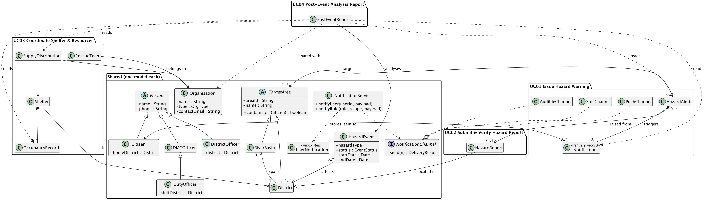

# 7 Cross-UC Consistency

<!-- Owner: Anupa (DMS-114.3) -->

The four use cases were improved separately, but they describe one system. Read side by side, the original Group_026 design names the same real-world things several times: a district appears as a `String` field in UC01, as the host of a shelter in UC03 and as an affected area in UC04; an "active incident" in UC03 is the same thing as an active `HazardEvent` in UC04; and every use case "notifies" someone in its own way. Left as they are, these overlaps produce duplicate classes that drift apart, and UC04 cannot report on data that UC01 and UC03 store in incompatible shapes. This chapter records how the improved design resolves each overlap: one shared model where two use cases mean the same thing (7.1), two deliberately separate types where they do not (7.2), and a fixed set of shapes that UC04 reads without changing (7.3).

## 7.1 Shared models

Table 7.1 lists the models that more than one use case depends on. Each is defined once, owned by one ticket, and used by the others through its public interface only.

Table 7.1 — Models shared between use cases

| Model | Used by | What it is | Why it is shared |
|---|---|---|---|
| `District`, `RiverBasin` (both `TargetArea`) | UC01, UC02, UC03, UC04 | The 25 administrative districts and the river basins, each basin spanning several districts | UC01 targets warnings at them, UC02 places each report in one, UC03 scopes shelters, teams and the district officer to one, and UC04 filters events by them. One `AreaRegistry` validates area ids, expands a basin to its districts and finds the district containing a point, so all four agree on what "in Colombo" means. |
| `HazardEvent` (`EventStatus`) | UC03, UC04 | A disaster event with a hazard type, the districts it affects, a start and end date, and a status | The UC03 precondition "an incident is active for the district" and the UC04 event being analysed are the same thing. The UC03 incident **is** the district's `HazardEvent` with status `ACTIVE`, rather than a second "Incident" class. |
| `Organisation` (`OrgType`) | UC03, UC04 | A relief or rescue organisation with a type and a contact email | UC03 records which organisation owns each rescue team and supplied each stock item; UC04 groups distributions by organisation and shares the report with them. Both class diagrams contained an `Organisation`; one model keeps the names and ids consistent. |
| `Person` hierarchy (`Citizen`, officers, team lead) | UC01, UC02, UC03, UC04 | Every user, with a role and, depending on the role, a home, work or shift district and a phone number | UC01 counts and contacts citizens by `homeDistrict`, UC02 routes a new report to the duty officer on shift for its district, and UC03 limits a district officer to their district. `DutyOfficer` specialising `DMCOfficer` (UC01) is part of the same hierarchy. |
| `NotificationService` and the `NotificationChannel` strategy | UC01, UC02, UC03 | One service that puts an item in a user's in-app inbox (`UserNotification`) and sends it through the configured channels | UC02 (new report, report confirmed or dismissed), UC03 (dispatch, declined, no team available) and UC01 all "notify" someone. One service with one interface (`notifyUser`, `notifyRole`) replaces a separate notifier per use case. UC01's warning channels (`PushChannel`, `SmsChannel`, `AudibleChannel`) are further implementations of the same `NotificationChannel` strategy. |

Figure 7.1 shows these models and the use cases that reach them. Two names in it are deliberately **not** shared. UC01's `Notification` is one delivery of one hazard warning to one citizen on one channel, with its own delivery status and retry `attempts` (UC01 E3). The in-app inbox item every use case writes is a different class, `UserNotification`. Giving them distinct names prevents a warning's delivery record, which UC04 counts, from being confused with an inbox message, which it does not.

## 7.2 Hazard-type alignment between UC01 and UC02

UC01 and UC02 both have an enumeration called `HazardType`, but with different values, and the difference is intentional (Table 7.2). UC01 types what a warning is **about**: a hazard the DMC can warn the public of. UC02 types what a citizen **sees** on the ground, including impacts such as a blocked road that are not themselves a warnable hazard.

Table 7.2 — The two hazard-type enumerations

| UC01 `AlertHazardType` | UC02 `ReportHazardType` |
|---|---|
| `FLOOD` | `RISING_RIVER_FLOOD` |
| `LANDSLIDE` | `LANDSLIDE` |
| `CYCLONE` | — |
| `DROUGHT` | — |
| — | `BLOCKED_ROAD` |
| — | `OTHER` |

Merging them would either let a citizen report a drought from a phone, or let an officer issue a "blocked road" warning; neither is in the case study. Keeping one name for both would also make it impossible for both to exist in the code. The improved design therefore keeps two enumerations, named `AlertHazardType` and `ReportHazardType`.

The two meet in exactly one place: UC01 A1, when a duty officer escalates a `CONFIRMED` report to a warning. The original UC02 use case diagram also had an "Escalate verified report to warning" use case, which duplicated UC01 A1; the improved design builds it once, in UC01, and UC02 only states whether a report can be escalated. When the report is escalated, `ReportHazardTypeMapper` pre-fills the warning's type (Table 7.3).

Table 7.3 — Report type to warning type on escalation (UC01 A1.2)

| Report type | Pre-filled warning type |
|---|---|
| `RISING_RIVER_FLOOD` | `FLOOD` |
| `LANDSLIDE` | `LANDSLIDE` |
| `BLOCKED_ROAD` | none: the officer chooses |
| `OTHER` | none: the officer chooses |

A blocked road or an "other" report is evidence of a hazard rather than a hazard type, so the officer interprets it and chooses the type. Every `ReportHazardType` value must have a row in the mapper, which a unit test enforces, so adding a report type cannot silently break escalation. The report's district is pre-filled as the warning's scope, and the warning keeps a link to the report it was raised from (the `HazardAlert` *raised from* 0..1 `HazardReport` association in the UC01 class diagram).

## 7.3 Data UC04 consumes

UC04 Generate Post-Event Analysis Report creates no operational data of its own. It reads what UC01 and UC03 recorded during the event, so the shape of those records is fixed (frozen in the API contract) before UC04 is built on it, and UC04 only reads them (Table 7.4).

Table 7.4 — Records UC04 reads

| Record | Written by | Fields UC04 relies on | Used in the report for |
|---|---|---|---|
| `HazardAlert` | UC01 (broadcast, update, all-clear) | hazard type, severity, status, version, target areas, `issuedAt`, status history | The warnings timeline: when each warning was issued, escalated (`UPDATED`) and ended (`CANCELLED`, the all-clear) |
| `Notification` (UC01 delivery record) | UC01, one per citizen, channel and alert version | alert and version, citizen, channel, `status`, `attempts`, `fallbackChannel` | "Citizens reached": the distinct citizens with at least one `DELIVERED` notification. `FAILED` deliveries, after the SMS fallback, count as not reached. |
| Occupancy record | UC03, one per occupancy update | shelter, district, occupants, capacity, `recordedAt` | Shelter occupancy over time |
| `SupplyDistribution` | UC03, one per logged distribution | shelter, district, organisation, supply type, quantity, `distributedAt` | Relief distributed, by supply type and organisation |
| `HazardEvent`, `Organisation` | Shared (7.1) | event dates, districts; organisation names | The report's period and scope; grouping and sharing by organisation |

Two decisions make this possible. First, UC01 records delivery per citizen and per channel (the improved `Notification`), where the original design only mentioned delivery confirmations without modelling them, so "citizens reached" could not be computed. Second, UC03 stores an occupancy record for every update instead of overwriting the shelter's current count, so occupancy over time can be reported. In both cases the use case that owns the data defines its shape, and a change to that shape needs UC04's approval.
